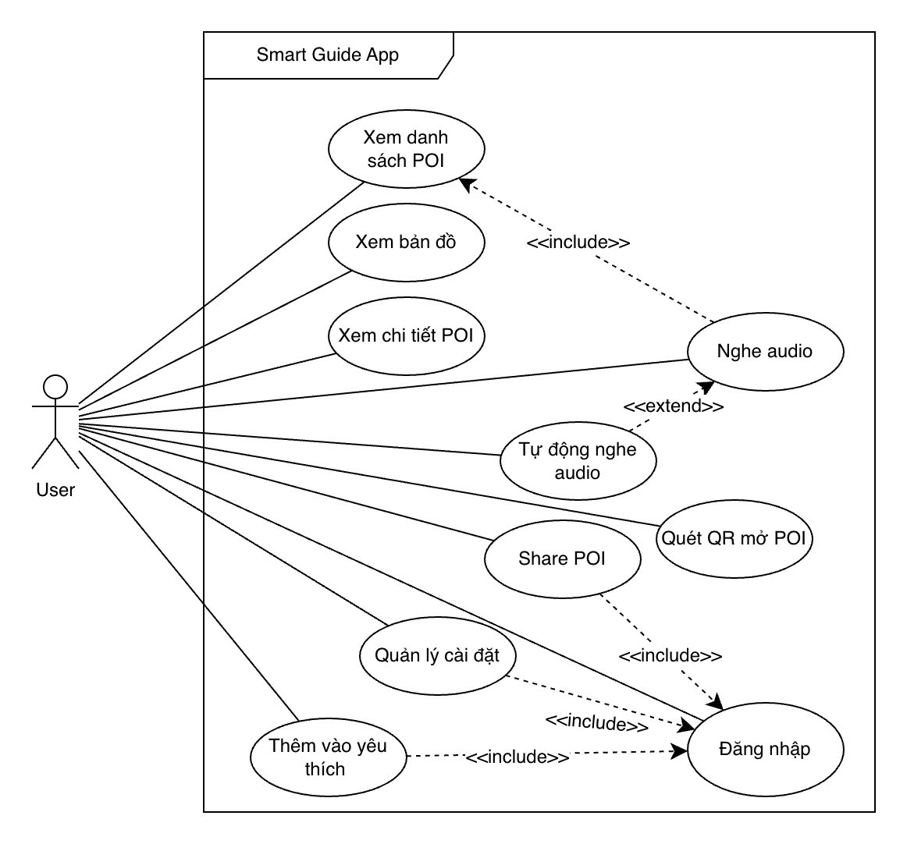
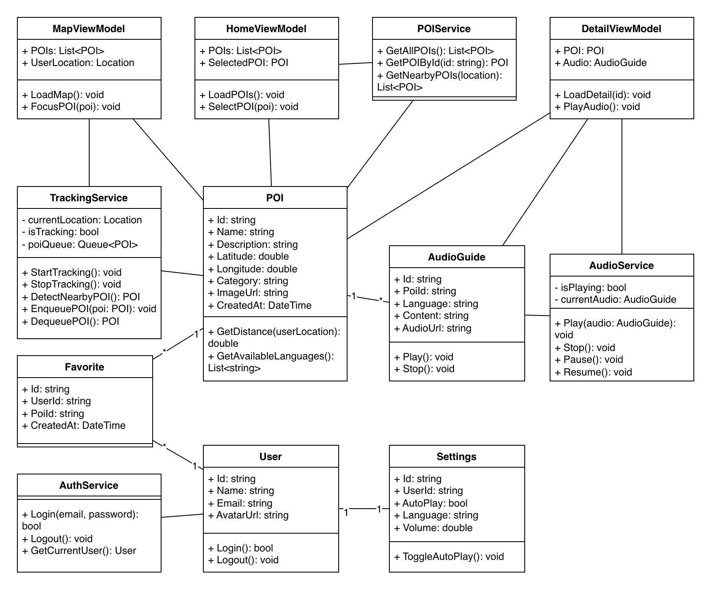
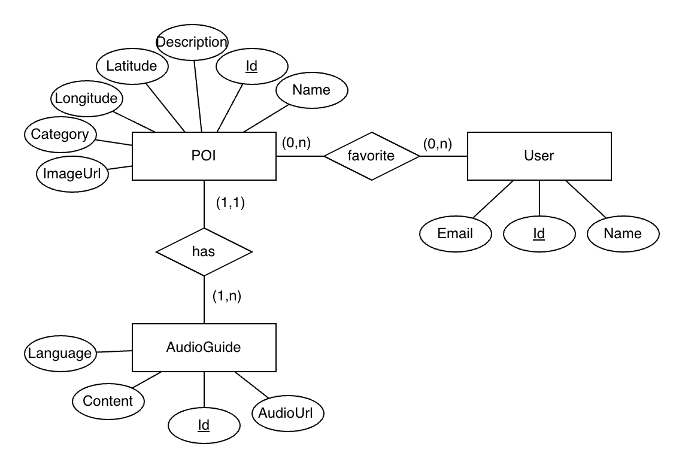

# SMART GUIDE – PRODUCT REQUIREMENT DOCUMENT (PRD)

# 1. Product Overview

## 1.1 Introduction

**Smart Guide** là ứng dụng di động thông minh chuyên cung cấp trải nghiệm hướng dẫn du lịch tự động, kết hợp công nghệ định vị GPS thời gian thực và công nghệ âm thanh. Ứng dụng giúp người dùng khám phá các điểm đến một cách liền mạch mà không cần phải thao tác thủ công nhiều.

<p align="center">
  
</p>

<p align="center"><i>Smart Guide</i></p>
Các tính năng chính bao gồm:
- Tự động nhận diện vị trí người dùng qua GPS và các công nghệ định vị bổ trợ (như Wi-Fi/Bluetooth beacon khi có).
- Xác định và gợi ý các **Point of Interest (POI)** gần nhất dựa trên khoảng cách và ngữ cảnh.
- Tự động phát audio giới thiệu chi tiết về POI (hỗ trợ Text-to-Speech hoặc audio ghi âm sẵn).

**Định vị sản phẩm (Product Positioning):**

> “A smart, automated audio tour guide powered by location awareness – biến mọi chuyến đi thành hành trình cá nhân hóa, không cần hướng dẫn viên truyền thống.”

Smart Guide nhắm đến việc mang lại cảm giác như đang được một hướng dẫn viên cá nhân “dẫn dắt” theo thời gian thực, phù hợp cho cả du lịch cá nhân và nhóm nhỏ.

## 1.2 Problem Statement

Hiện nay, du khách thường gặp phải những hạn chế sau:

- Phải chủ động đọc thông tin từ sách hướng dẫn, bảng chỉ dẫn hoặc ứng dụng du lịch thông thường → thiếu tính tương tác và dễ gây mệt mỏi.
- Tour guide truyền thống đòi hỏi chi phí cao, lịch trình cố định và không linh hoạt theo sở thích cá nhân.
- Trải nghiệm thiếu tính tự động và thời gian thực: người dùng phải liên tục kiểm tra bản đồ hoặc tìm kiếm thủ công.

**Vấn đề cốt lõi:**

- Không tiện lợi và tốn thời gian.
- Thiếu cá nhân hóa (ngôn ngữ, độ dài audio, mức độ chi tiết).
- Không tận dụng được vị trí thời gian thực để tạo ra trải nghiệm liền mạch và hấp dẫn.

Kết quả là nhiều du khách bỏ lỡ thông tin thú vị hoặc cảm thấy chuyến đi thiếu chiều sâu.

## 1.3 Solution

Smart Guide giải quyết triệt để các vấn đề trên bằng cách tạo ra một trải nghiệm **hands-free** (không cần dùng tay) thực sự:

<p align="center">
  
  
</p>

- **Tracking vị trí thời gian thực** liên tục và chính xác.
- **Tự động trigger POI** khi người dùng tiếp cận trong bán kính nhất định.
- **Tự động phát audio** giới thiệu mà không cần người dùng click hay chọn.

Người dùng chỉ cần mở ứng dụng, cấp quyền vị trí và bắt đầu di chuyển – ứng dụng sẽ “dẫn tour” một cách mượt mà, giống như đang có một hướng dẫn viên ảo luôn bên cạnh. Ngoài ra, ứng dụng vẫn hỗ trợ tương tác thủ công để tăng tính linh hoạt.

## 1.4 Product Goals

- Cung cấp trải nghiệm **hands-free** tối ưu, giúp người dùng tập trung hoàn toàn vào việc khám phá thay vì thao tác thiết bị.
- Tăng mức độ tương tác (engagement) và sự hài lòng khi tham quan thông qua nội dung audio cá nhân hóa.
- Xây dựng nền tảng có khả năng mở rộng thành hệ sinh thái du lịch thông minh (tích hợp đặt vé, khuyến nghị, cộng đồng...).
- Đạt được sự cân bằng giữa tự động hóa cao và khả năng kiểm soát thủ công từ người dùng.

**Success Metrics (Chỉ số đo lường thành công – mới bổ sung):**

- Tỷ lệ người dùng kích hoạt chế độ Auto-Tracking ≥ 70% trong phiên đầu tiên.
- Thời lượng nghe audio trung bình mỗi chuyến thăm quan ≥ 15 phút.
- Điểm hài lòng (NPS hoặc rating) ≥ 4.5/5.
- Tỷ lệ giữ chân người dùng (retention) sau 7 ngày ≥ 40%.
- Số lượng POI được trigger tự động trung bình mỗi phiên ≥ 5.

# 2. User Personas

## 2.1 Tourist (Du khách thông thường)

- Độ tuổi: 25-45, du lịch cá nhân hoặc gia đình.
- Mục tiêu: Khám phá nhanh các điểm nổi bật, muốn tiết kiệm thời gian và chi phí.
- Đặc điểm: Không muốn đọc nhiều chữ, thích trải nghiệm tự động, dễ bị phân tâm bởi thao tác phức tạp.
- Nhu cầu: Audio ngắn gọn, tự động phát khi đến nơi, hỗ trợ ngôn ngữ cơ bản (Việt Nam + Anh).

## 2.2 Explorer (Người khám phá sâu)

- Độ tuổi: 18-40, du lịch một mình hoặc nhóm nhỏ yêu thích văn hóa/lịch sử.
- Mục tiêu: Tìm hiểu chi tiết về POI, nghe thêm thông tin bổ sung (lịch sử, câu chuyện, mẹo du lịch).
- Đặc điểm: Muốn tùy chỉnh độ dài audio, hỗ trợ đa ngôn ngữ (Anh, Pháp, Hàn, Nhật...), đánh dấu yêu thích và lưu lại hành trình.
- Nhu cầu: Audio chi tiết, tùy chọn nghe lại, tích hợp bản đồ chi tiết và gợi ý tuyến đường.

# 3. User Stories

Dưới đây là các user story chính, được mở rộng với acceptance criteria cơ bản:

- As a user, I want to **automatically hear audio** when approaching a POI so that I can enjoy the information without manual action.  
  _(AC: Trigger trong bán kính 50m, audio phát liền mạch, có thông báo nhẹ nếu cần)._

- As a user, I want to **view all nearby POIs on an interactive map** so that I can plan route dễ dàng.

- As a user, I want to **manually play/pause/stop audio** for any POI so that I have full control.

- As a user, I want to **save favorite locations and routes** so that I can revisit or share later.

- As a user, I want to **scan QR code** to instantly open a specific POI and play its audio.

- As a user, I want to **switch languages** seamlessly during the tour.

# 4. Use Case Diagram

<p align="center">  </p> <p align="center"><i>Smart Guide</i></p>

## 4.1 Use Case Specification

### Use Case: Nghe audio

- **Actor:** User
- **Description:** Người dùng nghe audio giới thiệu của một POI
- **Preconditions:**
  - User đã mở chi tiết POI

- **Postconditions:**
  - Audio được phát thành công

#### Main Flow:

1. User chọn một POI
2. Hệ thống hiển thị chi tiết POI
3. User nhấn nút “Nghe audio”
4. Hệ thống phát audio

#### Alternative Flow:

- A1: Không có audio → hiển thị thông báo
- A2: Lỗi phát audio → hiển thị lỗi

### Use Case: Tự động nghe audio

- **Actor:** System (trigger bởi User)
- **Description:** Hệ thống tự động phát audio khi user đến gần POI
- **Preconditions:**
  - User bật tracking
  - User bật auto play

- **Postconditions:**
  - Audio được phát tự động

#### Main Flow:

1. Hệ thống lấy vị trí user
2. Phát hiện POI gần
3. Tự động mở chi tiết POI
4. Tự động phát audio

#### Alternative Flow:

- A1: Không có POI gần → không làm gì
- A2: Audio đang phát → đưa vào queue

### Use Case: Xem bản đồ

- **Actor:** User
- **Description:** Xem các POI trên bản đồ
- **Preconditions:** Không có
- **Postconditions:** Hiển thị map

#### Main Flow:

1. User mở tab bản đồ
2. Hệ thống load POI
3. Hiển thị marker trên map

### Use Case: Xem chi tiết POI

- **Actor:** User
- **Description:** Xem thông tin chi tiết của POI
- **Preconditions:** POI tồn tại
- **Postconditions:** Hiển thị detail

#### Main Flow:

1. User chọn POI
2. Hệ thống load dữ liệu
3. Hiển thị thông tin

### Use Case: Quét QR mở POI

- **Actor:** User
- **Description:** Mở POI bằng QR code
- **Preconditions:** QR hợp lệ
- **Postconditions:** Mở detail POI

#### Main Flow:

1. User quét QR
2. Hệ thống đọc id POI
3. Điều hướng đến trang chi tiết

#### Alternative Flow:

- A1: QR không hợp lệ → báo lỗi

### Use Case: Thêm vào yêu thích

- **Actor:** User
- **Description:** Lưu POI vào danh sách yêu thích
- **Preconditions:**
  - User đã đăng nhập

- **Postconditions:** POI được lưu

#### Main Flow:

1. User nhấn “Yêu thích”
2. Hệ thống kiểm tra đăng nhập
3. Lưu vào danh sách

#### Alternative Flow:

- A1: Chưa đăng nhập → chuyển sang login

### Use Case: Đăng nhập

- **Actor:** User
- **Description:** Xác thực người dùng
- **Preconditions:** Không có
- **Postconditions:** User đăng nhập thành công

#### Main Flow:

1. User nhập thông tin
2. Hệ thống xác thực
3. Đăng nhập thành công

#### Alternative Flow:

- A1: Sai thông tin → báo lỗi

### Use Case: Quản lý cài đặt

- **Actor:** User
- **Description:** Thay đổi cấu hình app
- **Preconditions:** User đã đăng nhập
- **Postconditions:** Cài đặt được lưu

#### Main Flow:

1. User mở settings
2. Thay đổi tùy chọn
3. Hệ thống lưu

### Use Case: Share POI

- **Actor:** User
- **Description:** Chia sẻ POI
- **Preconditions:** User đã đăng nhập
- **Postconditions:** Link được chia sẻ

#### Main Flow:

1. User chọn share
2. Hệ thống tạo link
3. Hiển thị options chia sẻ

# 5. System Flows

## 5.1 Tracking Flow

```text
User enables location services → App continuously tracks GPS/Wi-Fi → Detect nearby POI (within radius) → Add to smart queue (avoid duplicate) → Open POI detail (optional) → Auto-play audio
```

## 5.2 Audio Flow

```text
Audio trigger (auto or manual) → Check state → TTS or pre-recorded audio → Play with fade-in → On finish → Dequeue next POI → Play next (if any) → Return to idle
```

## 5.3 Navigation Flow

```text
Open Map Screen → Click POI marker → Navigate to Detail Screen → View information + images → Tap Play button
```

## 5.4 Deep Link / QR Flow

```text
Scan QR → Extract POI ID → Deep link navigation → Load POI data (offline-first if possible) → Auto-play audio
```

# 6. Core Logic (QUAN TRỌNG)

## 6.1 Tracking Logic

Ứng dụng sẽ liên tục lấy vị trí người dùng (mỗi 5-10 giây, tùy tối ưu pin).  
So sánh khoảng cách Euclidean hoặc sử dụng Geofencing với danh sách POI.  
Khi khoảng cách ≤ radius (mặc định 50m, có thể tùy chỉnh):

- Thêm POI vào queue nếu chưa visit trong phiên hiện tại.
- Đánh dấu “visited” để tránh trigger lặp lại.
- Hỗ trợ debounce để tránh spam trigger khi người dùng đứng yên hoặc di chuyển chậm.

## 6.2 Queue Logic (Fix bug audio skip/overlap)

- Queue hoạt động theo nguyên tắc FIFO (First In First Out).
- Nếu đang phát audio: POI mới → enqueue (thêm vào cuối hàng đợi).
- Khi audio hiện tại kết thúc: dequeue POI tiếp theo và phát ngay.
- Hỗ trợ ưu tiên (priority queue) cho POI quan trọng hoặc theo tuyến đường người dùng đang đi.
- Đảm bảo: **Không skip POI**, **Không overlap audio**, và có thể bỏ qua queue nếu người dùng muốn.

## 6.3 Audio Logic

- Sử dụng **Text-to-Speech (TTS)** kết hợp audio ghi âm sẵn (pre-recorded) để tăng chất lượng.
- Trạng thái audio rõ ràng: **Idle** | **Playing** | **Paused** | **Finished**.
- Hỗ trợ fade-in/fade-out, điều chỉnh tốc độ và âm lượng.
- Multi-language: Người dùng chọn ngôn ngữ mặc định, ứng dụng tự chuyển đổi nội dung.

# 7. System Architecture

## 7.1 Layers

- **View Layer**: UI/UX (Jetpack Compose cho Android, SwiftUI cho iOS).
- **ViewModel Layer**: MVVM pattern để xử lý logic và trạng thái.
- **Service Layer**: Các service độc lập (Tracking, Audio, POI, Network).
- **Model & Data Layer**: Local database + Backend sync.

## 7.2 Services

- **TrackingService**: Quản lý vị trí, geofencing.
- **AudioService**: Xử lý playback, queue, TTS.
- **POIService**: Lấy dữ liệu POI (API + cache local).
- **AuthService**: Xác thực người dùng và đồng bộ favorite.

# 8. Class Diagram

<p align="center">  </p> <p align="center"><i></i></p>

# 9. ERD

<p align="center">  </p> <p align="center"><i></i></p>

# 10. UI / UX Design

## 10.1 Home Screen

<p align="center">
  
  
</p>

- Hiển thị danh sách POI gần nhất + mini map.
- Nút nhanh bật/tắt Auto-Tracking và ngôn ngữ.

## 10.2 Map Screen

<p align="center">
  
  
</p>

- Marker POI với hiệu ứng phân biệt POI được chọn/không được chọn.
- Vị trí người dùng realtime với vòng tròn bán kính.

## 10.3 Detail Screen

<p align="center">
  
  
</p>

- Thông tin chi tiết và hình ảnh.
- Nút Play/Pause lớn, thời lượng audio, tùy chọn nghe lại.

## 10.4 Settings Screen

<p align="center">
  
  
</p>

- Toggle Auto-Play, Tracking precision.

# 11. Functional Requirements

## 11.1 Tracking & Location

- Phát hiện vị trí realtime với độ chính xác cao.
- Trigger POI tự động + queue thông minh.
- Hỗ trợ background tracking (với tối ưu pin).

## 11.2 Audio Management

- Play / Stop.
- Auto-play khi trigger.
- Hỗ trợ đa ngôn ngữ.

## 11.3 POI Management

- Xem danh sách, bản đồ, chi tiết.
- Tìm kiếm, lọc theo loại (lịch sử, ẩm thực, thiên nhiên...).

## 11.4 User Features

- Đăng nhập / Đăng ký (Google/Apple/Facebook).
- Lưu favorite, tạo tuyến đường cá nhân.
- Chia sẻ POI qua link hoặc mạng xã hội.

# 12. Edge Cases

- **Không có mạng**: Sử dụng dữ liệu POI và audio đã cache local (Room Database hoặc SQLite).
- **GPS không chính xác hoặc tắt**: Hiển thị cảnh báo rõ ràng, fallback sang chế độ thủ công, không trigger audio tự động.
- **Audio lỗi hoặc TTS thất bại**: Fallback sang hiển thị text chi tiết + nút đọc to.
- **Người dùng di chuyển nhanh**: Tự động skip hoặc ưu tiên POI quan trọng nhất trên tuyến đường.
- **Spam trigger (đứng yên lâu)**: Áp dụng debounce time (ít nhất 2-3 phút giữa các trigger cùng POI).
- **Pin yếu hoặc thiết bị nóng**: Tự động giảm tần suất tracking và cảnh báo người dùng.
- **Nhiều POI cùng lúc**: Sắp xếp queue theo khoảng cách hoặc độ ưu tiên.

# 13. Non-functional Requirements

- **Performance**: Thời gian load POI < 2 giây, tracking mượt mà.
- **Reliability**: Ứng dụng không crash khi chạy tracking nền; xử lý exception gracefully.
- **Battery Optimization**: Sử dụng fused location provider, giảm tần suất khi app ở background.
- **Security**: Bảo vệ dữ liệu vị trí, mã hóa thông tin người dùng, tuân thủ GDPR/CCPA.
- **Scalability**: Backend hỗ trợ hàng nghìn POI và người dùng đồng thời.
- **Accessibility**: Hỗ trợ VoiceOver/TalkBack, font lớn, chế độ tối.

**Assumptions & Dependencies (mới bổ sung):**

- Người dùng cấp quyền vị trí và thông báo.
- POI data được cung cấp từ backend hoặc admin dashboard.
- Thiết bị hỗ trợ GPS và TTS (Android/iOS tiêu chuẩn).

# 14. Risks & Mitigations (mới bổ sung)

- **Rủi ro pin hao nhanh**: Mitigation – Tối ưu tracking, cung cấp chế độ tiết kiệm.
- **Rủi ro dữ liệu POI không chính xác**: Mitigation – Cho phép người dùng báo lỗi POI.
- **Rủi ro audio chất lượng thấp**: Mitigation – Kết hợp pre-recorded + AI voice cải tiến sau.
- **Rủi ro pháp lý (quyền riêng tư vị trí)**: Mitigation – Minh bạch chính sách và xin phép rõ ràng.

# 15. Future Enhancements

- Hỗ trợ **offline audio đầy đủ** (tải trước toàn bộ tour).
- Tích hợp **AI voice** tự nhiên, cá nhân hóa theo giọng nói (nam/nữ, accent).
- **Recommendation system** dựa trên sở thích và lịch sử.
- **Push notification** khi gần POI quan trọng.
- Tích hợp AR (thử nghiệm hiển thị thông tin chồng lên thực tế).
- Cộng đồng: Người dùng đóng góp audio/đánh giá POI.
- Tích hợp đặt vé, đặt chỗ nhà hàng gần POI.

# 16. Deployment

- **Nền tảng**: iOS (phát triển bằng .NET MAUI - cross-platform)
- **Phát hành**:
  - Apple App Store
  - Google Play Store
- **Backend (hiện tại)**:
  - Sử dụng MockDataService (local data)
- **Backend (tương lai)**:
  - REST API (ASP.NET Core)
  - Database (PostgreSQL / Firebase)

# 17. Conclusion

Smart Guide không chỉ là một ứng dụng hướng dẫn du lịch, mà còn là người bạn đồng hành thông minh giúp biến mọi chuyến đi thành trải nghiệm đáng nhớ, cá nhân hóa và không tốn công sức. Với khả năng tự động hóa cao, giao diện thân thiện và nền tảng mở rộng linh hoạt, Smart Guide có tiềm năng trở thành giải pháp du lịch thông minh hàng đầu, mang lại giá trị thực sự cho du khách và các điểm đến.
