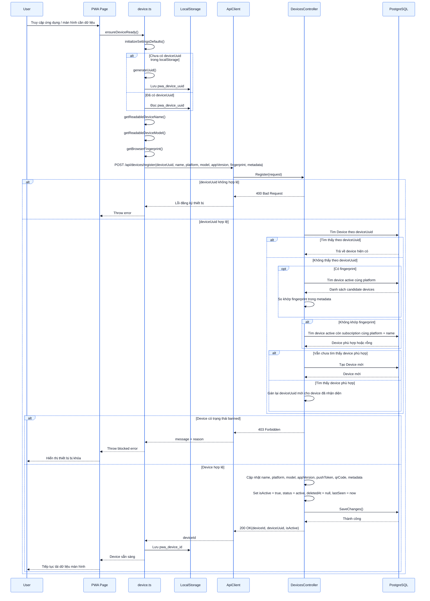
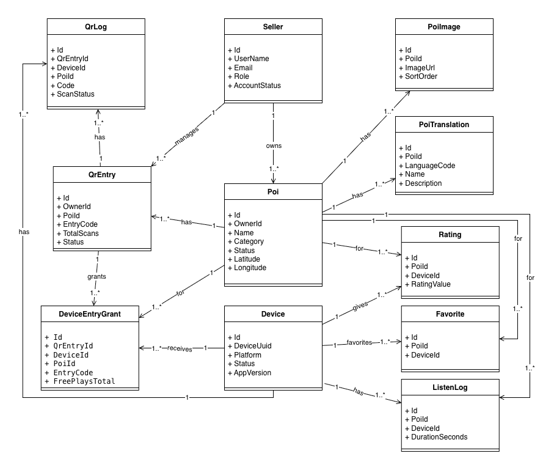

# Smart Guide System — Product Requirements Document (PRD)

## Mục lục

1. [Giới Thiệu Chung](#1-giới-thiệu-chung)
2. [Phân Quyền Và Đối Tượng Người Dùng](#2-phân-quyền-và-đối-tượng-người-dùng)
3. [User Stories Và Yêu Cầu Chức Năng](#3-user-stories-và-yêu-cầu-chức-năng)
4. [Yêu Cầu Phi Chức Năng](#4-yêu-cầu-phi-chức-năng)
5. [Technology Stack Và Kiến Trúc Hệ Thống](#5-technology-stack-và-kiến-trúc-hệ-thống)
6. [Cơ Sở Dữ Liệu](#6-cơ-sở-dữ-liệu)
7. [Danh Mục API Routes](#7-danh-mục-api-routes)
8. [Cấu Trúc Ứng Dụng Web](#8-cấu-trúc-ứng-dụng-web)
9. [Sơ Đồ Use Case](#9-sơ-đồ-use-case)
10. [Sơ Đồ Trình Tự](#10-sơ-đồ-trình-tự-sequence-diagram)
11. [Sơ Đồ Lớp](#11-sơ-đồ-lớp-class-diagram)
12. [Sơ Đồ Hoạt Động](#12-sơ-đồ-hoạt-động-activity-diagram)

---

## 1. Giới Thiệu Chung

**Smart Guide System** là hệ thống hỗ trợ trải nghiệm tham quan thông minh, cho phép user/guest truy cập nội dung hướng dẫn tại điểm đến thông qua **PWA**, quét **QR** để kích hoạt lượt nghe miễn phí hoặc mở khóa quyền truy cập, đồng thời cung cấp hai cổng quản trị riêng cho **seller (owner)** và **admin**.

Hệ thống được tổ chức theo kiến trúc web gồm:

| Thành phần      | Vai trò                                            | Công nghệ                                       |
| :-------------- | :------------------------------------------------- | :---------------------------------------------- |
| **PWA**         | Ứng dụng cho user/guest                            | Next.js, TypeScript, TailwindCSS                |
| **Seller Web**  | Cổng quản lý cho seller/owner                      | Next.js, TypeScript, TailwindCSS                |
| **Admin Web**   | Cổng điều hành và kiểm duyệt hệ thống              | Next.js, TypeScript, TailwindCSS                |
| **Backend API** | Xử lý nghiệp vụ, dữ liệu, thanh toán, QR, thiết bị | ASP.NET Core, Entity Framework Core, PostgreSQL |

### 1.1. Mục tiêu hệ thống

- Cung cấp trải nghiệm nghe thuyết minh và khám phá POI trực tiếp trên web app.
- Quản lý quyền truy cập theo thiết bị, QR và gói thanh toán.
- Cho seller/owner tự quản lý POI, nội dung, audio, QR và giao dịch liên quan.
- Cho admin quản lý tài khoản, POI, thiết bị, QR, gói dịch vụ và thanh toán toàn hệ thống.

### 1.2. Mục tiêu tài liệu

Tài liệu PRD này dùng để:

- Thống nhất phạm vi sản phẩm.
- Mô tả rõ actor, chức năng, dữ liệu và luồng xử lý chính.
- Làm nền cho việc vẽ UML, ERD, use case và các sơ đồ phân tích sau này.

---

## 2. Phân Quyền Và Đối Tượng Người Dùng

| Vai trò            | Nền tảng sử dụng | Mục tiêu chính                                              | Quyền hạn chính                                                       |
| :----------------- | :--------------- | :---------------------------------------------------------- | :-------------------------------------------------------------------- |
| **User / Guest**   | PWA              | Quét QR, xem bản đồ, nghe nội dung, lưu yêu thích, đánh giá | Truy cập nội dung POI, thanh toán gói sử dụng, quản lý hồ sơ thiết bị |
| **Seller / Owner** | Seller Web       | Tạo và quản lý POI, audio, QR, thanh toán nâng cấp          | CRUD POI của mình, quản lý QR, theo dõi giao dịch                     |
| **Admin**          | Admin Web        | Quản trị vận hành toàn hệ thống                             | Quản lý user, POI, QR, plans, devices, payments                       |

### 2.1. Mô hình nhận diện người dùng

- **PWA** nhận diện theo **device** thay vì tài khoản đăng nhập truyền thống.
- Khi user/guest truy cập lần đầu, hệ thống **tự động khởi tạo và đăng ký thiết bị ở nền**, không yêu cầu người dùng thao tác đăng ký thủ công.
- **Seller** đăng ký và đăng nhập bằng tài khoản owner.
- **Admin** đăng nhập bằng tài khoản admin.

### 2.2. Mô hình cấp quyền truy cập nội dung

User/guest có thể nghe nội dung theo ba trạng thái:

- Được cấp **lượt nghe miễn phí** sau khi quét QR hợp lệ.
- Đang có **gói sử dụng còn hạn** trên thiết bị.
- Không có quyền truy cập và cần chuyển sang màn hình **paywall / payment**.

---

## 3. User Stories Và Yêu Cầu Chức Năng

### Epic 1: Trải Nghiệm Người Dùng Trên PWA

**US 1.1 — Tự động nhận diện thiết bị**

> Là một user/guest, tôi muốn hệ thống tự nhận diện thiết bị của tôi để lưu lịch sử, yêu thích và quyền truy cập.

- **Functional Requirements**
  - Khi user truy cập PWA lần đầu, ứng dụng tự gửi thông tin thiết bị đến `POST /api/devices/register`.
  - Hệ thống sinh `deviceId`, `deviceUuid` và lưu metadata thiết bị.
  - Thiết bị bị khóa hoặc bị xóa sẽ không được tiếp tục sử dụng.
- **Acceptance Criteria**
  - Thiết bị mới được tạo tự động và lưu lại cho các lần dùng sau.
  - Thiết bị không hợp lệ không thể tiếp tục truy cập.

**US 1.2 — Quét QR để nhận lượt nghe miễn phí**

> Là một user/guest, tôi muốn quét QR tại điểm đến để nhận quyền nghe thử hoặc mở nội dung liên quan.

- **Functional Requirements**
  - PWA truy cập route `/qr/[entryCode]`.
  - Backend xử lý qua `POST /api/access/entry`.
  - Mỗi QR có số lượt quét giới hạn, trạng thái hoạt động, thời hạn và log quét.
  - Một thiết bị hoặc cùng fingerprint thiết bị chỉ được hưởng lượt nghe miễn phí theo luật hiện tại của hệ thống.
- **Acceptance Criteria**
  - QR hợp lệ cấp quyền thành công.
  - QR hết lượt hoặc bị khóa trả trạng thái phù hợp.
  - Log quét được ghi nhận để seller và admin theo dõi.

**US 1.3 — Kiểm tra trạng thái quyền truy cập**

> Là một user/guest, tôi muốn biết hiện tại mình có được nghe nội dung hay không.

- **Functional Requirements**
  - Hệ thống kiểm tra qua `GET /api/access/free-listen`.
  - Nếu thiết bị đang có gói sử dụng còn hạn, quyền truy cập được mở.
  - Nếu còn free play thì được phép nghe nội dung tương ứng.
- **Acceptance Criteria**
  - User thấy đúng trạng thái được nghe hoặc bị chặn.
  - Hệ thống phản hồi số lượt nghe miễn phí còn lại.

**US 1.4 — Thanh toán để mở gói nghe**

> Là một user/guest, tôi muốn thanh toán trực tuyến để mở quyền truy cập nội dung lâu hơn.

- **Functional Requirements**
  - PWA hiển thị paywall và trang thanh toán.
  - Backend quản lý checkout, trạng thái giao dịch và webhook qua `PaymentsController`.
  - Hệ thống tạo QR chuyển khoản Sepay, đối soát giao dịch và kích hoạt gói sử dụng cho thiết bị.
- **Acceptance Criteria**
  - User tạo được giao dịch mới.
  - Giao dịch thành công sẽ kích hoạt hoặc gia hạn gói sử dụng.
  - Giao dịch quá hạn được chuyển sang trạng thái từ chối hoặc hết hạn.

**US 1.5 — Xem danh sách và chi tiết POI**

> Là một user/guest, tôi muốn duyệt các điểm tham quan và xem nội dung chi tiết của từng điểm.

- **Functional Requirements**
  - `GET /api/pois` trả danh sách POI đã được duyệt.
  - `GET /api/pois/{id}` trả chi tiết POI.
  - Hệ thống hỗ trợ ngôn ngữ `vi`, `en`, `ja`, `ko`, `zh`.
  - Chỉ hiển thị POI đã được duyệt và thuộc owner còn hoạt động.
- **Acceptance Criteria**
  - Danh sách POI hiển thị đúng dữ liệu.
  - Chi tiết POI hiển thị mô tả, ảnh, audio và trạng thái yêu thích.

**US 1.6 — Xem bản đồ và điều hướng khám phá**

> Là một user/guest, tôi muốn xem POI trên bản đồ để tiện khám phá khu vực.

- **Functional Requirements**
  - PWA có trang `map`.
  - Bản đồ hiển thị vị trí POI, bán kính và thông tin cơ bản.
  - User có thể chuyển từ bản đồ sang chi tiết POI.
- **Acceptance Criteria**
  - POI hiển thị đúng trên bản đồ.
  - User có thể chọn POI và xem thông tin liên quan.

**US 1.7 — Lưu yêu thích và ghi nhận lịch sử nghe**

> Là một user/guest, tôi muốn lưu lại các địa điểm yêu thích và xem lại lịch sử đã nghe.

- **Functional Requirements**
  - Toggle favorite qua `POST /api/pois/favorite/{poiId}`.
  - Ghi nhận lượt nghe qua `POST /api/pois/listened/{poiId}`.
  - Hồ sơ cá nhân lấy qua `GET /api/profiles/{deviceId}`.
  - Danh sách yêu thích và lịch sử lấy qua `GET /api/profiles/{deviceId}/favorites` và `GET /api/profiles/{deviceId}/history`.
- **Acceptance Criteria**
  - Favorite được thêm/xóa đúng theo thao tác.
  - Lịch sử nghe được lưu và hiển thị lại đúng theo thiết bị.

**US 1.8 — Đánh giá POI**

> Là một user/guest, tôi muốn đánh giá chất lượng trải nghiệm của một POI.

- **Functional Requirements**
  - User gửi đánh giá qua `POST /api/ratings`.
  - Điểm trung bình và số lượt đánh giá được cập nhật ở POI.
- **Acceptance Criteria**
  - Đánh giá được lưu thành công.
  - Điểm trung bình hiển thị lại chính xác ở danh sách và chi tiết POI.

### Epic 2: Seller Quản Lý Nội Dung Và Tài Nguyên

**US 2.1 — Đăng ký và đăng nhập seller**

> Là một seller/owner, tôi muốn tạo tài khoản và đăng nhập để quản lý nội dung của mình.

- **Functional Requirements**
  - Đăng ký qua `POST /api/auth/register`.
  - Đăng nhập qua `POST /api/auth/login`.
  - Seller chỉ truy cập được vào portal của role owner.
- **Acceptance Criteria**
  - Seller tạo tài khoản được.
  - Seller đăng nhập thành công và vào dashboard.

**US 2.2 — Tạo và quản lý POI**

> Là một seller/owner, tôi muốn tạo điểm tham quan hoặc địa điểm của mình để đưa lên hệ thống.

- **Functional Requirements**
  - `GET /api/owner/pois`
  - `GET /api/owner/pois/{id}`
  - `POST /api/owner/pois`
  - POI có trạng thái duyệt như `pending`, `approved`, `rejected`.
  - Seller có thể khai báo thông tin chính, ảnh, vị trí, bán kính, ưu tiên, nội dung mô tả.
- **Acceptance Criteria**
  - Seller tạo được POI mới.
  - Seller chỉ xem và chỉnh dữ liệu của chính mình.

**US 2.3 — Dịch nội dung POI**

> Là một seller/owner, tôi muốn hỗ trợ dịch nhanh nội dung POI sang ngôn ngữ khác để phục vụ du khách.

- **Functional Requirements**
  - Gọi `POST /api/owner/pois/translate`.
  - Hệ thống hỗ trợ dịch nội dung đầu vào và trả text đã dịch.
- **Acceptance Criteria**
  - Dịch thành công khi dịch vụ phản hồi bình thường.
  - Có fallback khi dịch vụ dịch thất bại.

**US 2.4 — Upload ảnh POI**

> Là một seller/owner, tôi muốn tải ảnh lên để làm nội dung minh họa cho POI.

- **Functional Requirements**
  - Upload ảnh qua route upload trong `OwnerPoisController`.
  - Ảnh được lưu và gắn với POI theo thứ tự hiển thị.
- **Acceptance Criteria**
  - Seller upload được nhiều ảnh.
  - Ảnh xuất hiện đúng trong chi tiết POI.

**US 2.5 — Quản lý audio**

> Là một seller/owner, tôi muốn tạo, chỉnh sửa và xóa audio guide cho POI của mình.

- **Functional Requirements**
  - `GET /api/owner/audio/{poiId}`
  - `POST /api/owner/audio/tts`
  - `PUT /api/owner/audio/{audioId}`
  - `DELETE /api/owner/audio/{audioId}`
- **Acceptance Criteria**
  - Seller xem được các audio theo từng POI.
  - Audio được tạo, cập nhật và xóa đúng.

**US 2.6 — Tạo và quản lý QR**

> Là một seller/owner, tôi muốn tạo QR cho từng POI để phát cho khách quét truy cập.

- **Functional Requirements**
  - `GET /api/owner/qr`
  - `GET /api/owner/qr/logs`
  - `POST /api/owner/qr`
  - `PUT /api/owner/qr/{id}/topup`
  - `PUT /api/owner/qr/{id}/status`
  - `DELETE /api/owner/qr/{id}`
  - `POST /api/owner/qr/{id}/activation-request`
- **Acceptance Criteria**
  - Seller tạo được QR theo từng POI.
  - Seller theo dõi được số lượt quét và log quét.
  - Seller gửi được yêu cầu mở lại QR bị admin tạm ngưng.

**US 2.7 — Thanh toán nâng cấp POI**

> Là một seller/owner, tôi muốn thanh toán các gói nâng cấp liên quan đến POI để mở rộng khả năng hiển thị hoặc sử dụng.

- **Functional Requirements**
  - Hệ thống hỗ trợ payment type `poi_upgrade`.
  - Giao dịch thành công có thể hoàn tất việc tạo hoặc nâng cấp POI.
  - Seller có trang thanh toán và trang nâng cấp POI trong portal.
- **Acceptance Criteria**
  - Seller tạo được giao dịch nâng cấp.
  - POI được cập nhật đúng sau khi thanh toán thành công.

### Epic 3: Admin Điều Hành Toàn Hệ Thống

**US 3.1 — Quản lý tài khoản**

> Là admin, tôi muốn quản lý toàn bộ người dùng hệ thống.

- **Functional Requirements**
  - `GET /api/admin/users`
  - `GET /api/admin/users/{userId}/detail`
  - `PUT /api/admin/users/{userId}/toggle-active`
  - `PUT /api/admin/users/{userId}/status`
  - `DELETE /api/admin/users/{userId}`
- **Acceptance Criteria**
  - Admin xem được danh sách user theo role.
  - Admin khóa, tạm dừng hoặc hủy tài khoản được.

**US 3.2 — Kiểm duyệt và quản lý POI**

> Là admin, tôi muốn xem và xử lý POI do seller tạo lên.

- **Functional Requirements**
  - `GET /api/admin/pois`
  - Admin có thể lọc theo trạng thái, owner và từ khóa.
  - Admin xem được nội dung, ảnh, audio, lý do từ chối của từng POI.
- **Acceptance Criteria**
  - Admin xem được toàn bộ POI hệ thống.
  - Admin có thể phục vụ quy trình duyệt nội dung.

**US 3.3 — Quản lý QR toàn hệ thống**

> Là admin, tôi muốn giám sát và can thiệp vào QR của seller khi cần.

- **Functional Requirements**
  - `GET /api/admin/qr`
  - `GET /api/admin/qr/logs`
  - `GET /api/admin/qr/{id}/logs`
  - `PUT /api/admin/qr/{id}/status`
  - `POST /api/admin/qr/{id}/activation-request/reject`
  - `DELETE /api/admin/qr/{id}/hard`
- **Acceptance Criteria**
  - Admin xem được log quét theo QR.
  - Admin tạm ngưng hoặc xử lý yêu cầu kích hoạt lại QR được.

**US 3.4 — Quản lý thiết bị**

> Là admin, tôi muốn giám sát các thiết bị đã đăng ký và trạng thái hoạt động của chúng.

- **Functional Requirements**
  - Hệ thống có `DevicesController` để đăng ký, heartbeat và xóa thiết bị.
  - Admin portal có trang `devices`.
- **Acceptance Criteria**
  - Thiết bị hoạt động được cập nhật heartbeat.
  - Thiết bị vi phạm có thể bị vô hiệu hóa khỏi hệ thống.

**US 3.5 — Quản lý gói dịch vụ**

> Là admin, tôi muốn tạo và điều chỉnh các gói người dùng có thể mua.

- **Functional Requirements**
  - `GET /api/plans`
  - `GET /api/plans/admin`
  - `POST /api/plans`
  - `PUT /api/plans/{id}`
  - `DELETE /api/plans/{id}`
- **Acceptance Criteria**
  - Gói được tạo, cập nhật và xóa thành công.
  - PWA lấy được danh sách gói đang bán.

**US 3.6 — Giám sát thanh toán và vận hành**

> Là admin, tôi muốn theo dõi giao dịch thanh toán để xử lý sự cố và đối soát.

- **Functional Requirements**
  - Hệ thống lưu payment status, provider, transaction id, paid amount, paid at.
  - Admin portal có trang `payments`.
- **Acceptance Criteria**
  - Admin xem được trạng thái thanh toán theo thời gian thực tế đã ghi nhận.
  - Giao dịch `pending`, `used`, `rejected` được phân biệt rõ.

---

## 4. Yêu Cầu Phi Chức Năng

| Tiêu chí              | Mô tả                                                                                                                                |
| :-------------------- | :----------------------------------------------------------------------------------------------------------------------------------- |
| **Bảo mật**           | Seller và admin được phân quyền theo role. Thiết bị không hợp lệ hoặc bị khóa sẽ bị chặn ở backend.                                  |
| **Hiệu năng**         | Các màn danh sách chính phải phản hồi đủ nhanh để dùng thực tế trên web.                                                             |
| **Khả dụng**          | PWA phải hoạt động tốt trên mobile browser và có thể dùng như web app cài lên màn hình chính.                                        |
| **Khả năng mở rộng**  | Cấu trúc backend tách theo controller nghiệp vụ: auth, devices, payments, owner, admin, profiles, pois.                              |
| **Đa ngôn ngữ**       | Hệ thống hiện hỗ trợ các mã ngôn ngữ `vi`, `en`, `ja`, `ko`, `zh`.                                                                   |
| **Khả năng theo dõi** | QR logs, listen logs, payment states và subscription states cần được lưu để phục vụ phân tích và vận hành.                           |
| **Triển khai**        | `services/api` và PostgreSQL hiện triển khai trên Railway. `apps/pwa`, `apps/seller-web` và `apps/admin-web` triển khai trên Vercel. |

---

## 5. Technology Stack Và Kiến Trúc Hệ Thống

### 5.1. Technology Stack

| Thành phần      | Công nghệ chính                                               |
| :-------------- | :------------------------------------------------------------ |
| **Backend API** | ASP.NET Core, Entity Framework Core                           |
| **Database**    | PostgreSQL (Railway)                                          |
| **PWA**         | Next.js 14, React 18, TypeScript, TailwindCSS, Zustand, Axios |
| **Seller Web**  | Next.js 14, React 18, TypeScript, TailwindCSS, Zustand, Axios |
| **Admin Web**   | Next.js 14, React 18, TypeScript, TailwindCSS, Zustand, Axios |
| **Thanh toán**  | Chuyển khoản qua Sepay QR                                     |

### 5.2. Kiến trúc hệ thống tổng quan

- **Frontend layer**
  - `apps/pwa`
  - `apps/seller-web`
  - `apps/admin-web`
- **Backend layer**
  - `services/api`
- **Database layer**
  - PostgreSQL thông qua `AppDbContext`

### 5.3. Hạ tầng triển khai

| Thành phần      | Nơi triển khai |
| :-------------- | :------------- |
| **Backend API** | Railway        |
| **PostgreSQL**  | Railway        |
| **PWA**         | Vercel         |
| **Seller Web**  | Vercel         |
| **Admin Web**   | Vercel         |

### 5.4. Luồng tổng quát

1. User truy cập PWA.
2. PWA tự động đăng ký thiết bị với backend ở nền.
3. User quét QR hoặc truy cập danh sách POI.
4. Backend kiểm tra quyền theo QR, free listen hoặc gói sử dụng.
5. Seller và admin thao tác trên các portal riêng để cập nhật dữ liệu hệ thống.

---

## 6. Cơ Sở Dữ Liệu

### 6.1. Các thực thể chính

Theo `AppDbContext`, hệ thống hiện có các nhóm dữ liệu chính sau:

| Nhóm                          | Bảng / Entity                                            |
| :---------------------------- | :------------------------------------------------------- |
| **Người dùng và phân quyền**  | `users`                                                  |
| **Thiết bị và truy cập**      | `devices`, `device_entry_grants`, `subscriptions`        |
| **Nội dung POI**              | `pois`, `poi_images`, `poi_translations`, `audio_guides` |
| **Tương tác người dùng**      | `favorites`, `listen_logs`, `ratings`                    |
| **QR và nhật ký quét**        | `qr_entries`, `qr_logs`                                  |
| **Thương mại và gói dịch vụ** | `plans`, `payments`                                      |

### 6.2. Ghi chú dữ liệu nghiệp vụ

- Một **owner** có thể sở hữu nhiều **POI**.
- Một **POI** có thể có nhiều **ảnh**, **bản dịch** và **audio guide**.
- Một **device** có thể có nhiều **favorite**, **listen log**, **payment** và **subscription** liên quan.
- Một **QR entry** gắn với một **POI** và phát sinh nhiều **QR log**.
- Một **payment** có thể dùng để kích hoạt **user plan** hoặc **POI upgrade**.

### 6.3. Ràng buộc đáng chú ý

- `favorites` có unique index theo cặp `(DeviceId, PoiId)` để tránh trùng favorite.
- POI trên PWA chỉ hiển thị nếu đã được duyệt và owner còn hoạt động.
- QR có trạng thái nghiệp vụ như `active`, `inactive`, `expired`, `admin_suspended`, `seller_deleted`.

---

## 7. Danh Mục API Routes

### 7.1. Nhóm Auth

- `POST /api/auth/register`
- `POST /api/auth/login`
- `POST /api/auth/admin-login`
- `GET /api/auth/user/{userId}`
- `PUT /api/auth/user/{userId}`
- `PUT /api/auth/user/{userId}/status`

### 7.2. Nhóm Devices

- `POST /api/devices/register`
- `DELETE /api/devices/{deviceId}`
- `POST /api/devices/{deviceId}/heartbeat`

### 7.3. Nhóm Access

- `POST /api/access/entry`
- `GET /api/access/free-listen`
- `POST /api/access/free-listen/consume`

### 7.4. Nhóm PWA Content

- `GET /api/pois`
- `GET /api/pois/{id}`
- `POST /api/pois/favorite/{poiId}`
- `POST /api/pois/listened/{poiId}`
- `POST /api/ratings`
- `GET /api/profiles/{deviceId}`
- `GET /api/profiles/{deviceId}/favorites`
- `GET /api/profiles/{deviceId}/history`

### 7.5. Nhóm Seller

- `GET /api/owner/pois`
- `GET /api/owner/pois/{id}`
- `POST /api/owner/pois`
- `POST /api/owner/pois/translate`
- `GET /api/owner/audio/{poiId}`
- `POST /api/owner/audio/tts`
- `PUT /api/owner/audio/{audioId}`
- `DELETE /api/owner/audio/{audioId}`
- `GET /api/owner/qr`
- `GET /api/owner/qr/logs`
- `POST /api/owner/qr`
- `PUT /api/owner/qr/{id}/topup`
- `PUT /api/owner/qr/{id}/status`
- `DELETE /api/owner/qr/{id}`
- `POST /api/owner/qr/{id}/activation-request`

### 7.6. Nhóm Admin

- `GET /api/admin/users`
- `GET /api/admin/users/{userId}/detail`
- `PUT /api/admin/users/{userId}/toggle-active`
- `PUT /api/admin/users/{userId}/status`
- `DELETE /api/admin/users/{userId}`
- `GET /api/admin/pois`
- `GET /api/admin/qr`
- `GET /api/admin/qr/logs`
- `GET /api/admin/qr/{id}/logs`
- `PUT /api/admin/qr/{id}/status`
- `POST /api/admin/qr/{id}/activation-request/reject`
- `DELETE /api/admin/qr/{id}/hard`

### 7.7. Nhóm Plans Và Payments

- `GET /api/plans`
- `GET /api/plans/admin`
- `POST /api/plans`
- `PUT /api/plans/{id}`
- `DELETE /api/plans/{id}`
- Các route trong `PaymentsController` phục vụ:
  - tạo giao dịch
  - lấy trạng thái giao dịch
  - webhook cập nhật thanh toán
  - kích hoạt gói hoặc nâng cấp POI sau thanh toán

---

## 8. Cấu Trúc Ứng Dụng Web

### 8.1. PWA

| Nhóm màn hình      | Route chính                                        | Mục đích                                                  |
| :----------------- | :------------------------------------------------- | :-------------------------------------------------------- |
| **Trang khám phá** | `/`, `/map`, `/detail`                             | Duyệt POI, xem bản đồ, xem chi tiết                       |
| **Quyền truy cập** | `/qr/[entryCode]`, `/scan`, `/paywall`, `/payment` | Quét QR, nhận quyền nghe, chuyển sang thanh toán khi cần  |
| **Hồ sơ cá nhân**  | `/profile`                                         | Xem thông tin thiết bị, lịch sử nghe, danh sách yêu thích |

### 8.2. Seller Web

| Nhóm màn hình         | Route chính                                 | Mục đích                                    |
| :-------------------- | :------------------------------------------ | :------------------------------------------ |
| **Xác thực**          | `/auth/login`, `/auth/register`             | Đăng nhập và đăng ký seller/owner           |
| **Tổng quan**         | `/dashboard`, `/analytics`                  | Xem số liệu quản lý và thống kê             |
| **Quản lý POI**       | `/pois`, `/pois/create`, `/pois/[id]`       | Tạo, xem và chỉnh sửa POI                   |
| **Nội dung âm thanh** | `/audio`                                    | Quản lý audio guide cho POI                 |
| **QR và thanh toán**  | `/qr`, `/payments`, `/payments/poi-upgrade` | Quản lý QR, theo dõi và thực hiện giao dịch |
| **Tài khoản**         | `/profile`                                  | Quản lý hồ sơ seller/owner                  |

### 8.3. Admin Web

| Nhóm màn hình                     | Route chính                | Mục đích                               |
| :-------------------------------- | :------------------------- | :------------------------------------- |
| **Xác thực**                      | `/auth/login`              | Đăng nhập admin                        |
| **Điều hành tổng quan**           | `/dashboard`, `/analytics` | Theo dõi số liệu vận hành              |
| **Quản lý tài khoản và thiết bị** | `/users`, `/devices`       | Quản lý user, seller/owner và thiết bị |
| **Quản lý nội dung và QR**        | `/pois`, `/qr`             | Kiểm duyệt POI, giám sát QR            |
| **Gói và giao dịch**              | `/plans`, `/payments`      | Quản lý gói sử dụng và thanh toán      |

---

## 9. Sơ Đồ Use Case

### 9.1. Use Case Tổng Quan Hệ Thống

### 9.2. Use Case User / Guest

### 9.3. Use Case Seller / Owner

### 9.4. Use Case Admin

### 9.5. Use Case Thanh Toán Và Kích Hoạt Quyền Truy Cập

---

## 10. Sơ Đồ Trình Tự (Sequence Diagram)

### 10.1. Sequence Tự Động Đăng Ký Thiết Bị

> Bao gồm các trường hợp: tạo `deviceUuid` lần đầu, tái sử dụng thiết bị theo `deviceUuid`, nhận diện lại theo `fingerprint`, tái liên kết thiết bị đang còn gói sử dụng, tạo thiết bị mới và chặn truy cập nếu thiết bị bị khóa.

```mermaid
%%{init: {
  "theme": "base",
  "themeVariables": {
    "primaryColor": "#EAF4FF",
    "primaryBorderColor": "#2563EB",
    "primaryTextColor": "#0F172A",
    "lineColor": "#2563EB",
    "secondaryColor": "#DBEAFE",
    "tertiaryColor": "#F8FBFF",
    "noteBkgColor": "#EFF6FF",
    "noteBorderColor": "#3B82F6",
    "activationBorderColor": "#2563EB",
    "activationBkgColor": "#DBEAFE",
    "sequenceNumberColor": "#0F172A"
  }
}}%%
sequenceDiagram
    participant User as User
    participant PWA as PWA Page
    participant DeviceLib as device.ts
    participant Storage as LocalStorage
    participant API as ApiClient
    participant DevicesCtl as DevicesController
    participant DB as PostgreSQL

    User ->> PWA: Truy cập ứng dụng / màn hình cần dữ liệu
    PWA ->> DeviceLib: ensureDeviceReady()
    DeviceLib ->> DeviceLib: initializeSettingsDefaults()

    alt Chưa có deviceUuid trong localStorage
        DeviceLib ->> DeviceLib: generateUuid()
        DeviceLib ->> Storage: Lưu pwa_device_uuid
    else Đã có deviceUuid
        DeviceLib ->> Storage: Đọc pwa_device_uuid
    end

    DeviceLib ->> DeviceLib: getReadableDeviceName()
    DeviceLib ->> DeviceLib: getReadableDeviceModel()
    DeviceLib ->> DeviceLib: getBrowserFingerprint()
    DeviceLib ->> API: POST /api/devices/register(deviceUuid, name, platform, model, appVersion, fingerprint, metadata)
    API ->> DevicesCtl: Register(request)

    alt deviceUuid không hợp lệ
        DevicesCtl -->> API: 400 Bad Request
        API -->> DeviceLib: Lỗi đăng ký thiết bị
        DeviceLib -->> PWA: Throw error
    else deviceUuid hợp lệ
        DevicesCtl ->> DB: Tìm Device theo deviceUuid

        alt Tìm thấy theo deviceUuid
            DB -->> DevicesCtl: Trả về device hiện có
        else Không thấy theo deviceUuid
            opt Có fingerprint
                DevicesCtl ->> DB: Tìm device active cùng platform
                DB -->> DevicesCtl: Danh sách candidate devices
                DevicesCtl ->> DevicesCtl: So khớp fingerprint trong metadata
            end

            alt Không khớp fingerprint
                DevicesCtl ->> DB: Tìm device active còn subscription cùng platform + name
                DB -->> DevicesCtl: Device phù hợp hoặc rỗng
            end

            alt Vẫn chưa tìm thấy device phù hợp
                DevicesCtl ->> DB: Tạo Device mới
                DB -->> DevicesCtl: Device mới
            else Tìm thấy device phù hợp
                DevicesCtl ->> DevicesCtl: Gán lại deviceUuid mới cho device đã nhận diện
            end
        end

        alt Device có trạng thái banned
            DevicesCtl -->> API: 403 Forbidden
            API -->> DeviceLib: message + reason
            DeviceLib -->> PWA: Throw blocked error
            PWA -->> User: Hiển thị thiết bị bị khóa
        else Device hợp lệ
            DevicesCtl ->> DevicesCtl: Cập nhật name, platform, model, appVersion, pushToken, qrCode, metadata
            DevicesCtl ->> DevicesCtl: Set isActive = true, status = active, deletedAt = null, lastSeen = now
            DevicesCtl ->> DB: SaveChanges()
            DB -->> DevicesCtl: Thành công
            DevicesCtl -->> API: 200 OK(deviceId, deviceUuid, isActive)
            API -->> DeviceLib: deviceId
            DeviceLib ->> Storage: Lưu pwa_device_id
            DeviceLib -->> PWA: Device sẵn sàng
            PWA -->> User: Tiếp tục tải dữ liệu màn hình
        end
    end
```

### 10.2. Sequence Quét QR Và Cấp Lượt Nghe Miễn Phí

Nội dung sơ đồ sẽ bổ sung sau.

### 10.3. Sequence Thanh Toán Gói Người Dùng

Nội dung sơ đồ sẽ bổ sung sau.

### 10.4. Sequence Webhook Xác Nhận Thanh Toán

Nội dung sơ đồ sẽ bổ sung sau.

### 10.5. Sequence Seller Tạo POI

Nội dung sơ đồ sẽ bổ sung sau.

### 10.6. Sequence Admin Xử Lý QR Bị Tạm Ngưng

Nội dung sơ đồ sẽ bổ sung sau.

---

## 11. Sơ Đồ Lớp (Class Diagram)

---

## 12. Sơ Đồ Hoạt Động (Activity Diagram)

### 12.1. Activity User Truy Cập Nội Dung Trên PWA

Nội dung sơ đồ sẽ bổ sung sau.

### 12.2. Activity User Quét QR Và Nhận Quyền Nghe

Nội dung sơ đồ sẽ bổ sung sau.

### 12.3. Activity Seller Tạo Và Xuất Bản POI

Nội dung sơ đồ sẽ bổ sung sau.

### 12.4. Activity Seller Quản Lý QR

Nội dung sơ đồ sẽ bổ sung sau.

### 12.5. Activity Thanh Toán Và Kích Hoạt Gói

Nội dung sơ đồ sẽ bổ sung sau.

### 12.6. Activity Admin Quản Trị Hệ Thống

Nội dung sơ đồ sẽ bổ sung sau.
