# Smart Guide System — Product Requirements Document (PRD)

<p align="center">
  
</p>

## Mục lục

1. [Giới Thiệu Chung](#1-giới-thiệu-chung)
   - [1.1. Mục tiêu hệ thống](#11-mục-tiêu-hệ-thống)
   - [1.2. Mục tiêu tài liệu](#12-mục-tiêu-tài-liệu)
2. [Phân Quyền Và Đối Tượng Người Dùng](#2-phân-quyền-và-đối-tượng-người-dùng)
   - [2.1. Mô hình nhận diện người dùng](#21-mô-hình-nhận-diện-người-dùng)
   - [2.2. Mô hình cấp quyền truy cập nội dung](#22-mô-hình-cấp-quyền-truy-cập-nội-dung)
3. [User Stories Và Yêu Cầu Chức Năng](#3-user-stories-và-yêu-cầu-chức-năng)
   - [Epic 1: Trải Nghiệm Người Dùng Trên PWA](#epic-1-trải-nghiệm-người-dùng-trên-pwa)
   - [Epic 2: Seller Quản Lý Nội Dung Và Tài Nguyên](#epic-2-seller-quản-lý-nội-dung-và-tài-nguyên)
   - [Epic 3: Admin Điều Hành Toàn Hệ Thống](#epic-3-admin-điều-hành-toàn-hệ-thống)
4. [Yêu Cầu Phi Chức Năng](#4-yêu-cầu-phi-chức-năng)
5. [Technology Stack Và Kiến Trúc Hệ Thống](#5-technology-stack-và-kiến-trúc-hệ-thống)
   - [5.1. Technology Stack](#51-technology-stack)
   - [5.2. Kiến trúc hệ thống tổng quan](#52-kiến-trúc-hệ-thống-tổng-quan)
   - [5.3. Hạ tầng triển khai](#53-hạ-tầng-triển-khai)
   - [5.4. Luồng tổng quát](#54-luồng-tổng-quát)
6. [Cơ Sở Dữ Liệu](#6-cơ-sở-dữ-liệu)
   - [6.1. Các thực thể chính](#61-các-thực-thể-chính)
   - [6.2. Ghi chú dữ liệu nghiệp vụ](#62-ghi-chú-dữ-liệu-nghiệp-vụ)
   - [6.3. Ràng buộc đáng chú ý](#63-ràng-buộc-đáng-chú-ý)
7. [Danh Mục API Routes](#7-danh-mục-api-routes)
   - [7.1. Nhóm Auth](#71-nhóm-auth)
   - [7.2. Nhóm Devices](#72-nhóm-devices)
   - [7.3. Nhóm Access](#73-nhóm-access)
   - [7.4. Nhóm PWA Content](#74-nhóm-pwa-content)
   - [7.5. Nhóm Seller](#75-nhóm-seller)
   - [7.6. Nhóm Admin](#76-nhóm-admin)
   - [7.7. Nhóm Plans Và Payments](#77-nhóm-plans-và-payments)
8. [Cấu Trúc Ứng Dụng Web](#8-cấu-trúc-ứng-dụng-web)
   - [8.1. PWA](#81-pwa)
   - [8.2. Seller Web](#82-seller-web)
   - [8.3. Admin Web](#83-admin-web)
9. [Sơ Đồ Use Case](#9-sơ-đồ-use-case)
   - [9.1. Use Case Tổng Quan Hệ Thống](#91-use-case-tổng-quan-hệ-thống)
   - [9.2. Use Case User / Guest](#92-use-case-user--guest)
   - [9.3. Use Case Seller / Owner](#93-use-case-seller--owner)
   - [9.4. Use Case Admin](#94-use-case-admin)
   - [9.5. Use Case Thanh Toán Và Kích Hoạt Quyền Truy Cập](#95-use-case-thanh-toán-và-kích-hoạt-quyền-truy-cập)
10. [Sơ Đồ Trình Tự (Sequence)](#10-sơ-đồ-trình-tự-sequence-diagram)
    - [10.1. Sequence Tự Động Đăng Ký Thiết Bị](#101-sequence-tự-động-đăng-ký-thiết-bị)
    - [10.2. Sequence Device Heartbeat Và Khôi Phục Trạng Thái](#102-sequence-device-heartbeat-và-khôi-phục-trạng-thái)
    - [10.3. Sequence Tìm Kiếm Và Lọc POI](#103-sequence-tìm-kiếm-và-lọc-poi)
    - [10.4. Sequence Quét QR Và Cấp Lượt Nghe Miễn Phí](#104-sequence-quét-qr-và-cấp-lượt-nghe-miễn-phí)
    - [10.5. Sequence Kiểm Tra Quyền Truy Cập Và Phát Audio](#105-sequence-kiểm-tra-quyền-truy-cập-và-phát-audio)
    - [10.6. Sequence Theo Dõi Vị Trí Và Tự Động Phát Audio](#106-sequence-theo-dõi-vị-trí-và-tự-động-phát-audio)
    - [10.7. Sequence User Lưu Và Bỏ Yêu Thích POI](#107-sequence-user-lưu-và-bỏ-yêu-thích-poi)
    - [10.8. Sequence User Đánh Giá POI](#108-sequence-user-đánh-giá-poi)
    - [10.9. Sequence PWA Profile, Yêu Thích, Lịch Sử Và Thanh Toán](#109-sequence-pwa-profile-yêu-thích-lịch-sử-và-thanh-toán)
    - [10.10. Sequence Thanh Toán Gói Người Dùng](#1010-sequence-thanh-toán-gói-người-dùng)
    - [10.11. Sequence Webhook Xác Nhận Thanh Toán](#1011-sequence-webhook-xác-nhận-thanh-toán)
    - [10.12. Sequence User Xem Tour Và Mở Bản Đồ](#1012-sequence-user-xem-tour-và-mở-bản-đồ)
    - [10.13. Sequence PWA Theo Dõi Tour Và Tự Động Phát](#1013-sequence-pwa-theo-dõi-tour-và-tự-động-phát)
    - [10.14. Sequence Xác Thực Seller Và Admin](#1014-sequence-xác-thực-seller-và-admin)
    - [10.15. Sequence Seller Tạo POI](#1015-sequence-seller-tạo-poi)
    - [10.16. Sequence Seller Upload Ảnh POI](#1016-sequence-seller-upload-ảnh-poi)
    - [10.17. Sequence Seller Chỉnh Sửa POI Và Gửi Duyệt Lại](#1017-sequence-seller-chỉnh-sửa-poi-và-gửi-duyệt-lại)
    - [10.18. Sequence Seller Cập Nhật Audio Và Bản Dịch](#1018-sequence-seller-cập-nhật-audio-và-bản-dịch)
    - [10.19. Sequence Seller Tạo, Gia Hạn Và Kích Hoạt Lại QR](#1019-sequence-seller-tạo-gia-hạn-và-kích-hoạt-lại-qr)
    - [10.20. Sequence Seller Xem Log Quét QR](#1020-sequence-seller-xem-log-quét-qr)
    - [10.21. Sequence Seller Thanh Toán Nâng Cấp POI](#1021-sequence-seller-thanh-toán-nâng-cấp-poi)
    - [10.22. Sequence Admin Duyệt POI](#1022-sequence-admin-duyệt-poi)
    - [10.23. Sequence Admin Xem Chi Tiết, Cập Nhật Trạng Thái Và Hủy Tài Khoản](#1023-sequence-admin-xem-chi-tiết-cập-nhật-trạng-thái-và-hủy-tài-khoản)
    - [10.24. Sequence Admin Cập Nhật Trạng Thái Thiết Bị](#1024-sequence-admin-cập-nhật-trạng-thái-thiết-bị)
    - [10.25. Sequence Admin Xử Lý QR Bị Tạm Ngưng](#1025-sequence-admin-xử-lý-qr-bị-tạm-ngưng)
    - [10.26. Sequence Admin Tạo, Cập Nhật Và Xóa Gói Sử Dụng](#1026-sequence-admin-tạo-cập-nhật-và-xóa-gói-sử-dụng)
    - [10.27. Sequence Admin Quản Lý Tour](#1027-sequence-admin-quản-lý-tour)
    - [10.28. Sequence Admin Upload Cover Tour](#1028-sequence-admin-upload-cover-tour)
    - [10.29. Sequence Admin Publish Và Ẩn Tour](#1029-sequence-admin-publish-và-ẩn-tour)
11. [Sơ Đồ Lớp (Class)](#11-sơ-đồ-lớp-class-diagram)
12. [Sơ Đồ ERD](#12-sơ-đồ-erd)
13. [Sơ Đồ Hoạt Động (Activity)](#13-sơ-đồ-hoạt-động-activity-diagram)
    - [13.1. Activity Khởi Tạo Thiết Bị Và Truy Cập PWA](#131-activity-khởi-tạo-thiết-bị-và-truy-cập-pwa)
    - [13.2. Activity Tìm Kiếm Và Lọc POI](#132-activity-tìm-kiếm-và-lọc-poi)
    - [13.3. Activity User Quét QR Và Nhận Quyền Nghe](#133-activity-user-quét-qr-và-nhận-quyền-nghe)
    - [13.4. Activity Kiểm Tra Quyền Truy Cập Và Phát Audio](#134-activity-kiểm-tra-quyền-truy-cập-và-phát-audio)
    - [13.5. Activity Theo Dõi Vị Trí Và Tự Động Phát Audio](#135-activity-theo-dõi-vị-trí-và-tự-động-phát-audio)
    - [13.6. Activity Thanh Toán Và Kích Hoạt Gói](#136-activity-thanh-toán-và-kích-hoạt-gói)
    - [13.7. Activity User Khám Phá Theo Tour](#137-activity-user-khám-phá-theo-tour)
    - [13.8. Activity Seller Tạo Và Gửi Duyệt POI](#138-activity-seller-tạo-và-gửi-duyệt-poi)
    - [13.9. Activity Seller Upload Ảnh POI](#139-activity-seller-upload-ảnh-poi)
    - [13.10. Activity Seller Quản Lý QR](#1310-activity-seller-quản-lý-qr)
    - [13.11. Activity Admin Duyệt POI](#1311-activity-admin-duyệt-poi)
    - [13.12. Activity Admin Xử Lý QR Bị Tạm Ngưng](#1312-activity-admin-xử-lý-qr-bị-tạm-ngưng)
    - [13.13. Activity Admin Quản Trị Hệ Thống](#1313-activity-admin-quản-trị-hệ-thống)
    - [13.14. Activity Admin Quản Lý Tour](#1314-activity-admin-quản-lý-tour)
14. [Phụ Lục: Cấu Trúc Thư Mục Dự Án](#14-phụ-lục-cấu-trúc-thư-mục-dự-án)

---

## 1. Giới Thiệu Chung

**Smart Guide System** là hệ thống hỗ trợ trải nghiệm tham quan thông minh, cho phép user/guest truy cập nội dung hướng dẫn tại điểm đến thông qua **PWA**, quét **QR** để kích hoạt lượt nghe miễn phí hoặc mở khóa quyền truy cập, khám phá **tour tham quan được sắp sẵn theo thứ tự POI**, đồng thời cung cấp hai cổng quản trị riêng cho **seller (owner)** và **admin**.

Hệ thống được tổ chức theo kiến trúc web gồm:

| Thành phần      | Vai trò                                                         | Công nghệ                                       |
| :-------------- | :-------------------------------------------------------------- | :---------------------------------------------- |
| **PWA**         | Ứng dụng cho user/guest                                         | Next.js, TypeScript, TailwindCSS                |
| **Seller Web**  | Cổng quản lý cho seller/owner                                   | Next.js, TypeScript, TailwindCSS                |
| **Admin Web**   | Cổng điều hành, kiểm duyệt và quản lý tour                      | Next.js, TypeScript, TailwindCSS                |
| **Backend API** | Xử lý nghiệp vụ, dữ liệu, thanh toán, QR, thiết bị, media, tour | ASP.NET Core, Entity Framework Core, PostgreSQL |

### 1.1. Mục tiêu hệ thống

- Cung cấp trải nghiệm nghe thuyết minh và khám phá POI trực tiếp trên web app.
- Cung cấp thêm trải nghiệm khám phá theo tuyến/tour thay vì chỉ duyệt POI rời rạc.
- Quản lý quyền truy cập theo thiết bị, QR và gói thanh toán.
- Cho seller/owner tự quản lý POI, nội dung, audio, ảnh, QR và giao dịch liên quan.
- Cho admin quản lý tài khoản, POI, thiết bị, QR, tour, gói dịch vụ và thanh toán toàn hệ thống.

### 1.2. Mục tiêu tài liệu

Tài liệu PRD này dùng để:

- Thống nhất phạm vi sản phẩm.
- Mô tả rõ actor, chức năng, dữ liệu và luồng xử lý chính.
- Ghi nhận những thay đổi đã triển khai thực tế để tránh lệch giữa tài liệu và codebase.
- Làm nền cho việc vẽ UML, ERD, use case và các sơ đồ phân tích sau này.

---

## 2. Phân Quyền Và Đối Tượng Người Dùng

| Vai trò            | Nền tảng sử dụng | Mục tiêu chính                                                            | Quyền hạn chính                                                            |
| :----------------- | :--------------- | :------------------------------------------------------------------------ | :------------------------------------------------------------------------- |
| **User / Guest**   | PWA              | Quét QR, xem bản đồ, nghe nội dung, đi theo tour, lưu yêu thích, đánh giá | Truy cập nội dung POI/tour, thanh toán gói sử dụng, quản lý hồ sơ thiết bị |
| **Seller / Owner** | Seller Web       | Tạo và quản lý POI, audio, ảnh, QR, thanh toán nâng cấp                   | CRUD POI của mình, upload ảnh, quản lý QR, theo dõi giao dịch              |
| **Admin**          | Admin Web        | Quản trị vận hành toàn hệ thống                                           | Quản lý user, POI, QR, tour, plans, devices, payments                      |

### 2.1. Mô hình nhận diện người dùng

- **PWA** nhận diện theo **device** thay vì tài khoản đăng nhập truyền thống.
- Khi user/guest truy cập lần đầu, hệ thống **tự động khởi tạo và đăng ký thiết bị ở nền**, không yêu cầu người dùng thao tác đăng ký thủ công.
- **Seller** đăng ký và đăng nhập bằng tài khoản owner.
- **Admin** đăng nhập bằng tài khoản admin.

### 2.2. Mô hình cấp quyền truy cập nội dung

User/guest có thể nghe nội dung theo ba trạng thái:

- Được cấp **lượt nghe miễn phí** sau khi quét QR hợp lệ.
- Đang có **gói sử dụng còn hạn** trên thiết bị.
- Không có quyền truy cập và cần chuyển sang màn hình **paywall / payment**.

---

## 3. User Stories Và Yêu Cầu Chức Năng

### Epic 1: Trải Nghiệm Người Dùng Trên PWA

**US 1.1 — Tự động nhận diện thiết bị**

> Là một user/guest, tôi muốn hệ thống tự nhận diện thiết bị của tôi để lưu lịch sử, yêu thích và quyền truy cập.

- **Functional Requirements**
  - Khi user truy cập PWA lần đầu, ứng dụng tự gửi thông tin thiết bị đến `POST /api/devices/register`.
  - Hệ thống sinh `deviceId`, `deviceUuid` và lưu metadata thiết bị.
  - Thiết bị bị khóa hoặc bị xóa sẽ không được tiếp tục sử dụng.
- **Acceptance Criteria**
  - Thiết bị mới được tạo tự động và lưu lại cho các lần dùng sau.
  - Thiết bị không hợp lệ không thể tiếp tục truy cập.

**US 1.2 — Quét QR để nhận lượt nghe miễn phí**

> Là một user/guest, tôi muốn quét QR tại điểm đến để nhận quyền nghe thử hoặc mở nội dung liên quan.

- **Functional Requirements**
  - PWA truy cập route `/qr/[entryCode]`.
  - Backend xử lý qua `POST /api/access/entry`.
  - Mỗi QR có số lượt quét giới hạn, trạng thái hoạt động, thời hạn và log quét.
  - Một thiết bị hoặc cùng fingerprint thiết bị chỉ được hưởng lượt nghe miễn phí theo luật hiện tại của hệ thống.
- **Acceptance Criteria**
  - QR hợp lệ cấp quyền thành công.
  - QR hết lượt hoặc bị khóa trả trạng thái phù hợp.
  - Log quét được ghi nhận để seller và admin theo dõi.

**US 1.3 — Kiểm tra trạng thái quyền truy cập**

> Là một user/guest, tôi muốn biết hiện tại mình có được nghe nội dung hay không.

- **Functional Requirements**
  - Hệ thống kiểm tra qua `GET /api/access/free-listen`.
  - Nếu thiết bị đang có gói sử dụng còn hạn, quyền truy cập được mở.
  - Nếu còn free play thì được phép nghe nội dung tương ứng.
- **Acceptance Criteria**
  - User thấy đúng trạng thái được nghe hoặc bị chặn.
  - Hệ thống phản hồi số lượt nghe miễn phí còn lại.

**US 1.4 — Thanh toán để mở gói nghe**

> Là một user/guest, tôi muốn thanh toán trực tuyến để mở quyền truy cập nội dung lâu hơn.

- **Functional Requirements**
  - PWA hiển thị paywall và trang thanh toán.
  - Backend quản lý checkout, trạng thái giao dịch và webhook qua `PaymentsController`.
  - Hệ thống tạo QR chuyển khoản Sepay, đối soát giao dịch và kích hoạt gói sử dụng cho thiết bị.
- **Acceptance Criteria**
  - User tạo được giao dịch mới.
  - Giao dịch thành công sẽ kích hoạt hoặc gia hạn gói sử dụng.
  - Giao dịch quá hạn được chuyển sang trạng thái từ chối hoặc hết hạn.

**US 1.5 — Xem danh sách và chi tiết POI**

> Là một user/guest, tôi muốn duyệt các điểm tham quan và xem nội dung chi tiết của từng điểm.

- **Functional Requirements**
  - `GET /api/pois` trả danh sách POI đã được duyệt.
  - `GET /api/pois/{id}` trả chi tiết POI.
  - Hệ thống hỗ trợ ngôn ngữ `vi`, `en`, `ja`, `ko`, `zh`.
  - Chỉ hiển thị POI đã được duyệt và thuộc owner còn hoạt động.
- **Acceptance Criteria**
  - Danh sách POI hiển thị đúng dữ liệu.
  - Chi tiết POI hiển thị mô tả, ảnh, audio và trạng thái yêu thích.

**US 1.6 — Xem bản đồ và điều hướng khám phá**

> Là một user/guest, tôi muốn xem POI trên bản đồ để tiện khám phá khu vực.

- **Functional Requirements**
  - PWA có trang `map`.
  - Bản đồ hiển thị vị trí POI, bán kính và thông tin cơ bản.
  - User có thể chuyển từ bản đồ sang chi tiết POI.
- **Acceptance Criteria**
  - POI hiển thị đúng trên bản đồ.
  - User có thể chọn POI và xem thông tin liên quan.

**US 1.7 — Khám phá theo tour**

> Là một user/guest, tôi muốn xem các tour tham quan được sắp sẵn để khám phá nhiều POI theo đúng thứ tự gợi ý.

- **Functional Requirements**
  - PWA có route `/tours` để hiển thị danh sách tour đã publish.
  - Backend cung cấp `GET /api/tours` và `GET /api/tours/{tourId}`.
  - Mỗi tour gồm tên, mô tả, ảnh cover, số lượng POI và danh sách POI theo `sort_order`.
  - PWA có thể mở `map` ở chế độ tour qua query `tourId`, tính quãng đường ước lượng và hỗ trợ theo dõi tour trên bản đồ.
  - Tour chỉ hiển thị khi đang publish và còn ít nhất một POI hợp lệ, đã approved, thuộc owner còn active.
- **Acceptance Criteria**
  - User xem được danh sách tour đã phát hành.
  - Thứ tự các POI trong tour hiển thị đúng như admin cấu hình.
  - User có thể đi từ màn hình tour sang bản đồ chế độ tour mà không phải tự chọn lại từng POI.

**US 1.8 — Lưu yêu thích và ghi nhận lịch sử nghe**

> Là một user/guest, tôi muốn lưu lại các địa điểm yêu thích và xem lại lịch sử đã nghe.

- **Functional Requirements**
  - Toggle favorite qua `POST /api/pois/favorite/{poiId}`.
  - Ghi nhận lượt nghe qua `POST /api/pois/listened/{poiId}`.
  - Hồ sơ cá nhân lấy qua `GET /api/profiles/{deviceId}`.
  - Danh sách yêu thích và lịch sử lấy qua `GET /api/profiles/{deviceId}/favorites` và `GET /api/profiles/{deviceId}/history`.
- **Acceptance Criteria**
  - Favorite được thêm/xóa đúng theo thao tác.
  - Lịch sử nghe được lưu và hiển thị lại đúng theo thiết bị.

**US 1.9 — Đánh giá POI**

> Là một user/guest, tôi muốn đánh giá chất lượng trải nghiệm của một POI.

- **Functional Requirements**
  - User gửi đánh giá qua `POST /api/ratings`.
  - Điểm trung bình và số lượt đánh giá được cập nhật ở POI.
- **Acceptance Criteria**
  - Đánh giá được lưu thành công.
  - Điểm trung bình hiển thị lại chính xác ở danh sách và chi tiết POI.

### Epic 2: Seller Quản Lý Nội Dung Và Tài Nguyên

**US 2.1 — Đăng ký và đăng nhập seller**

> Là một seller/owner, tôi muốn tạo tài khoản và đăng nhập để quản lý nội dung của mình.

- **Functional Requirements**
  - Đăng ký qua `POST /api/auth/register`.
  - Đăng nhập qua `POST /api/auth/login`.
  - Seller chỉ truy cập được vào portal của role owner.
- **Acceptance Criteria**
  - Seller tạo tài khoản được.
  - Seller đăng nhập thành công và vào dashboard.

**US 2.2 — Tạo và quản lý POI**

> Là một seller/owner, tôi muốn tạo điểm tham quan hoặc địa điểm của mình để đưa lên hệ thống.

- **Functional Requirements**
  - `GET /api/owner/pois`
  - `GET /api/owner/pois/{id}`
  - `POST /api/owner/pois`
  - POI có trạng thái duyệt như `pending`, `approved`, `rejected`.
  - Seller có thể khai báo thông tin chính, ảnh, vị trí, bán kính, ưu tiên, nội dung mô tả.
- **Acceptance Criteria**
  - Seller tạo được POI mới.
  - Seller chỉ xem và chỉnh dữ liệu của chính mình.

**US 2.3 — Dịch nội dung POI**

> Là một seller/owner, tôi muốn hỗ trợ dịch nhanh nội dung POI sang ngôn ngữ khác để phục vụ du khách.

- **Functional Requirements**
  - Gọi `POST /api/owner/pois/translate`.
  - Hệ thống hỗ trợ dịch nội dung đầu vào và trả text đã dịch.
- **Acceptance Criteria**
  - Dịch thành công khi dịch vụ phản hồi bình thường.
  - Có fallback khi dịch vụ dịch thất bại.

**US 2.4 — Upload ảnh POI**

> Là một seller/owner, tôi muốn tải ảnh lên để làm nội dung minh họa cho POI.

- **Functional Requirements**
  - Upload ảnh qua `POST /api/owner/pois/uploads/images`.
  - Upload sử dụng `MediaStorageService`, ưu tiên **Cloudinary** nếu có cấu hình; nếu không sẽ fallback lưu local trong `wwwroot/images`.
  - Hệ thống trả về danh sách URL ảnh để seller gắn vào POI theo thứ tự hiển thị.
- **Acceptance Criteria**
  - Seller upload được nhiều ảnh.
  - URL ảnh hợp lệ dùng lại được ở seller web, admin web và PWA.
  - Ảnh xuất hiện đúng trong chi tiết POI.

**US 2.5 — Quản lý audio**

> Là một seller/owner, tôi muốn tạo, chỉnh sửa và xóa audio guide cho POI của mình.

- **Functional Requirements**
  - `GET /api/owner/audio/{poiId}`
  - `POST /api/owner/audio/tts`
  - `PUT /api/owner/audio/{audioId}`
  - `DELETE /api/owner/audio/{audioId}`
- **Acceptance Criteria**
  - Seller xem được các audio theo từng POI.
  - Audio được tạo, cập nhật và xóa đúng.

**US 2.6 — Tạo và quản lý QR**

> Là một seller/owner, tôi muốn tạo QR cho từng POI để phát cho khách quét truy cập.

- **Functional Requirements**
  - `GET /api/owner/qr`
  - `GET /api/owner/qr/logs`
  - `POST /api/owner/qr`
  - `PUT /api/owner/qr/{id}/topup`
  - `PUT /api/owner/qr/{id}/status`
  - `DELETE /api/owner/qr/{id}`
  - `POST /api/owner/qr/{id}/activation-request`
- **Acceptance Criteria**
  - Seller tạo được QR theo từng POI.
  - Seller theo dõi được số lượt quét và log quét.
  - Seller gửi được yêu cầu mở lại QR bị admin tạm ngưng.

**US 2.7 — Thanh toán nâng cấp POI**

> Là một seller/owner, tôi muốn thanh toán các gói nâng cấp liên quan đến POI để mở rộng khả năng hiển thị hoặc sử dụng.

- **Functional Requirements**
  - Hệ thống hỗ trợ payment type `poi_upgrade`.
  - Giao dịch thành công có thể hoàn tất việc tạo hoặc nâng cấp POI.
  - Seller có trang thanh toán và trang nâng cấp POI trong portal.
- **Acceptance Criteria**
  - Seller tạo được giao dịch nâng cấp.
  - POI được cập nhật đúng sau khi thanh toán thành công.

### Epic 3: Admin Điều Hành Toàn Hệ Thống

**US 3.1 — Quản lý tài khoản**

> Là admin, tôi muốn quản lý toàn bộ người dùng hệ thống.

- **Functional Requirements**
  - `GET /api/admin/users`
  - `GET /api/admin/users/{userId}/detail`
  - `PUT /api/admin/users/{userId}/toggle-active`
  - `PUT /api/admin/users/{userId}/status`
  - `DELETE /api/admin/users/{userId}`
- **Acceptance Criteria**
  - Admin xem được danh sách user theo role.
  - Admin khóa, tạm dừng hoặc hủy tài khoản được.

**US 3.2 — Kiểm duyệt và quản lý POI**

> Là admin, tôi muốn xem và xử lý POI do seller tạo lên.

- **Functional Requirements**
  - `GET /api/admin/pois`
  - Admin có thể lọc theo trạng thái, owner và từ khóa.
  - Admin xem được nội dung, ảnh, audio, lý do từ chối của từng POI.
- **Acceptance Criteria**
  - Admin xem được toàn bộ POI hệ thống.
  - Admin có thể phục vụ quy trình duyệt nội dung.

**US 3.3 — Quản lý QR toàn hệ thống**

> Là admin, tôi muốn giám sát và can thiệp vào QR của seller khi cần.

- **Functional Requirements**
  - `GET /api/admin/qr`
  - `GET /api/admin/qr/logs`
  - `GET /api/admin/qr/{id}/logs`
  - `PUT /api/admin/qr/{id}/status`
  - `POST /api/admin/qr/{id}/activation-request/reject`
  - `DELETE /api/admin/qr/{id}/hard`
- **Acceptance Criteria**
  - Admin xem được log quét theo QR.
  - Admin tạm ngưng hoặc xử lý yêu cầu kích hoạt lại QR được.

**US 3.4 — Quản lý thiết bị**

> Là admin, tôi muốn giám sát các thiết bị đã đăng ký và trạng thái hoạt động của chúng.

- **Functional Requirements**
  - Hệ thống có `DevicesController` để đăng ký, heartbeat và xóa thiết bị.
  - Admin portal có trang `devices`.
- **Acceptance Criteria**
  - Thiết bị hoạt động được cập nhật heartbeat.
  - Thiết bị vi phạm có thể bị vô hiệu hóa khỏi hệ thống.

**US 3.5 — Quản lý tour**

> Là admin, tôi muốn tạo và điều phối tour để user có thể khám phá nhiều POI theo hành trình đã sắp sẵn.

- **Functional Requirements**
  - Admin portal có trang `/tours`.
  - Backend hỗ trợ `GET /api/admin/tours`, `POST /api/admin/tours`, `PUT /api/admin/tours/{tourId}`, `DELETE /api/admin/tours/{tourId}`.
  - Admin upload ảnh cover qua `POST /api/admin/tours/uploads/cover`.
  - Tour bắt buộc có tên, ảnh cover và ít nhất một POI đã approved.
  - Admin chọn thứ tự POI trong tour; hệ thống lưu liên kết qua bảng `tour_pois`.
  - Tour có cờ `is_published` để quyết định có hiển thị trên PWA hay không.
- **Acceptance Criteria**
  - Admin tạo, sửa, xóa tour thành công.
  - Tour publish sẽ xuất hiện ở PWA nếu còn POI hợp lệ.
  - Tour ẩn hoặc thiếu POI hợp lệ sẽ không hiển thị cho user cuối.

**US 3.6 — Quản lý gói dịch vụ**

> Là admin, tôi muốn tạo và điều chỉnh các gói người dùng có thể mua.

- **Functional Requirements**
  - `GET /api/plans`
  - `GET /api/plans/admin`
  - `POST /api/plans`
  - `PUT /api/plans/{id}`
  - `DELETE /api/plans/{id}`
- **Acceptance Criteria**
  - Gói được tạo, cập nhật và xóa thành công.
  - PWA lấy được danh sách gói đang bán.

**US 3.7 — Giám sát thanh toán và vận hành**

> Là admin, tôi muốn theo dõi giao dịch thanh toán để xử lý sự cố và đối soát.

- **Functional Requirements**
  - Hệ thống lưu payment status, provider, transaction id, paid amount, paid at.
  - Admin portal có trang `payments`.
- **Acceptance Criteria**
  - Admin xem được trạng thái thanh toán theo thời gian thực tế đã ghi nhận.
  - Giao dịch `pending`, `used`, `rejected` được phân biệt rõ.

---

## 4. Yêu Cầu Phi Chức Năng

| Tiêu chí              | Mô tả                                                                                                                                |
| :-------------------- | :----------------------------------------------------------------------------------------------------------------------------------- |
| **Bảo mật**           | Seller và admin được phân quyền theo role. Thiết bị không hợp lệ hoặc bị khóa sẽ bị chặn ở backend.                                  |
| **Hiệu năng**         | Các màn danh sách chính như POI, tour, QR, payments phải phản hồi đủ nhanh để dùng thực tế trên web và mobile.                       |
| **Khả dụng**          | PWA phải hoạt động tốt trên mobile browser và có thể dùng như web app cài lên màn hình chính.                                        |
| **Khả năng mở rộng**  | Cấu trúc backend tách theo controller nghiệp vụ: auth, devices, payments, owner, admin, profiles, pois, tours, media.                |
| **Đa ngôn ngữ**       | Hệ thống hiện hỗ trợ các mã ngôn ngữ `vi`, `en`, `ja`, `ko`, `zh` cho nội dung và nhãn UI chính.                                     |
| **Khả năng theo dõi** | QR logs, listen logs, payment states, subscription states và dữ liệu quét/duyệt vận hành cần được lưu để phục vụ phân tích.          |
| **Media storage**     | Ảnh upload phải dùng chung một abstraction lưu trữ; ưu tiên Cloudinary, fallback local nếu môi trường chưa cấu hình.                 |
| **Triển khai**        | `services/api` và PostgreSQL hiện triển khai trên Railway. `apps/pwa`, `apps/seller-web` và `apps/admin-web` triển khai trên Vercel. |

---

## 5. Technology Stack Và Kiến Trúc Hệ Thống

### 5.1. Technology Stack

| Thành phần         | Công nghệ chính                                               |
| :----------------- | :------------------------------------------------------------ |
| **Backend API**    | ASP.NET Core, Entity Framework Core, HttpClient               |
| **Database**       | PostgreSQL (Railway)                                          |
| **PWA**            | Next.js 14, React 18, TypeScript, TailwindCSS, Zustand, Axios |
| **Seller Web**     | Next.js 14, React 18, TypeScript, TailwindCSS, Zustand, Axios |
| **Admin Web**      | Next.js 14, React 18, TypeScript, TailwindCSS, Zustand, Axios |
| **Bản đồ / Route** | OpenStreetMap, Leaflet, OSRM                                  |
| **Media storage**  | Cloudinary hoặc local static files (`wwwroot/images`)         |
| **Dịch nội dung**  | Google Translate HTTP fallback cho thao tác hỗ trợ seller     |
| **Thanh toán**     | Chuyển khoản qua Sepay QR                                     |

### 5.2. Kiến trúc hệ thống tổng quan

- **Frontend layer**
  - `apps/pwa`
  - `apps/seller-web`
  - `apps/admin-web`
- **Backend layer**
  - `services/api`
  - `MediaStorageService` dùng chung cho upload ảnh POI và cover tour
- **Database layer**
  - PostgreSQL thông qua `AppDbContext`
  - Các bảng nghiệp vụ chính gồm POI, QR, payments, subscriptions, tours và tour_pois

### 5.3. Hạ tầng triển khai

| Thành phần      | Nơi triển khai |
| :-------------- | :------------- |
| **Backend API** | Railway        |
| **PostgreSQL**  | Railway        |
| **PWA**         | Vercel         |
| **Seller Web**  | Vercel         |
| **Admin Web**   | Vercel         |

### 5.4. Luồng tổng quát

1. User truy cập PWA.
2. PWA tự động đăng ký thiết bị với backend ở nền.
3. User quét QR, truy cập danh sách POI hoặc mở danh sách tour.
4. Backend kiểm tra quyền theo QR, free listen hoặc gói sử dụng.
5. PWA hiển thị nội dung theo POI đơn lẻ hoặc theo route tour đã được publish.
6. Seller quản lý POI, ảnh, audio, QR và giao dịch nâng cấp trên seller portal.
7. Admin kiểm duyệt nội dung, quản lý tour, plans, devices và payments trên admin portal.

---

## 6. Cơ Sở Dữ Liệu

### 6.1. Các thực thể chính

Theo `AppDbContext`, hệ thống hiện có các nhóm dữ liệu chính sau:

| Nhóm                          | Bảng / Entity                                            |
| :---------------------------- | :------------------------------------------------------- |
| **Người dùng và phân quyền**  | `users`                                                  |
| **Thiết bị và truy cập**      | `devices`, `device_entry_grants`, `subscriptions`        |
| **Nội dung POI**              | `pois`, `poi_images`, `poi_translations`, `audio_guides` |
| **Tour và tuyến tham quan**   | `tours`, `tour_pois`                                     |
| **Tương tác người dùng**      | `favorites`, `listen_logs`, `ratings`                    |
| **QR và nhật ký quét**        | `qr_entries`, `qr_logs`                                  |
| **Thương mại và gói dịch vụ** | `plans`, `payments`                                      |

### 6.2. Ghi chú dữ liệu nghiệp vụ

- Một **owner** có thể sở hữu nhiều **POI**.
- Một **POI** có thể có nhiều **ảnh**, **bản dịch** và **audio guide**.
- Một **tour** có thể chứa nhiều **POI** và một **POI** có thể xuất hiện trong nhiều **tour** thông qua bảng nối `tour_pois`.
- Một **device** có thể có nhiều **favorite**, **listen log**, **payment** liên quan và có thể có một **subscription** đang hiệu lực.
- Một **QR entry** gắn với một **POI** và phát sinh nhiều **QR log**.
- Một **payment** có thể dùng để kích hoạt **user plan** hoặc **POI upgrade**.

### 6.3. Ràng buộc đáng chú ý

- `favorites` có unique index theo cặp `(DeviceId, PoiId)` để tránh trùng favorite.
- POI trên PWA chỉ hiển thị nếu đã được duyệt và owner còn hoạt động.
- Tour trên PWA chỉ hiển thị nếu `is_published = true` và còn ít nhất một POI approved, hợp lệ.
- `tour_pois` có unique index theo cặp `(tour_id, poi_id)` và lưu thứ tự qua `sort_order`.
- QR có trạng thái nghiệp vụ như `active`, `inactive`, `expired`, `admin_suspended`, `seller_deleted`.

---

## 7. Danh Mục API Routes

### 7.1. Nhóm Auth

- `POST /api/auth/register`
- `POST /api/auth/login`
- `POST /api/auth/admin-login`
- `GET /api/auth/user/{userId}`
- `PUT /api/auth/user/{userId}`
- `PUT /api/auth/user/{userId}/status`

### 7.2. Nhóm Devices

- `POST /api/devices/register`
- `DELETE /api/devices/{deviceId}`
- `POST /api/devices/{deviceId}/heartbeat`

### 7.3. Nhóm Access

- `POST /api/access/entry`
- `GET /api/access/free-listen`
- `POST /api/access/free-listen/consume`

### 7.4. Nhóm PWA Content

- `GET /api/pois`
- `GET /api/pois/{id}`
- `GET /api/tours`
- `GET /api/tours/{tourId}`
- `POST /api/pois/favorite/{poiId}`
- `POST /api/pois/listened/{poiId}`
- `POST /api/ratings`
- `GET /api/profiles/{deviceId}`
- `GET /api/profiles/{deviceId}/favorites`
- `GET /api/profiles/{deviceId}/history`

### 7.5. Nhóm Seller

- `GET /api/owner/pois`
- `GET /api/owner/pois/{id}`
- `POST /api/owner/pois`
- `POST /api/owner/pois/translate`
- `POST /api/owner/pois/uploads/images`
- `GET /api/owner/audio/{poiId}`
- `POST /api/owner/audio/tts`
- `PUT /api/owner/audio/{audioId}`
- `DELETE /api/owner/audio/{audioId}`
- `GET /api/owner/qr`
- `GET /api/owner/qr/logs`
- `GET /api/owner/qr/{id}/logs`
- `POST /api/owner/qr`
- `PUT /api/owner/qr/{id}/topup`
- `PUT /api/owner/qr/{id}/status`
- `DELETE /api/owner/qr/{id}`
- `POST /api/owner/qr/{id}/activation-request`

### 7.6. Nhóm Admin

- `GET /api/admin/users`
- `GET /api/admin/users/{userId}/detail`
- `PUT /api/admin/users/{userId}/toggle-active`
- `PUT /api/admin/users/{userId}/status`
- `DELETE /api/admin/users/{userId}`
- `GET /api/admin/pois`
- `PUT /api/admin/pois/{id}/approve`
- `PUT /api/admin/pois/{id}/reject`
- `DELETE /api/admin/pois/{id}`
- `PUT /api/admin/audio/{audioId}/approve`
- `PUT /api/admin/audio/{audioId}/reject`
- `GET /api/admin/devices`
- `GET /api/admin/devices/{deviceId}/detail`
- `PUT /api/admin/devices/{deviceId}/status`
- `DELETE /api/admin/devices/{deviceId}`
- `GET /api/admin/analytics/dashboard`
- `GET /api/admin/qr`
- `GET /api/admin/qr/logs`
- `GET /api/admin/qr/{id}/logs`
- `PUT /api/admin/qr/{id}/status`
- `POST /api/admin/qr/{id}/activation-request/reject`
- `DELETE /api/admin/qr/{id}/hard`
- `GET /api/admin/tours`
- `POST /api/admin/tours`
- `PUT /api/admin/tours/{tourId}`
- `DELETE /api/admin/tours/{tourId}`
- `POST /api/admin/tours/uploads/cover`

### 7.7. Nhóm Plans Và Payments

- `GET /api/plans`
- `GET /api/plans/admin`
- `POST /api/plans`
- `PUT /api/plans/{id}`
- `DELETE /api/plans/{id}`
- `POST /api/payments/create`
- `POST /api/payments/submit`
- `GET /api/payments/status`
- `GET /api/payments/check`
- `GET /api/payments/history`
- `POST /api/payments/sepay/webhook`
- `GET /api/owner/payments`
- `GET /api/owner/payments/status`
- `POST /api/owner/payments/prepare-poi-upgrade`
- `POST /api/owner/payments/submit`
- `GET /api/admin/payments`
- `PUT /api/admin/payments/{id}/status`
- `GET /api/payments/sepay/debug-match`

---

## 8. Cấu Trúc Ứng Dụng Web

### 8.1. PWA

| Nhóm màn hình      | Route chính                                        | Mục đích                                                  |
| :----------------- | :------------------------------------------------- | :-------------------------------------------------------- |
| **Trang khám phá** | `/`, `/map`, `/detail`, `/tours`                   | Duyệt POI, xem bản đồ, xem chi tiết, khám phá theo tour   |
| **Quyền truy cập** | `/qr/[entryCode]`, `/scan`, `/paywall`, `/payment` | Quét QR, nhận quyền nghe, chuyển sang thanh toán khi cần  |
| **Hồ sơ cá nhân**  | `/profile`                                         | Xem thông tin thiết bị, lịch sử nghe, danh sách yêu thích |

### 8.2. Seller Web

| Nhóm màn hình         | Route chính                                 | Mục đích                                    |
| :-------------------- | :------------------------------------------ | :------------------------------------------ |
| **Xác thực**          | `/auth/login`, `/auth/register`             | Đăng nhập và đăng ký seller/owner           |
| **Tổng quan**         | `/dashboard`, `/analytics`                  | Xem số liệu quản lý và thống kê             |
| **Quản lý POI**       | `/pois`, `/pois/create`, `/pois/[id]`       | Tạo, xem và chỉnh sửa POI                   |
| **Nội dung âm thanh** | `/audio`                                    | Quản lý audio guide cho POI                 |
| **QR và thanh toán**  | `/qr`, `/payments`, `/payments/poi-upgrade` | Quản lý QR, theo dõi và thực hiện giao dịch |
| **Tài khoản**         | `/profile`                                  | Quản lý hồ sơ seller/owner                  |

### 8.3. Admin Web

| Nhóm màn hình                     | Route chính                | Mục đích                                             |
| :-------------------------------- | :------------------------- | :--------------------------------------------------- |
| **Xác thực**                      | `/auth/login`              | Đăng nhập admin                                      |
| **Điều hành tổng quan**           | `/dashboard`, `/analytics` | Theo dõi số liệu vận hành                            |
| **Quản lý tài khoản và thiết bị** | `/users`, `/devices`       | Quản lý user, seller/owner và thiết bị               |
| **Quản lý nội dung và QR**        | `/pois`, `/qr`             | Kiểm duyệt POI, giám sát QR                          |
| **Quản lý tour**                  | `/tours`                   | Tạo route tham quan, sắp thứ tự POI, publish/ẩn tour |
| **Gói và giao dịch**              | `/plans`, `/payments`      | Quản lý gói sử dụng và thanh toán                    |

---

> Ghi chú đồng bộ tài liệu: các phần mô tả nghiệp vụ, API, dữ liệu, web structure và các sơ đồ chính ở mục 1-12 đã được cập nhật theo code hiện tại. Trong đó, sequence/activity cho `tour` và `media upload` đã được bổ sung lại theo implementation mới; các sơ đồ cũ khác vẫn giữ vai trò mô tả luồng cốt lõi của hệ thống.

## 9. Sơ Đồ Use Case

### 9.1. Use Case Tổng Quan Hệ Thống

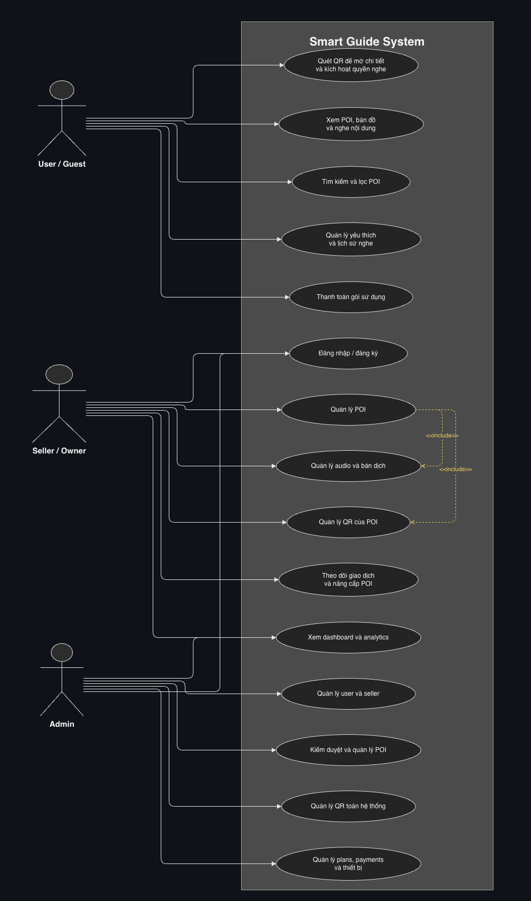

### 9.2. Use Case User / Guest

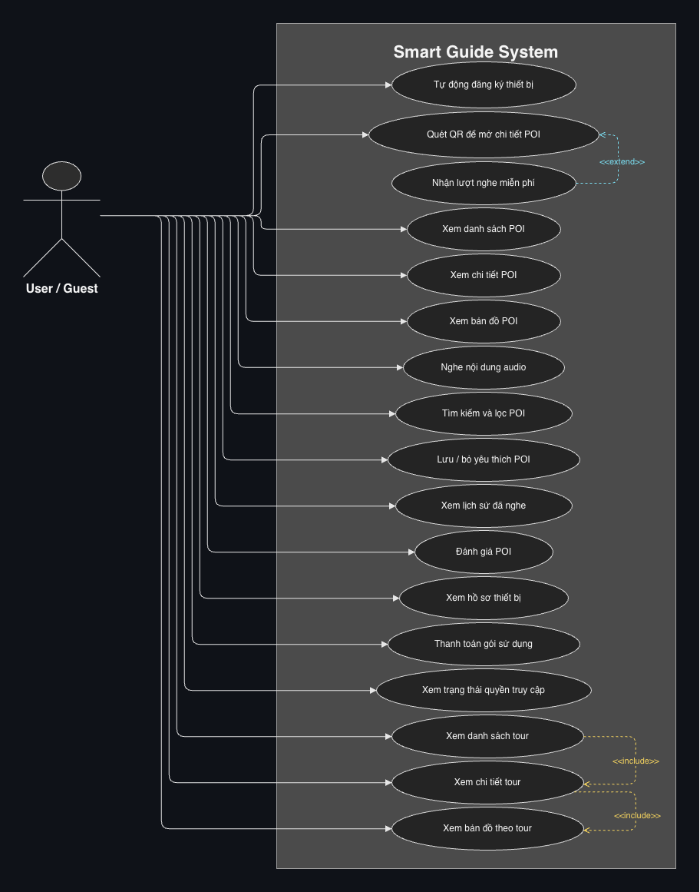

### 9.3. Use Case Seller / Owner

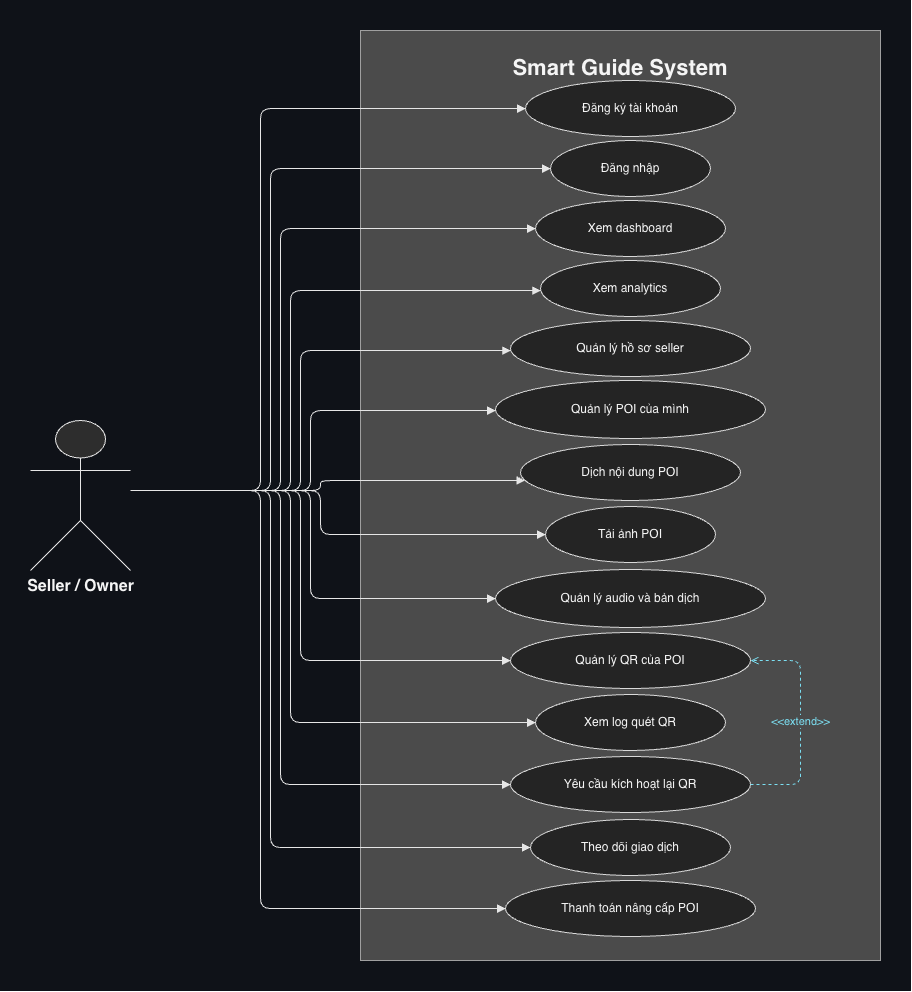

### 9.4. Use Case Admin

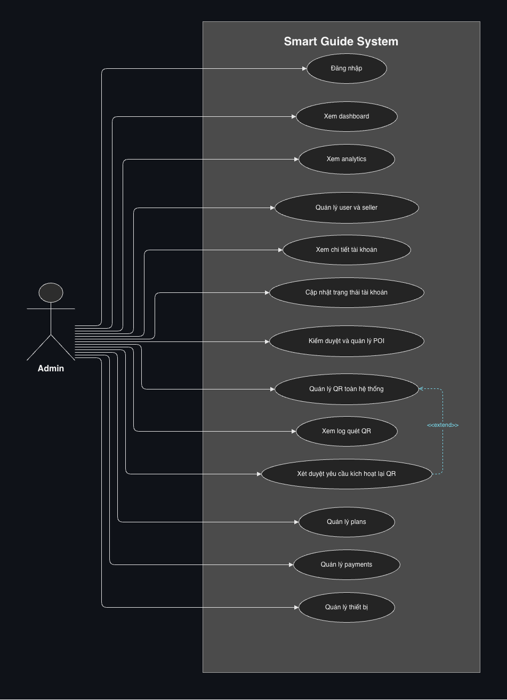

### 9.5. Use Case Thanh Toán Và Kích Hoạt Quyền Truy Cập

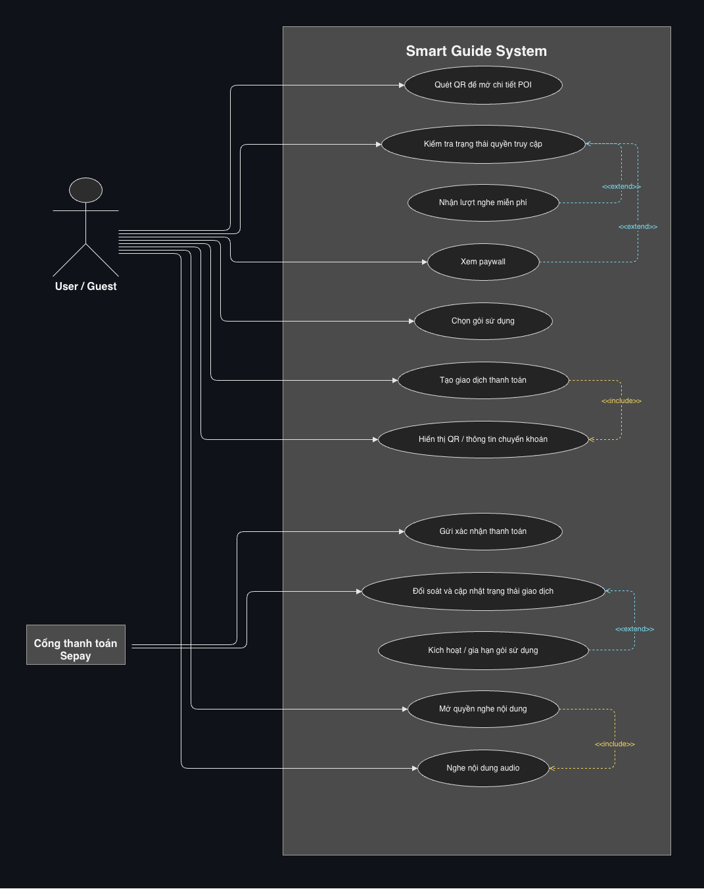

---

## 10. Sơ Đồ Trình Tự (Sequence Diagram)

### 10.1. Sequence Tự Động Đăng Ký Thiết Bị

> Bao gồm các trường hợp: tạo `deviceUuid` lần đầu, tái sử dụng thiết bị theo `deviceUuid`, nhận diện lại theo `fingerprint`, tái liên kết thiết bị đang còn gói sử dụng, tạo thiết bị mới và chặn truy cập nếu thiết bị bị khóa.

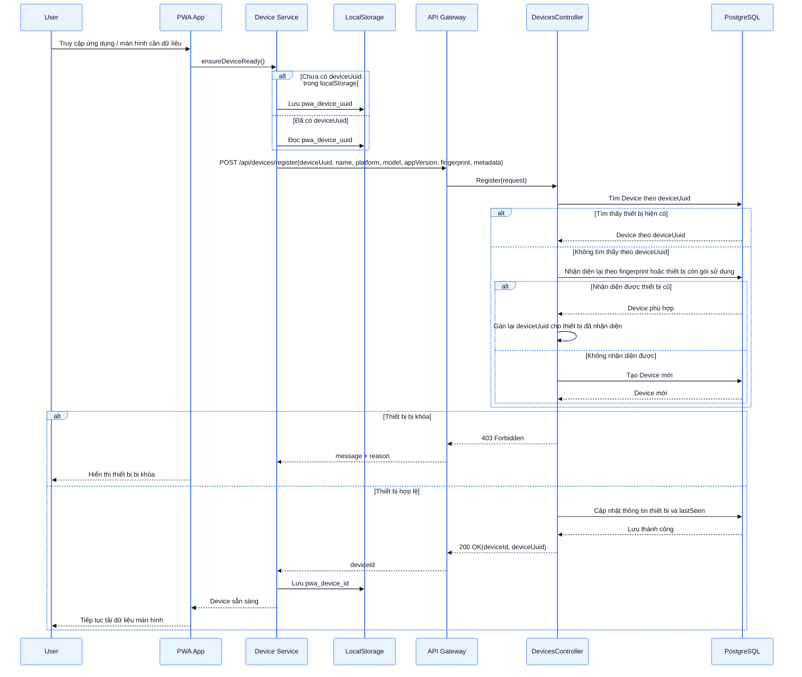
```mermaid
%%{init: {
  "theme": "base",
  "themeVariables": {
    "primaryColor": "#EAF4FF",
    "primaryBorderColor": "#2563EB",
    "primaryTextColor": "#0F172A",
    "lineColor": "#2563EB",
    "secondaryColor": "#DBEAFE",
    "tertiaryColor": "#F8FBFF",
    "noteBkgColor": "#EFF6FF",
    "noteBorderColor": "#3B82F6",
    "activationBorderColor": "#2563EB",
    "activationBkgColor": "#DBEAFE",
    "sequenceNumberColor": "#0F172A"
  }
}}%%
sequenceDiagram
    participant User as User
    participant PWA as PWA App
    participant DeviceLib as Device Service
    participant Storage as LocalStorage
    participant API as API Gateway
    participant DevicesCtl as DevicesController
    participant DB as PostgreSQL

    User ->> PWA: Truy cập ứng dụng / màn hình cần dữ liệu
    PWA ->> DeviceLib: ensureDeviceReady()

    alt Chưa có deviceUuid trong localStorage
        DeviceLib ->> Storage: Lưu pwa_device_uuid
    else Đã có deviceUuid
        DeviceLib ->> Storage: Đọc pwa_device_uuid
    end

    DeviceLib ->> API: POST /api/devices/register(deviceUuid, name, platform, model, appVersion, fingerprint, metadata)
    API ->> DevicesCtl: Register(request)
    DevicesCtl ->> DB: Tìm Device theo deviceUuid

    alt Tìm thấy thiết bị hiện có
        DB -->> DevicesCtl: Device theo deviceUuid
    else Không tìm thấy theo deviceUuid
        DevicesCtl ->> DB: Nhận diện lại theo fingerprint hoặc thiết bị còn gói sử dụng

        alt Nhận diện được thiết bị cũ
            DB -->> DevicesCtl: Device phù hợp
            DevicesCtl ->> DevicesCtl: Gán lại deviceUuid cho thiết bị đã nhận diện
        else Không nhận diện được
            DevicesCtl ->> DB: Tạo Device mới
            DB -->> DevicesCtl: Device mới
        end
    end

    alt Thiết bị bị khóa
        DevicesCtl -->> API: 403 Forbidden
        API -->> DeviceLib: message + reason
        PWA -->> User: Hiển thị thiết bị bị khóa
    else Thiết bị hợp lệ
        DevicesCtl ->> DB: Cập nhật thông tin thiết bị và lastSeen
        DB -->> DevicesCtl: Lưu thành công
        DevicesCtl -->> API: 200 OK(deviceId, deviceUuid)
        API -->> DeviceLib: deviceId
        DeviceLib ->> Storage: Lưu pwa_device_id
        DeviceLib -->> PWA: Device sẵn sàng
        PWA -->> User: Tiếp tục tải dữ liệu màn hình
    end
```

### 10.2. Sequence Device Heartbeat Và Khôi Phục Trạng Thái

> Luồng này bổ sung cho sequence đăng ký thiết bị, mô tả cách PWA gửi heartbeat định kỳ để cập nhật `lastSeen`, đồng thời xử lý các trường hợp thiết bị bị khóa, bị người dùng xóa hoặc cần đăng ký lại từ đầu.

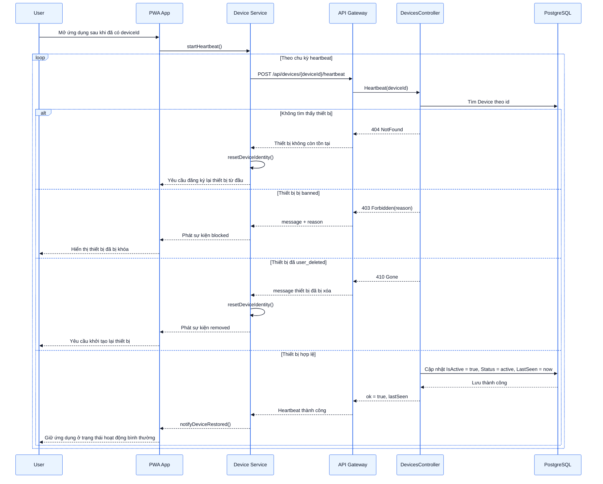
```mermaid
%%{init: {
  "theme": "base",
  "themeVariables": {
    "primaryColor": "#EAF4FF",
    "primaryBorderColor": "#2563EB",
    "primaryTextColor": "#0F172A",
    "lineColor": "#2563EB",
    "secondaryColor": "#DBEAFE",
    "tertiaryColor": "#F8FBFF",
    "noteBkgColor": "#EFF6FF",
    "noteBorderColor": "#3B82F6",
    "activationBorderColor": "#2563EB",
    "activationBkgColor": "#DBEAFE",
    "sequenceNumberColor": "#0F172A"
  }
}}%%
sequenceDiagram
    participant User as User
    participant PWA as PWA App
    participant DeviceLib as Device Service
    participant API as API Gateway
    participant DevicesCtl as DevicesController
    participant DB as PostgreSQL

    User ->> PWA: Mở ứng dụng sau khi đã có deviceId
    PWA ->> DeviceLib: startHeartbeat()

    loop Theo chu kỳ heartbeat
        DeviceLib ->> API: POST /api/devices/{deviceId}/heartbeat
        API ->> DevicesCtl: Heartbeat(deviceId)
        DevicesCtl ->> DB: Tìm Device theo id

        alt Không tìm thấy thiết bị
            DevicesCtl -->> API: 404 NotFound
            API -->> DeviceLib: Thiết bị không còn tồn tại
            DeviceLib ->> DeviceLib: resetDeviceIdentity()
            DeviceLib -->> PWA: Yêu cầu đăng ký lại thiết bị từ đầu
        else Thiết bị bị banned
            DevicesCtl -->> API: 403 Forbidden(reason)
            API -->> DeviceLib: message + reason
            DeviceLib -->> PWA: Phát sự kiện blocked
            PWA -->> User: Hiển thị thiết bị đã bị khóa
        else Thiết bị đã user_deleted
            DevicesCtl -->> API: 410 Gone
            API -->> DeviceLib: message thiết bị đã bị xóa
            DeviceLib ->> DeviceLib: resetDeviceIdentity()
            DeviceLib -->> PWA: Phát sự kiện removed
            PWA -->> User: Yêu cầu khởi tạo lại thiết bị
        else Thiết bị hợp lệ
            DevicesCtl ->> DB: Cập nhật IsActive = true, Status = active, LastSeen = now
            DB -->> DevicesCtl: Lưu thành công
            DevicesCtl -->> API: ok = true, lastSeen
            API -->> DeviceLib: Heartbeat thành công
            DeviceLib -->> PWA: notifyDeviceRestored()
            PWA -->> User: Giữ ứng dụng ở trạng thái hoạt động bình thường
        end
    end
```

### 10.3. Sequence Tìm Kiếm Và Lọc POI

> Bao gồm các trường hợp: người dùng tải danh sách POI, nhập từ khóa tìm kiếm, lọc theo khoảng cách hoặc giá miễn phí và sắp xếp lại kết quả hiển thị.

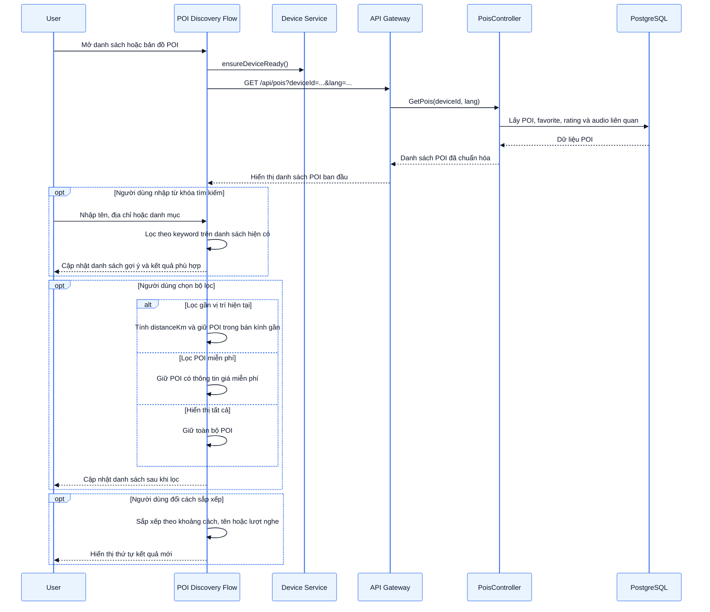
```mermaid
%%{init: {
  "theme": "base",
  "themeVariables": {
    "primaryColor": "#EAF4FF",
    "primaryBorderColor": "#2563EB",
    "primaryTextColor": "#0F172A",
    "lineColor": "#2563EB",
    "secondaryColor": "#DBEAFE",
    "tertiaryColor": "#F8FBFF",
    "noteBkgColor": "#EFF6FF",
    "noteBorderColor": "#3B82F6",
    "activationBorderColor": "#2563EB",
    "activationBkgColor": "#DBEAFE",
    "sequenceNumberColor": "#0F172A"
  }
}}%%
sequenceDiagram
    participant User as User
    participant ExploreFlow as POI Discovery Flow
    participant DeviceSvc as Device Service
    participant API as API Gateway
    participant PoiCtl as PoisController
    participant DB as PostgreSQL

    User ->> ExploreFlow: Mở danh sách hoặc bản đồ POI
    ExploreFlow ->> DeviceSvc: ensureDeviceReady()
    ExploreFlow ->> API: GET /api/pois?deviceId=...&lang=...
    API ->> PoiCtl: GetPois(deviceId, lang)
    PoiCtl ->> DB: Lấy POI, favorite, rating và audio liên quan
    DB -->> PoiCtl: Dữ liệu POI
    PoiCtl -->> API: Danh sách POI đã chuẩn hóa
    API -->> ExploreFlow: Hiển thị danh sách POI ban đầu

    opt Người dùng nhập từ khóa tìm kiếm
        User ->> ExploreFlow: Nhập tên, địa chỉ hoặc danh mục
        ExploreFlow ->> ExploreFlow: Lọc theo keyword trên danh sách hiện có
        ExploreFlow -->> User: Cập nhật danh sách gợi ý và kết quả phù hợp
    end

    opt Người dùng chọn bộ lọc
        alt Lọc gần vị trí hiện tại
            ExploreFlow ->> ExploreFlow: Tính distanceKm và giữ POI trong bán kính gần
        else Lọc POI miễn phí
            ExploreFlow ->> ExploreFlow: Giữ POI có thông tin giá miễn phí
        else Hiển thị tất cả
            ExploreFlow ->> ExploreFlow: Giữ toàn bộ POI
        end
        ExploreFlow -->> User: Cập nhật danh sách sau khi lọc
    end

    opt Người dùng đổi cách sắp xếp
        ExploreFlow ->> ExploreFlow: Sắp xếp theo khoảng cách, tên hoặc lượt nghe
        ExploreFlow -->> User: Hiển thị thứ tự kết quả mới
    end
```

### 10.4. Sequence Quét QR Và Cấp Lượt Nghe Miễn Phí

> Bao gồm các trường hợp: QR không hợp lệ, QR bị tạm ngưng, QR hết lượt hoặc hết hạn, thiết bị đã có gói sử dụng, thiết bị đã dùng lượt nghe miễn phí trước đó và thiết bị mới được cấp lượt nghe miễn phí.

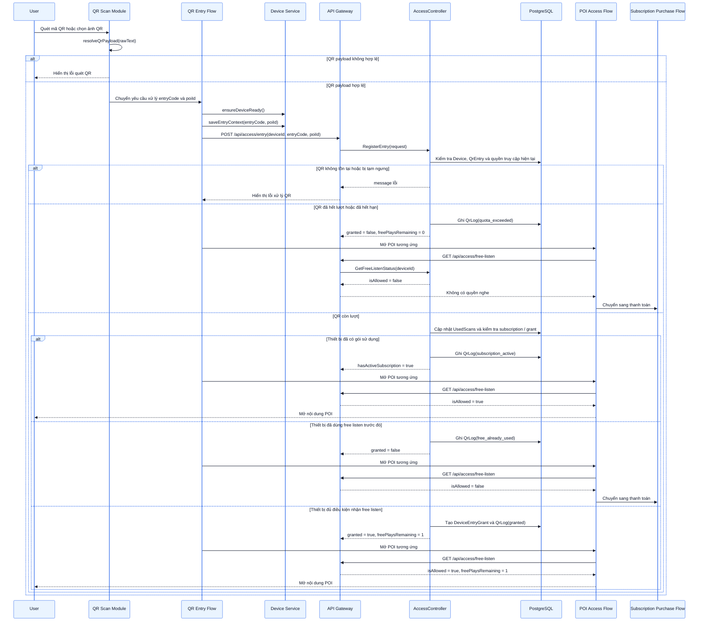
```mermaid
%%{init: {
  "theme": "base",
  "themeVariables": {
    "primaryColor": "#EAF4FF",
    "primaryBorderColor": "#2563EB",
    "primaryTextColor": "#0F172A",
    "lineColor": "#2563EB",
    "secondaryColor": "#DBEAFE",
    "tertiaryColor": "#F8FBFF",
    "noteBkgColor": "#EFF6FF",
    "noteBorderColor": "#3B82F6",
    "activationBorderColor": "#2563EB",
    "activationBkgColor": "#DBEAFE",
    "sequenceNumberColor": "#0F172A"
  }
}}%%
sequenceDiagram
    participant User as User
    participant Scanner as QR Scan Module
    participant EntryFlow as QR Entry Flow
    participant DeviceLib as Device Service
    participant API as API Gateway
    participant AccessCtl as AccessController
    participant DB as PostgreSQL
    participant ContentFlow as POI Access Flow
    participant PaymentFlow as Subscription Purchase Flow

    User ->> Scanner: Quét mã QR hoặc chọn ảnh QR
    Scanner ->> Scanner: resolveQrPayload(rawText)

    alt QR payload không hợp lệ
        Scanner -->> User: Hiển thị lỗi quét QR
    else QR payload hợp lệ
        Scanner ->> EntryFlow: Chuyển yêu cầu xử lý entryCode và poiId
        EntryFlow ->> DeviceLib: ensureDeviceReady()
        EntryFlow ->> DeviceLib: saveEntryContext(entryCode, poiId)
        EntryFlow ->> API: POST /api/access/entry(deviceId, entryCode, poiId)
        API ->> AccessCtl: RegisterEntry(request)
        AccessCtl ->> DB: Kiểm tra Device, QrEntry và quyền truy cập hiện tại

        alt QR không tồn tại hoặc bị tạm ngưng
            AccessCtl -->> API: message lỗi
            API -->> EntryFlow: Hiển thị lỗi xử lý QR
        else QR đã hết lượt hoặc đã hết hạn
            AccessCtl ->> DB: Ghi QrLog(quota_exceeded)
            AccessCtl -->> API: granted = false, freePlaysRemaining = 0
            EntryFlow ->> ContentFlow: Mở POI tương ứng
            ContentFlow ->> API: GET /api/access/free-listen
            API ->> AccessCtl: GetFreeListenStatus(deviceId)
            AccessCtl -->> API: isAllowed = false
            API -->> ContentFlow: Không có quyền nghe
            ContentFlow ->> PaymentFlow: Chuyển sang thanh toán
        else QR còn lượt
            AccessCtl ->> DB: Cập nhật UsedScans và kiểm tra subscription / grant

            alt Thiết bị đã có gói sử dụng
                AccessCtl ->> DB: Ghi QrLog(subscription_active)
                AccessCtl -->> API: hasActiveSubscription = true
                EntryFlow ->> ContentFlow: Mở POI tương ứng
                ContentFlow ->> API: GET /api/access/free-listen
                API -->> ContentFlow: isAllowed = true
                ContentFlow -->> User: Mở nội dung POI
            else Thiết bị đã dùng free listen trước đó
                AccessCtl ->> DB: Ghi QrLog(free_already_used)
                AccessCtl -->> API: granted = false
                EntryFlow ->> ContentFlow: Mở POI tương ứng
                ContentFlow ->> API: GET /api/access/free-listen
                API -->> ContentFlow: isAllowed = false
                ContentFlow ->> PaymentFlow: Chuyển sang thanh toán
            else Thiết bị đủ điều kiện nhận free listen
                AccessCtl ->> DB: Tạo DeviceEntryGrant và QrLog(granted)
                AccessCtl -->> API: granted = true, freePlaysRemaining = 1
                EntryFlow ->> ContentFlow: Mở POI tương ứng
                ContentFlow ->> API: GET /api/access/free-listen
                API -->> ContentFlow: isAllowed = true, freePlaysRemaining = 1
                ContentFlow -->> User: Mở nội dung POI
            end
        end
    end
```

### 10.5. Sequence Kiểm Tra Quyền Truy Cập Và Phát Audio

> Bao gồm các trường hợp: tải màn chi tiết, kiểm tra gói sử dụng hoặc lượt nghe miễn phí, chuyển sang paywall khi không đủ quyền, phát audio, tiêu thụ lượt nghe miễn phí và cập nhật số lượt nghe của POI.

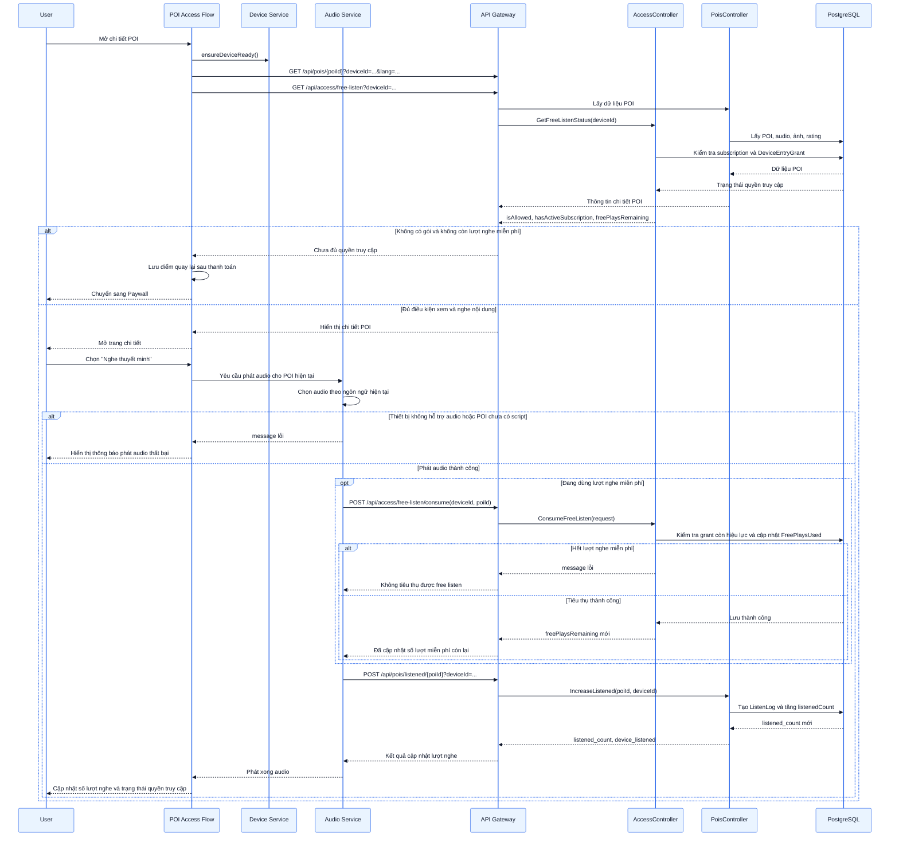
```mermaid
%%{init: {
  "theme": "base",
  "themeVariables": {
    "primaryColor": "#EAF4FF",
    "primaryBorderColor": "#2563EB",
    "primaryTextColor": "#0F172A",
    "lineColor": "#2563EB",
    "secondaryColor": "#DBEAFE",
    "tertiaryColor": "#F8FBFF",
    "noteBkgColor": "#EFF6FF",
    "noteBorderColor": "#3B82F6",
    "activationBorderColor": "#2563EB",
    "activationBkgColor": "#DBEAFE",
    "sequenceNumberColor": "#0F172A"
  }
}}%%
sequenceDiagram
    participant User as User
    participant DetailPage as POI Access Flow
    participant DeviceLib as Device Service
    participant AudioSvc as Audio Service
    participant API as API Gateway
    participant AccessCtl as AccessController
    participant PoiCtl as PoisController
    participant DB as PostgreSQL

    User ->> DetailPage: Mở chi tiết POI
    DetailPage ->> DeviceLib: ensureDeviceReady()
    DetailPage ->> API: GET /api/pois/{poiId}?deviceId=...&lang=...
    DetailPage ->> API: GET /api/access/free-listen?deviceId=...
    API ->> PoiCtl: Lấy dữ liệu POI
    API ->> AccessCtl: GetFreeListenStatus(deviceId)
    PoiCtl ->> DB: Lấy POI, audio, ảnh, rating
    AccessCtl ->> DB: Kiểm tra subscription và DeviceEntryGrant
    DB -->> PoiCtl: Dữ liệu POI
    DB -->> AccessCtl: Trạng thái quyền truy cập
    PoiCtl -->> API: Thông tin chi tiết POI
    AccessCtl -->> API: isAllowed, hasActiveSubscription, freePlaysRemaining

    alt Không có gói và không còn lượt nghe miễn phí
        API -->> DetailPage: Chưa đủ quyền truy cập
        DetailPage ->> DetailPage: Lưu điểm quay lại sau thanh toán
        DetailPage -->> User: Chuyển sang Paywall
    else Đủ điều kiện xem và nghe nội dung
        API -->> DetailPage: Hiển thị chi tiết POI
        DetailPage -->> User: Mở trang chi tiết

        User ->> DetailPage: Chọn "Nghe thuyết minh"
        DetailPage ->> AudioSvc: Yêu cầu phát audio cho POI hiện tại
        AudioSvc ->> AudioSvc: Chọn audio theo ngôn ngữ hiện tại

        alt Thiết bị không hỗ trợ audio hoặc POI chưa có script
            AudioSvc -->> DetailPage: message lỗi
            DetailPage -->> User: Hiển thị thông báo phát audio thất bại
        else Phát audio thành công
            opt Đang dùng lượt nghe miễn phí
                AudioSvc ->> API: POST /api/access/free-listen/consume(deviceId, poiId)
                API ->> AccessCtl: ConsumeFreeListen(request)
                AccessCtl ->> DB: Kiểm tra grant còn hiệu lực và cập nhật FreePlaysUsed

                alt Hết lượt nghe miễn phí
                    AccessCtl -->> API: message lỗi
                    API -->> AudioSvc: Không tiêu thụ được free listen
                else Tiêu thụ thành công
                    DB -->> AccessCtl: Lưu thành công
                    AccessCtl -->> API: freePlaysRemaining mới
                    API -->> AudioSvc: Đã cập nhật số lượt miễn phí còn lại
                end
            end

            AudioSvc ->> API: POST /api/pois/listened/{poiId}?deviceId=...
            API ->> PoiCtl: IncreaseListened(poiId, deviceId)
            PoiCtl ->> DB: Tạo ListenLog và tăng listenedCount
            DB -->> PoiCtl: listened_count mới
            PoiCtl -->> API: listened_count, device_listened
            API -->> AudioSvc: Kết quả cập nhật lượt nghe
            AudioSvc -->> DetailPage: Phát xong audio
            DetailPage -->> User: Cập nhật số lượt nghe và trạng thái quyền truy cập
        end
    end
```

### 10.6. Sequence Theo Dõi Vị Trí Và Tự Động Phát Audio

> Bao gồm các trường hợp: bật tracking, lấy vị trí định kỳ, chọn POI phù hợp trong vùng bán kính, ưu tiên POI mục tiêu từ QR, tự động phát audio và tắt tracking khi phát thất bại.

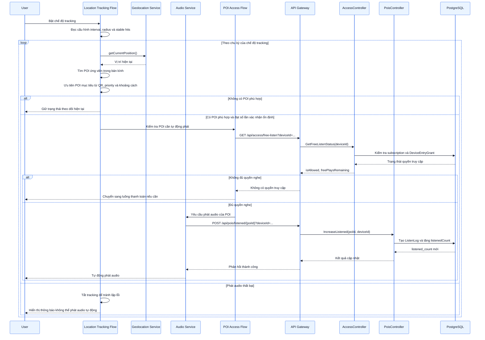
```mermaid
%%{init: {
  "theme": "base",
  "themeVariables": {
    "primaryColor": "#EAF4FF",
    "primaryBorderColor": "#2563EB",
    "primaryTextColor": "#0F172A",
    "lineColor": "#2563EB",
    "secondaryColor": "#DBEAFE",
    "tertiaryColor": "#F8FBFF",
    "noteBkgColor": "#EFF6FF",
    "noteBorderColor": "#3B82F6",
    "activationBorderColor": "#2563EB",
    "activationBkgColor": "#DBEAFE",
    "sequenceNumberColor": "#0F172A"
  }
}}%%
sequenceDiagram
    participant User as User
    participant TrackingFlow as Location Tracking Flow
    participant GPS as Geolocation Service
    participant AudioSvc as Audio Service
    participant AccessFlow as POI Access Flow
    participant API as API Gateway
    participant AccessCtl as AccessController
    participant PoiCtl as PoisController
    participant DB as PostgreSQL

    User ->> TrackingFlow: Bật chế độ tracking
    TrackingFlow ->> TrackingFlow: Đọc cấu hình interval, radius và stable hits

    loop Theo chu kỳ của chế độ tracking
        TrackingFlow ->> GPS: getCurrentPosition()
        GPS -->> TrackingFlow: Vị trí hiện tại
        TrackingFlow ->> TrackingFlow: Tìm POI ứng viên trong bán kính
        TrackingFlow ->> TrackingFlow: Ưu tiên POI mục tiêu từ QR, priority và khoảng cách

        alt Không có POI phù hợp
            TrackingFlow -->> User: Giữ trạng thái theo dõi hiện tại
        else Có POI phù hợp và đạt số lần xác nhận ổn định
            TrackingFlow ->> AccessFlow: Kiểm tra POI cần tự động phát
            AccessFlow ->> API: GET /api/access/free-listen?deviceId=...
            API ->> AccessCtl: GetFreeListenStatus(deviceId)
            AccessCtl ->> DB: Kiểm tra subscription và DeviceEntryGrant
            DB -->> AccessCtl: Trạng thái quyền truy cập
            AccessCtl -->> API: isAllowed, freePlaysRemaining

            alt Không đủ quyền nghe
                API -->> AccessFlow: Không có quyền truy cập
                AccessFlow -->> User: Chuyển sang luồng thanh toán nếu cần
            else Đủ quyền nghe
                AccessFlow ->> AudioSvc: Yêu cầu phát audio của POI
                AudioSvc ->> API: POST /api/pois/listened/{poiId}?deviceId=...
                API ->> PoiCtl: IncreaseListened(poiId, deviceId)
                PoiCtl ->> DB: Tạo ListenLog và tăng listenedCount
                DB -->> PoiCtl: listened_count mới
                PoiCtl -->> API: Kết quả cập nhật
                API -->> AudioSvc: Phản hồi thành công
                AudioSvc -->> User: Tự động phát audio
            end
        else Phát audio thất bại
            TrackingFlow ->> TrackingFlow: Tắt tracking để tránh lặp lỗi
            TrackingFlow -->> User: Hiển thị thông báo không thể phát audio tự động
        end
    end
```

### 10.7. Sequence User Lưu Và Bỏ Yêu Thích POI

> Bao gồm các trường hợp: người dùng đánh dấu POI yêu thích, hủy yêu thích, thiết bị không hợp lệ và cập nhật lại danh sách yêu thích trong hồ sơ.

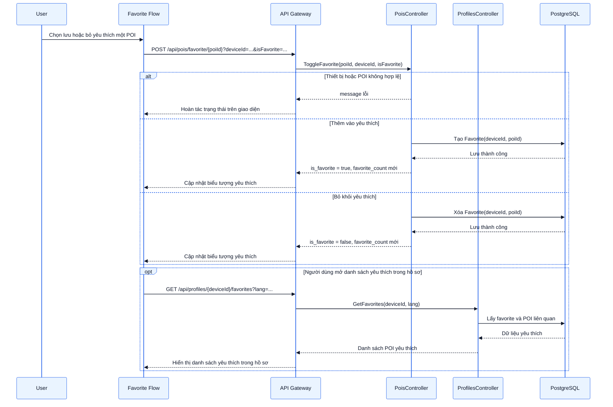
```mermaid
%%{init: {
  "theme": "base",
  "themeVariables": {
    "primaryColor": "#EAF4FF",
    "primaryBorderColor": "#2563EB",
    "primaryTextColor": "#0F172A",
    "lineColor": "#2563EB",
    "secondaryColor": "#DBEAFE",
    "tertiaryColor": "#F8FBFF",
    "noteBkgColor": "#EFF6FF",
    "noteBorderColor": "#3B82F6",
    "activationBorderColor": "#2563EB",
    "activationBkgColor": "#DBEAFE",
    "sequenceNumberColor": "#0F172A"
  }
}}%%
sequenceDiagram
    participant User as User
    participant FavoriteFlow as Favorite Flow
    participant API as API Gateway
    participant PoiCtl as PoisController
    participant ProfileCtl as ProfilesController
    participant DB as PostgreSQL

    User ->> FavoriteFlow: Chọn lưu hoặc bỏ yêu thích một POI
    FavoriteFlow ->> API: POST /api/pois/favorite/{poiId}?deviceId=...&isFavorite=...
    API ->> PoiCtl: ToggleFavorite(poiId, deviceId, isFavorite)

    alt Thiết bị hoặc POI không hợp lệ
        PoiCtl -->> API: message lỗi
        API -->> FavoriteFlow: Hoàn tác trạng thái trên giao diện
    else Thêm vào yêu thích
        PoiCtl ->> DB: Tạo Favorite(deviceId, poiId)
        DB -->> PoiCtl: Lưu thành công
        PoiCtl -->> API: is_favorite = true, favorite_count mới
        API -->> FavoriteFlow: Cập nhật biểu tượng yêu thích
    else Bỏ khỏi yêu thích
        PoiCtl ->> DB: Xóa Favorite(deviceId, poiId)
        DB -->> PoiCtl: Lưu thành công
        PoiCtl -->> API: is_favorite = false, favorite_count mới
        API -->> FavoriteFlow: Cập nhật biểu tượng yêu thích
    end

    opt Người dùng mở danh sách yêu thích trong hồ sơ
        FavoriteFlow ->> API: GET /api/profiles/{deviceId}/favorites?lang=...
        API ->> ProfileCtl: GetFavorites(deviceId, lang)
        ProfileCtl ->> DB: Lấy favorite và POI liên quan
        DB -->> ProfileCtl: Dữ liệu yêu thích
        ProfileCtl -->> API: Danh sách POI yêu thích
        API -->> FavoriteFlow: Hiển thị danh sách yêu thích trong hồ sơ
    end
```

### 10.8. Sequence User Đánh Giá POI

> Bao gồm các trường hợp: gửi đánh giá mới, cập nhật đánh giá cũ, dữ liệu đánh giá không hợp lệ và cập nhật lại thống kê rating của POI.

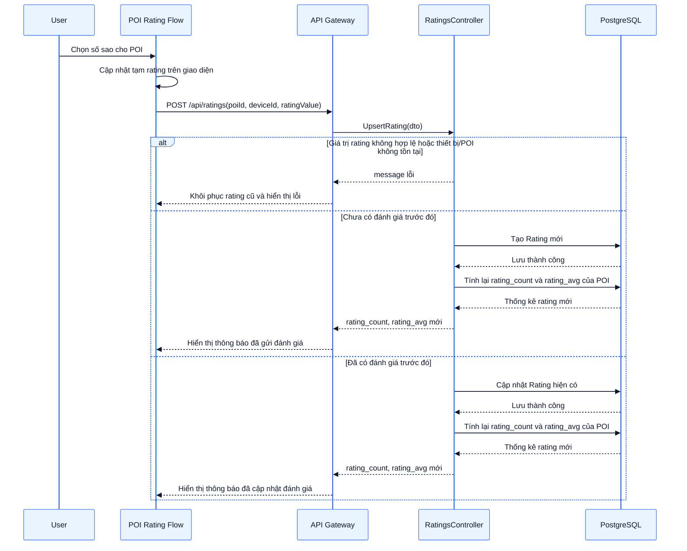
```mermaid
%%{init: {
  "theme": "base",
  "themeVariables": {
    "primaryColor": "#EAF4FF",
    "primaryBorderColor": "#2563EB",
    "primaryTextColor": "#0F172A",
    "lineColor": "#2563EB",
    "secondaryColor": "#DBEAFE",
    "tertiaryColor": "#F8FBFF",
    "noteBkgColor": "#EFF6FF",
    "noteBorderColor": "#3B82F6",
    "activationBorderColor": "#2563EB",
    "activationBkgColor": "#DBEAFE",
    "sequenceNumberColor": "#0F172A"
  }
}}%%
sequenceDiagram
    participant User as User
    participant RatingFlow as POI Rating Flow
    participant API as API Gateway
    participant RatingsCtl as RatingsController
    participant DB as PostgreSQL

    User ->> RatingFlow: Chọn số sao cho POI
    RatingFlow ->> RatingFlow: Cập nhật tạm rating trên giao diện
    RatingFlow ->> API: POST /api/ratings(poiId, deviceId, ratingValue)
    API ->> RatingsCtl: UpsertRating(dto)

    alt Giá trị rating không hợp lệ hoặc thiết bị/POI không tồn tại
        RatingsCtl -->> API: message lỗi
        API -->> RatingFlow: Khôi phục rating cũ và hiển thị lỗi
    else Chưa có đánh giá trước đó
        RatingsCtl ->> DB: Tạo Rating mới
        DB -->> RatingsCtl: Lưu thành công
        RatingsCtl ->> DB: Tính lại rating_count và rating_avg của POI
        DB -->> RatingsCtl: Thống kê rating mới
        RatingsCtl -->> API: rating_count, rating_avg mới
        API -->> RatingFlow: Hiển thị thông báo đã gửi đánh giá
    else Đã có đánh giá trước đó
        RatingsCtl ->> DB: Cập nhật Rating hiện có
        DB -->> RatingsCtl: Lưu thành công
        RatingsCtl ->> DB: Tính lại rating_count và rating_avg của POI
        DB -->> RatingsCtl: Thống kê rating mới
        RatingsCtl -->> API: rating_count, rating_avg mới
        API -->> RatingFlow: Hiển thị thông báo đã cập nhật đánh giá
    end
```

### 10.9. Sequence PWA Profile, Yêu Thích, Lịch Sử Và Thanh Toán

> Luồng này mô tả màn profile hiện tại của PWA: tải summary thiết bị, kiểm tra gói đang hoạt động, mở lịch sử nghe, danh sách yêu thích và lịch sử thanh toán; đồng thời phản ánh việc POI có thể bị khóa hoặc bị ẩn khỏi hệ thống.

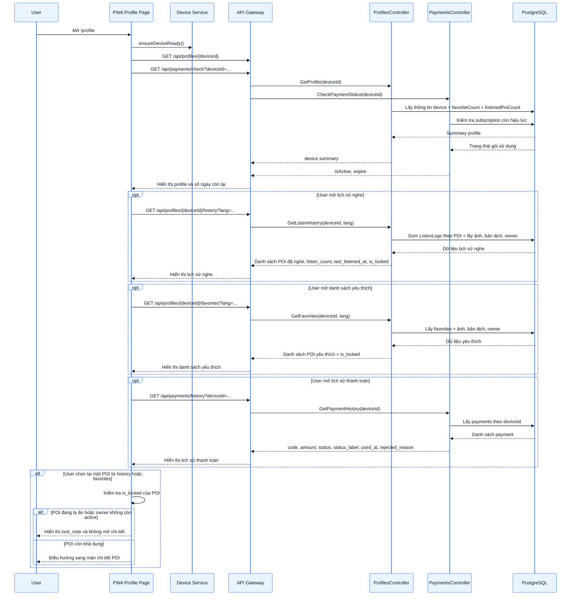
```mermaid
%%{init: {
  "theme": "base",
  "themeVariables": {
    "primaryColor": "#EAF4FF",
    "primaryBorderColor": "#2563EB",
    "primaryTextColor": "#0F172A",
    "lineColor": "#2563EB",
    "secondaryColor": "#DBEAFE",
    "tertiaryColor": "#F8FBFF",
    "noteBkgColor": "#EFF6FF",
    "noteBorderColor": "#3B82F6",
    "activationBorderColor": "#2563EB",
    "activationBkgColor": "#DBEAFE",
    "sequenceNumberColor": "#0F172A"
  }
}}%%
sequenceDiagram
    participant User as User
    participant ProfilePage as PWA Profile Page
    participant DeviceLib as Device Service
    participant API as API Gateway
    participant ProfilesCtl as ProfilesController
    participant PaymentsCtl as PaymentsController
    participant DB as PostgreSQL

    User ->> ProfilePage: Mở /profile
    ProfilePage ->> DeviceLib: ensureDeviceReady()
    ProfilePage ->> API: GET /api/profiles/{deviceId}
    ProfilePage ->> API: GET /api/payments/check?deviceId=...
    API ->> ProfilesCtl: GetProfile(deviceId)
    API ->> PaymentsCtl: CheckPaymentStatus(deviceId)
    ProfilesCtl ->> DB: Lấy thông tin device + favoriteCount + listenedPoiCount
    PaymentsCtl ->> DB: Kiểm tra subscription còn hiệu lực
    DB -->> ProfilesCtl: Summary profile
    DB -->> PaymentsCtl: Trạng thái gói sử dụng
    ProfilesCtl -->> API: device summary
    PaymentsCtl -->> API: isActive, expire
    API -->> ProfilePage: Hiển thị profile và số ngày còn lại

    opt User mở lịch sử nghe
        ProfilePage ->> API: GET /api/profiles/{deviceId}/history?lang=...
        API ->> ProfilesCtl: GetListenHistory(deviceId, lang)
        ProfilesCtl ->> DB: Gom ListenLogs theo POI + lấy ảnh, bản dịch, owner
        DB -->> ProfilesCtl: Dữ liệu lịch sử nghe
        ProfilesCtl -->> API: Danh sách POI đã nghe, listen_count, last_listened_at, is_locked
        API -->> ProfilePage: Hiển thị lịch sử nghe
    end

    opt User mở danh sách yêu thích
        ProfilePage ->> API: GET /api/profiles/{deviceId}/favorites?lang=...
        API ->> ProfilesCtl: GetFavorites(deviceId, lang)
        ProfilesCtl ->> DB: Lấy favorites + ảnh, bản dịch, owner
        DB -->> ProfilesCtl: Dữ liệu yêu thích
        ProfilesCtl -->> API: Danh sách POI yêu thích + is_locked
        API -->> ProfilePage: Hiển thị danh sách yêu thích
    end

    opt User mở lịch sử thanh toán
        ProfilePage ->> API: GET /api/payments/history?deviceId=...
        API ->> PaymentsCtl: GetPaymentHistory(deviceId)
        PaymentsCtl ->> DB: Lấy payments theo deviceId
        DB -->> PaymentsCtl: Danh sách payment
        PaymentsCtl -->> API: code, amount, status, status_label, used_at, rejected_reason
        API -->> ProfilePage: Hiển thị lịch sử thanh toán
    end

    alt User chọn lại một POI từ history hoặc favorites
        ProfilePage ->> ProfilePage: Kiểm tra is_locked của POI
        alt POI đang bị ẩn hoặc owner không còn active
            ProfilePage -->> User: Hiển thị lock_note và không mở chi tiết
        else POI còn khả dụng
            ProfilePage -->> User: Điều hướng sang màn chi tiết POI
        end
    end
```

### 10.10. Sequence Thanh Toán Gói Người Dùng

> Bao gồm các trường hợp: thiết bị không hợp lệ, plan không tồn tại, tạo giao dịch thành công, polling trạng thái giao dịch, người dùng chủ động xác nhận đã thanh toán, giao dịch được đồng bộ thành công, giao dịch chưa được ghi nhận và giao dịch hết thời gian chờ.

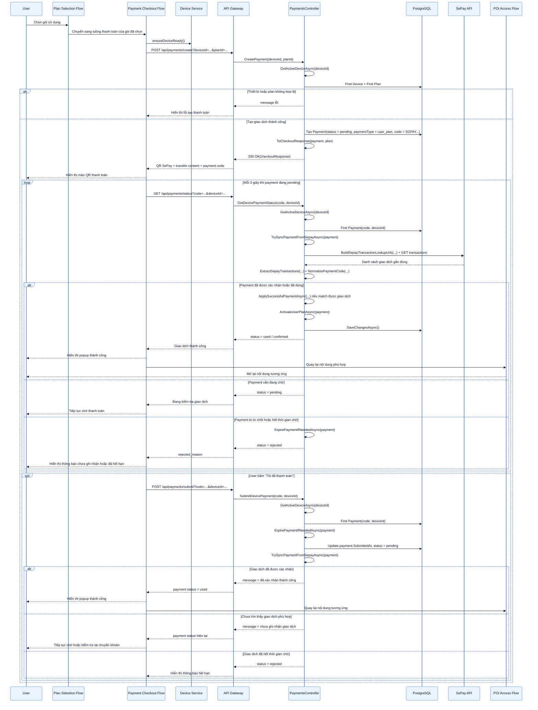
```mermaid
%%{init: {
  "theme": "base",
  "themeVariables": {
    "primaryColor": "#EAF4FF",
    "primaryBorderColor": "#2563EB",
    "primaryTextColor": "#0F172A",
    "lineColor": "#2563EB",
    "secondaryColor": "#DBEAFE",
    "tertiaryColor": "#F8FBFF",
    "noteBkgColor": "#EFF6FF",
    "noteBorderColor": "#3B82F6",
    "activationBorderColor": "#2563EB",
    "activationBkgColor": "#DBEAFE",
    "sequenceNumberColor": "#0F172A"
  }
}}%%
sequenceDiagram
    participant User as User
    participant Paywall as Plan Selection Flow
    participant PaymentPage as Payment Checkout Flow
    participant DeviceLib as Device Service
    participant API as API Gateway
    participant PaymentsCtl as PaymentsController
    participant DB as PostgreSQL
    participant Sepay as SePay API
    participant ContentFlow as POI Access Flow

    User ->> Paywall: Chọn gói sử dụng
    Paywall ->> PaymentPage: Chuyển sang luồng thanh toán của gói đã chọn
    PaymentPage ->> DeviceLib: ensureDeviceReady()
    PaymentPage ->> API: POST /api/payments/create?deviceId=...&planId=...
    API ->> PaymentsCtl: CreatePayment(deviceId, planId)
    PaymentsCtl ->> PaymentsCtl: GetActiveDeviceAsync(deviceId)
    PaymentsCtl ->> DB: Find Device + Find Plan

    alt Thiết bị hoặc plan không hợp lệ
        PaymentsCtl -->> API: message lỗi
        API -->> PaymentPage: Hiển thị lỗi tạo thanh toán
    else Tạo giao dịch thành công
        PaymentsCtl ->> DB: Tạo Payment(status = pending, paymentType = user_plan, code = SGPAY...)
        PaymentsCtl ->> PaymentsCtl: ToCheckoutResponse(payment, plan)
        PaymentsCtl -->> API: 200 OK(checkoutResponse)
        API -->> PaymentPage: QR SePay + transfer content + payment code
        PaymentPage -->> User: Hiển thị màn QR thanh toán

        loop Mỗi 3 giây khi payment đang pending
            PaymentPage ->> API: GET /api/payments/status?code=...&deviceId=...
            API ->> PaymentsCtl: GetDevicePaymentStatus(code, deviceId)
            PaymentsCtl ->> PaymentsCtl: GetActiveDeviceAsync(deviceId)
            PaymentsCtl ->> DB: Find Payment(code, deviceId)
            PaymentsCtl ->> PaymentsCtl: TrySyncPaymentFromSepayAsync(payment)
            PaymentsCtl ->> Sepay: BuildSepayTransactionLookupUrls(...) + GET transactions
            Sepay -->> PaymentsCtl: Danh sách giao dịch gần đúng
            PaymentsCtl ->> PaymentsCtl: ExtractSepayTransactions(...) + NormalizePaymentCode(...)

            alt Payment đã được xác nhận hoặc đã dùng
                PaymentsCtl ->> PaymentsCtl: ApplySuccessfulPaymentAsync(...) nếu match được giao dịch
                PaymentsCtl ->> PaymentsCtl: ActivateUserPlanAsync(payment)
                PaymentsCtl ->> DB: SaveChangesAsync()
                PaymentsCtl -->> API: status = used / confirmed
                API -->> PaymentPage: Giao dịch thành công
                PaymentPage -->> User: Hiển thị popup thành công
                PaymentPage ->> ContentFlow: Quay lại nội dung phù hợp
                ContentFlow -->> User: Mở lại nội dung tương ứng
            else Payment vẫn đang chờ
                PaymentsCtl -->> API: status = pending
                API -->> PaymentPage: Đang kiểm tra giao dịch
                PaymentPage -->> User: Tiếp tục chờ thanh toán
            else Payment bị từ chối hoặc hết thời gian chờ
                PaymentsCtl ->> PaymentsCtl: ExpirePaymentIfNeededAsync(payment)
                PaymentsCtl -->> API: status = rejected
                API -->> PaymentPage: rejected_reason
                PaymentPage -->> User: Hiển thị thông báo chưa ghi nhận hoặc đã hết hạn
            end
        end

        opt User bấm "Tôi đã thanh toán"
            PaymentPage ->> API: POST /api/payments/submit?code=...&deviceId=...
            API ->> PaymentsCtl: SubmitDevicePayment(code, deviceId)
            PaymentsCtl ->> PaymentsCtl: GetActiveDeviceAsync(deviceId)
            PaymentsCtl ->> DB: Find Payment(code, deviceId)
            PaymentsCtl ->> PaymentsCtl: ExpirePaymentIfNeededAsync(payment)
            PaymentsCtl ->> DB: Update payment.SubmittedAt, status = pending
            PaymentsCtl ->> PaymentsCtl: TrySyncPaymentFromSepayAsync(payment)

            alt Giao dịch đã được xác nhận
                PaymentsCtl -->> API: message = đã xác nhận thành công
                API -->> PaymentPage: payment status = used
                PaymentPage -->> User: Hiển thị popup thành công
                PaymentPage ->> ContentFlow: Quay lại nội dung tương ứng
            else Chưa tìm thấy giao dịch phù hợp
                PaymentsCtl -->> API: message = chưa ghi nhận giao dịch
                API -->> PaymentPage: payment status hiện tại
                PaymentPage -->> User: Tiếp tục chờ hoặc kiểm tra lại chuyển khoản
            else Giao dịch đã hết thời gian chờ
                PaymentsCtl -->> API: status = rejected
                API -->> PaymentPage: Hiển thị thông báo hết hạn
            end
        end
    end
```

### 10.11. Sequence Webhook Xác Nhận Thanh Toán

> Bao gồm các trường hợp: webhook không hợp lệ, không tìm thấy mã thanh toán, không tìm thấy payment tương ứng, payment đã được xử lý trước đó, số tiền chuyển chưa đủ và xác nhận thanh toán thành công để kích hoạt gói người dùng.

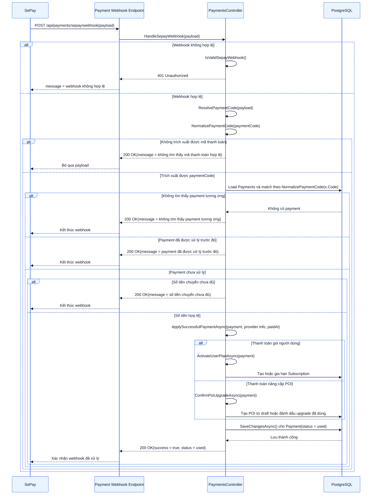
```mermaid
%%{init: {
  "theme": "base",
  "themeVariables": {
    "primaryColor": "#EAF4FF",
    "primaryBorderColor": "#2563EB",
    "primaryTextColor": "#0F172A",
    "lineColor": "#2563EB",
    "secondaryColor": "#DBEAFE",
    "tertiaryColor": "#F8FBFF",
    "noteBkgColor": "#EFF6FF",
    "noteBorderColor": "#3B82F6",
    "activationBorderColor": "#2563EB",
    "activationBkgColor": "#DBEAFE",
    "sequenceNumberColor": "#0F172A"
  }
}}%%
sequenceDiagram
    participant Sepay as SePay
    participant API as Payment Webhook Endpoint
    participant PaymentsCtl as PaymentsController
    participant DB as PostgreSQL

    Sepay ->> API: POST /api/payments/sepay/webhook(payload)
    API ->> PaymentsCtl: HandleSepayWebhook(payload)

    alt Webhook không hợp lệ
        PaymentsCtl ->> PaymentsCtl: IsValidSepayWebhook()
        PaymentsCtl -->> API: 401 Unauthorized
        API -->> Sepay: message = webhook không hợp lệ
    else Webhook hợp lệ
        PaymentsCtl ->> PaymentsCtl: ResolvePaymentCode(payload)
        PaymentsCtl ->> PaymentsCtl: NormalizePaymentCode(paymentCode)
        alt Không trích xuất được mã thanh toán
            PaymentsCtl -->> API: 200 OK(message = không tìm thấy mã thanh toán hợp lệ)
            API -->> Sepay: Bỏ qua payload
        else Trích xuất được paymentCode
            PaymentsCtl ->> DB: Load Payments và match theo NormalizePaymentCode(x.Code)

            alt Không tìm thấy payment tương ứng
                DB -->> PaymentsCtl: Không có payment
                PaymentsCtl -->> API: 200 OK(message = không tìm thấy payment tương ứng)
                API -->> Sepay: Kết thúc webhook
            else Payment đã được xử lý trước đó
                PaymentsCtl -->> API: 200 OK(message = payment đã được xử lý trước đó)
                API -->> Sepay: Kết thúc webhook
            else Payment chưa xử lý
                alt Số tiền chuyển chưa đủ
                    PaymentsCtl -->> API: 200 OK(message = số tiền chuyển chưa đủ)
                    API -->> Sepay: Kết thúc webhook
                else Số tiền hợp lệ
                    PaymentsCtl ->> PaymentsCtl: ApplySuccessfulPaymentAsync(payment, provider info, paidAt)

                    alt Thanh toán gói người dùng
                        PaymentsCtl ->> PaymentsCtl: ActivateUserPlanAsync(payment)
                        PaymentsCtl ->> DB: Tạo hoặc gia hạn Subscription
                    else Thanh toán nâng cấp POI
                        PaymentsCtl ->> PaymentsCtl: ConfirmPoiUpgradeAsync(payment)
                        PaymentsCtl ->> DB: Tạo POI từ draft hoặc đánh dấu upgrade đã dùng
                    end

                    PaymentsCtl ->> DB: SaveChangesAsync() cho Payment(status = used)
                    DB -->> PaymentsCtl: Lưu thành công
                    PaymentsCtl -->> API: 200 OK(success = true, status = used)
                    API -->> Sepay: Xác nhận webhook đã xử lý
                end
            end
        end
    end
```

### 10.12. Sequence User Xem Tour Và Mở Bản Đồ

> Luồng này mô tả trải nghiệm mới ở PWA: tải danh sách tour, lấy chi tiết tour, lọc POI hợp lệ và mở bản đồ ở chế độ `tourId`.

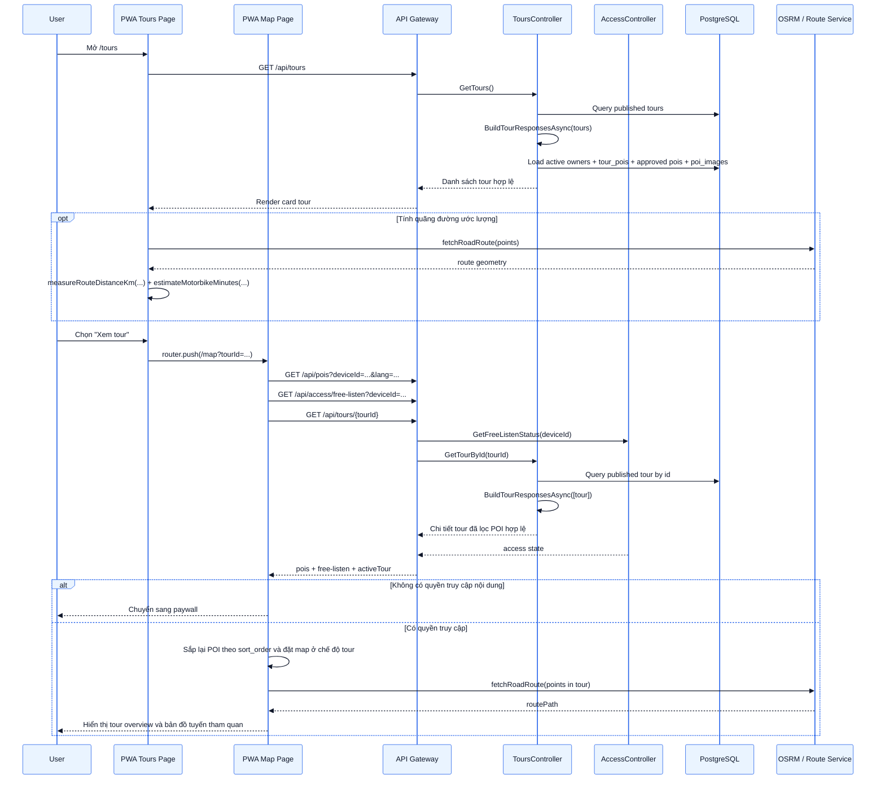
```mermaid
%%{init: {
  "theme": "base",
  "themeVariables": {
    "primaryColor": "#EAF4FF",
    "primaryBorderColor": "#2563EB",
    "primaryTextColor": "#0F172A",
    "lineColor": "#2563EB",
    "secondaryColor": "#DBEAFE",
    "tertiaryColor": "#F8FBFF",
    "noteBkgColor": "#EFF6FF",
    "noteBorderColor": "#3B82F6",
    "activationBorderColor": "#2563EB",
    "activationBkgColor": "#DBEAFE",
    "sequenceNumberColor": "#0F172A"
  }
}}%%
sequenceDiagram
    participant User as User
    participant ToursPage as PWA Tours Page
    participant MapPage as PWA Map Page
    participant API as API Gateway
    participant ToursCtl as ToursController
    participant AccessCtl as AccessController
    participant DB as PostgreSQL
    participant RouteSvc as OSRM / Route Service

    User ->> ToursPage: Mở /tours
    ToursPage ->> API: GET /api/tours
    API ->> ToursCtl: GetTours()
    ToursCtl ->> DB: Query published tours
    ToursCtl ->> ToursCtl: BuildTourResponsesAsync(tours)
    ToursCtl ->> DB: Load active owners + tour_pois + approved pois + poi_images
    ToursCtl -->> API: Danh sách tour hợp lệ
    API -->> ToursPage: Render card tour

    opt Tính quãng đường ước lượng
        ToursPage ->> RouteSvc: fetchRoadRoute(points)
        RouteSvc -->> ToursPage: route geometry
        ToursPage ->> ToursPage: measureRouteDistanceKm(...) + estimateMotorbikeMinutes(...)
    end

    User ->> ToursPage: Chọn "Xem tour"
    ToursPage ->> MapPage: router.push(/map?tourId=...)
    MapPage ->> API: GET /api/pois?deviceId=...&lang=...
    MapPage ->> API: GET /api/access/free-listen?deviceId=...
    MapPage ->> API: GET /api/tours/{tourId}
    API ->> AccessCtl: GetFreeListenStatus(deviceId)
    API ->> ToursCtl: GetTourById(tourId)
    ToursCtl ->> DB: Query published tour by id
    ToursCtl ->> ToursCtl: BuildTourResponsesAsync([tour])
    ToursCtl -->> API: Chi tiết tour đã lọc POI hợp lệ
    AccessCtl -->> API: access state
    API -->> MapPage: pois + free-listen + activeTour

    alt Không có quyền truy cập nội dung
        MapPage -->> User: Chuyển sang paywall
    else Có quyền truy cập
        MapPage ->> MapPage: Sắp lại POI theo sort_order và đặt map ở chế độ tour
        MapPage ->> RouteSvc: fetchRoadRoute(points in tour)
        RouteSvc -->> MapPage: routePath
        MapPage -->> User: Hiển thị tour overview và bản đồ tuyến tham quan
    end
```

### 10.13. Sequence PWA Theo Dõi Tour Và Tự Động Phát

> Luồng này tách riêng nhánh theo dõi tour trong PWA: sau khi mở tour ở bản đồ, user bật chế độ theo dõi, hệ thống xác định POI kế tiếp theo `sort_order`, vẽ tuyến đường và tự động phát audio khi đến gần điểm phù hợp.

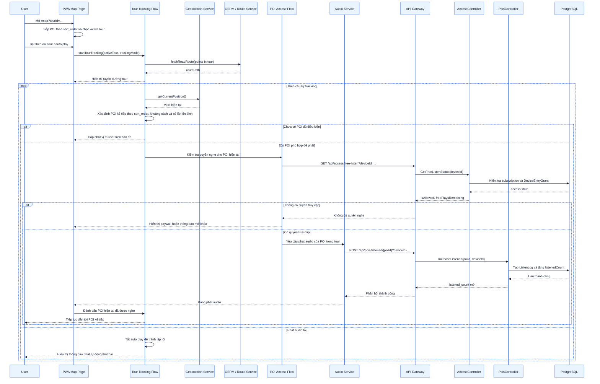
```mermaid
%%{init: {
  "theme": "base",
  "themeVariables": {
    "primaryColor": "#EAF4FF",
    "primaryBorderColor": "#2563EB",
    "primaryTextColor": "#0F172A",
    "lineColor": "#2563EB",
    "secondaryColor": "#DBEAFE",
    "tertiaryColor": "#F8FBFF",
    "noteBkgColor": "#EFF6FF",
    "noteBorderColor": "#3B82F6",
    "activationBorderColor": "#2563EB",
    "activationBkgColor": "#DBEAFE",
    "sequenceNumberColor": "#0F172A"
  }
}}%%
sequenceDiagram
    participant User as User
    participant MapPage as PWA Map Page
    participant TrackingFlow as Tour Tracking Flow
    participant GPS as Geolocation Service
    participant RouteSvc as OSRM / Route Service
    participant AccessFlow as POI Access Flow
    participant AudioSvc as Audio Service
    participant API as API Gateway
    participant AccessCtl as AccessController
    participant PoiCtl as PoisController
    participant DB as PostgreSQL

    User ->> MapPage: Mở /map?tourId=...
    MapPage ->> MapPage: Sắp POI theo sort_order và chọn activeTour
    User ->> MapPage: Bật theo dõi tour / auto play
    MapPage ->> TrackingFlow: startTourTracking(activeTour, trackingMode)
    TrackingFlow ->> RouteSvc: fetchRoadRoute(points in tour)
    RouteSvc -->> TrackingFlow: routePath
    TrackingFlow -->> MapPage: Hiển thị tuyến đường tour

    loop Theo chu kỳ tracking
        TrackingFlow ->> GPS: getCurrentPosition()
        GPS -->> TrackingFlow: Vị trí hiện tại
        TrackingFlow ->> TrackingFlow: Xác định POI kế tiếp theo sort_order, khoảng cách và số lần ổn định

        alt Chưa có POI đủ điều kiện
            TrackingFlow -->> MapPage: Cập nhật vị trí user trên bản đồ
        else Có POI phù hợp để phát
            TrackingFlow ->> AccessFlow: Kiểm tra quyền nghe cho POI hiện tại
            AccessFlow ->> API: GET /api/access/free-listen?deviceId=...
            API ->> AccessCtl: GetFreeListenStatus(deviceId)
            AccessCtl ->> DB: Kiểm tra subscription và DeviceEntryGrant
            DB -->> AccessCtl: access state
            AccessCtl -->> API: isAllowed, freePlaysRemaining

            alt Không có quyền truy cập
                API -->> AccessFlow: Không đủ quyền nghe
                AccessFlow -->> MapPage: Hiển thị paywall hoặc thông báo mở khóa
            else Có quyền truy cập
                AccessFlow ->> AudioSvc: Yêu cầu phát audio của POI trong tour
                AudioSvc ->> API: POST /api/pois/listened/{poiId}?deviceId=...
                API ->> PoiCtl: IncreaseListened(poiId, deviceId)
                PoiCtl ->> DB: Tạo ListenLog và tăng listenedCount
                DB -->> PoiCtl: Lưu thành công
                PoiCtl -->> API: listened_count mới
                API -->> AudioSvc: Phản hồi thành công
                AudioSvc -->> MapPage: Đang phát audio
                MapPage ->> TrackingFlow: Đánh dấu POI hiện tại đã được nghe
                TrackingFlow -->> User: Tiếp tục dẫn tới POI kế tiếp
            end
        else Phát audio lỗi
            TrackingFlow ->> TrackingFlow: Tắt auto play để tránh lặp lỗi
            TrackingFlow -->> User: Hiển thị thông báo phát tự động thất bại
        end
    end
```

### 10.14. Sequence Xác Thực Seller Và Admin

> Luồng này gom các nhánh xác thực chính hiện có trong hệ thống: đăng ký seller, đăng nhập seller và đăng nhập admin, bao gồm các trường hợp tài khoản sai vai trò, sai mật khẩu hoặc đã bị khóa.

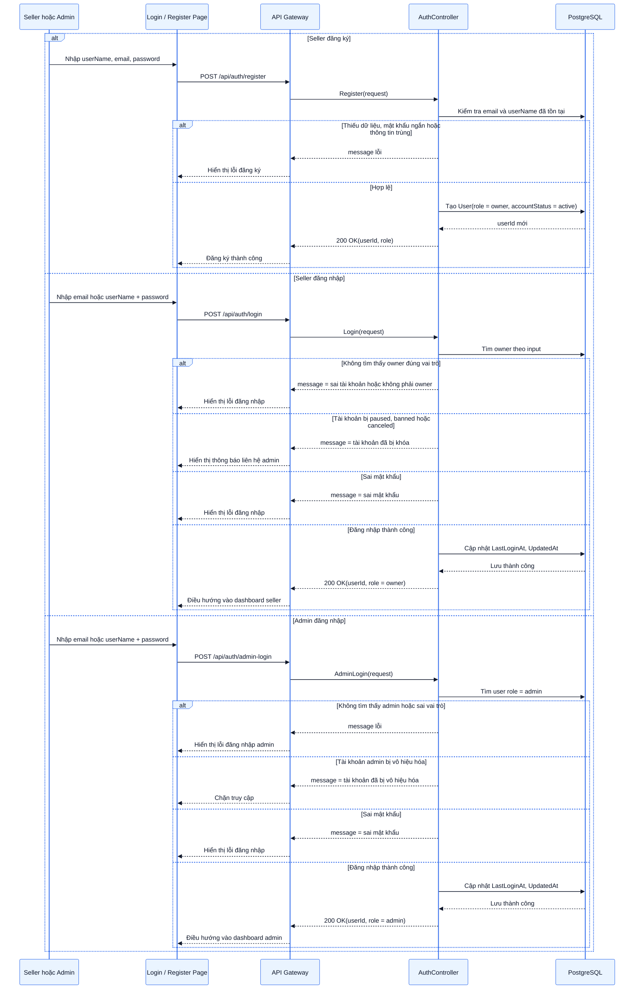
```mermaid
%%{init: {
  "theme": "base",
  "themeVariables": {
    "primaryColor": "#EAF4FF",
    "primaryBorderColor": "#2563EB",
    "primaryTextColor": "#0F172A",
    "lineColor": "#2563EB",
    "secondaryColor": "#DBEAFE",
    "tertiaryColor": "#F8FBFF",
    "noteBkgColor": "#EFF6FF",
    "noteBorderColor": "#3B82F6",
    "activationBorderColor": "#2563EB",
    "activationBkgColor": "#DBEAFE",
    "sequenceNumberColor": "#0F172A"
  }
}}%%
sequenceDiagram
    participant User as Seller hoặc Admin
    participant AuthPage as Login / Register Page
    participant API as API Gateway
    participant AuthCtl as AuthController
    participant DB as PostgreSQL

    alt Seller đăng ký
        User ->> AuthPage: Nhập userName, email, password
        AuthPage ->> API: POST /api/auth/register
        API ->> AuthCtl: Register(request)
        AuthCtl ->> DB: Kiểm tra email và userName đã tồn tại

        alt Thiếu dữ liệu, mật khẩu ngắn hoặc thông tin trùng
            AuthCtl -->> API: message lỗi
            API -->> AuthPage: Hiển thị lỗi đăng ký
        else Hợp lệ
            AuthCtl ->> DB: Tạo User(role = owner, accountStatus = active)
            DB -->> AuthCtl: userId mới
            AuthCtl -->> API: 200 OK(userId, role)
            API -->> AuthPage: Đăng ký thành công
        end
    else Seller đăng nhập
        User ->> AuthPage: Nhập email hoặc userName + password
        AuthPage ->> API: POST /api/auth/login
        API ->> AuthCtl: Login(request)
        AuthCtl ->> DB: Tìm owner theo input

        alt Không tìm thấy owner đúng vai trò
            AuthCtl -->> API: message = sai tài khoản hoặc không phải owner
            API -->> AuthPage: Hiển thị lỗi đăng nhập
        else Tài khoản bị paused, banned hoặc canceled
            AuthCtl -->> API: message = tài khoản đã bị khóa
            API -->> AuthPage: Hiển thị thông báo liên hệ admin
        else Sai mật khẩu
            AuthCtl -->> API: message = sai mật khẩu
            API -->> AuthPage: Hiển thị lỗi đăng nhập
        else Đăng nhập thành công
            AuthCtl ->> DB: Cập nhật LastLoginAt, UpdatedAt
            DB -->> AuthCtl: Lưu thành công
            AuthCtl -->> API: 200 OK(userId, role = owner)
            API -->> AuthPage: Điều hướng vào dashboard seller
        end
    else Admin đăng nhập
        User ->> AuthPage: Nhập email hoặc userName + password
        AuthPage ->> API: POST /api/auth/admin-login
        API ->> AuthCtl: AdminLogin(request)
        AuthCtl ->> DB: Tìm user role = admin

        alt Không tìm thấy admin hoặc sai vai trò
            AuthCtl -->> API: message lỗi
            API -->> AuthPage: Hiển thị lỗi đăng nhập admin
        else Tài khoản admin bị vô hiệu hóa
            AuthCtl -->> API: message = tài khoản đã bị vô hiệu hóa
            API -->> AuthPage: Chặn truy cập
        else Sai mật khẩu
            AuthCtl -->> API: message = sai mật khẩu
            API -->> AuthPage: Hiển thị lỗi đăng nhập
        else Đăng nhập thành công
            AuthCtl ->> DB: Cập nhật LastLoginAt, UpdatedAt
            DB -->> AuthCtl: Lưu thành công
            AuthCtl -->> API: 200 OK(userId, role = admin)
            API -->> AuthPage: Điều hướng vào dashboard admin
        end
    end
```

### 10.15. Sequence Seller Tạo POI

> Bao gồm các trường hợp: dữ liệu không hợp lệ, seller không đủ quyền, dịch nội dung thất bại có fallback, tạo POI thường không cần nâng cấp và tạo POI có phát sinh thanh toán nâng cấp.

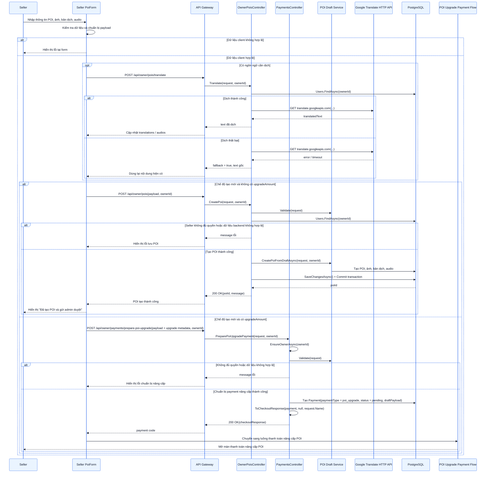
```mermaid
%%{init: {
  "theme": "base",
  "themeVariables": {
    "primaryColor": "#EAF4FF",
    "primaryBorderColor": "#2563EB",
    "primaryTextColor": "#0F172A",
    "lineColor": "#2563EB",
    "secondaryColor": "#DBEAFE",
    "tertiaryColor": "#F8FBFF",
    "noteBkgColor": "#EFF6FF",
    "noteBorderColor": "#3B82F6",
    "activationBorderColor": "#2563EB",
    "activationBkgColor": "#DBEAFE",
    "sequenceNumberColor": "#0F172A"
  }
}}%%
sequenceDiagram
    participant Seller as Seller
    participant PoiForm as Seller PoiForm
    participant API as API Gateway
    participant OwnerCtl as OwnerPoisController
    participant PaymentCtl as PaymentsController
    participant DraftSvc as POI Draft Service
    participant TranslateApi as Google Translate HTTP API
    participant DB as PostgreSQL
    participant UpgradePage as POI Upgrade Payment Flow

    Seller ->> PoiForm: Nhập thông tin POI, ảnh, bản dịch, audio
    PoiForm ->> PoiForm: Kiểm tra dữ liệu và chuẩn bị payload

    alt Dữ liệu client không hợp lệ
        PoiForm -->> Seller: Hiển thị lỗi tại form
    else Dữ liệu client hợp lệ
        opt Có ngôn ngữ cần dịch
            PoiForm ->> API: POST /api/owner/pois/translate
            API ->> OwnerCtl: Translate(request, ownerId)
            OwnerCtl ->> DB: Users.FindAsync(ownerId)

            alt Dịch thành công
                OwnerCtl ->> TranslateApi: GET translate.googleapis.com(...)
                TranslateApi -->> OwnerCtl: translatedText
                OwnerCtl -->> API: text đã dịch
                API -->> PoiForm: Cập nhật translations / audios
            else Dịch thất bại
                OwnerCtl ->> TranslateApi: GET translate.googleapis.com(...)
                TranslateApi -->> OwnerCtl: error / timeout
                OwnerCtl -->> API: fallback = true, text gốc
                API -->> PoiForm: Dùng lại nội dung hiện có
            end
        end

        alt Chế độ tạo mới và không có upgradeAmount
            PoiForm ->> API: POST /api/owner/pois(payload, ownerId)
            API ->> OwnerCtl: CreatePoi(request, ownerId)
            OwnerCtl ->> DraftSvc: Validate(request)
            OwnerCtl ->> DB: Users.FindAsync(ownerId)

            alt Seller không đủ quyền hoặc dữ liệu backend không hợp lệ
                OwnerCtl -->> API: message lỗi
                API -->> PoiForm: Hiển thị lỗi lưu POI
            else Tạo POI thành công
                OwnerCtl ->> DraftSvc: CreatePoiFromDraftAsync(request, ownerId)
                DraftSvc ->> DB: Tạo POI, ảnh, bản dịch, audio
                OwnerCtl ->> DB: SaveChangesAsync() + Commit transaction
                DB -->> OwnerCtl: poiId
                OwnerCtl -->> API: 200 OK(poiId, message)
                API -->> PoiForm: POI tạo thành công
                PoiForm -->> Seller: Hiển thị "Đã tạo POI và gửi admin duyệt"
            end
        else Chế độ tạo mới và có upgradeAmount
            PoiForm ->> API: POST /api/owner/payments/prepare-poi-upgrade(payload + upgrade metadata, ownerId)
            API ->> PaymentCtl: PreparePoiUpgradePayment(request, ownerId)
            PaymentCtl ->> PaymentCtl: EnsureOwnerAsync(ownerId)
            PaymentCtl ->> DraftSvc: Validate(request)

            alt Không đủ quyền hoặc dữ liệu không hợp lệ
                PaymentCtl -->> API: message lỗi
                API -->> PoiForm: Hiển thị lỗi chuẩn bị nâng cấp
            else Chuẩn bị payment nâng cấp thành công
                PaymentCtl ->> DB: Tạo Payment(paymentType = poi_upgrade, status = pending, draftPayload)
                PaymentCtl ->> PaymentCtl: ToCheckoutResponse(payment, null, request.Name)
                PaymentCtl -->> API: 200 OK(checkoutResponse)
                API -->> PoiForm: payment code
                PoiForm ->> UpgradePage: Chuyển sang luồng thanh toán nâng cấp POI
                UpgradePage -->> Seller: Mở màn thanh toán nâng cấp POI
            end
        end
    end
```

### 10.16. Sequence Seller Upload Ảnh POI

> Luồng này cập nhật theo implementation hiện tại của `OwnerPoisController.UploadPoiImages(...)` và `MediaStorageService.UploadImageAsync(...)`, bao gồm cả nhánh dùng Cloudinary và nhánh fallback lưu local.

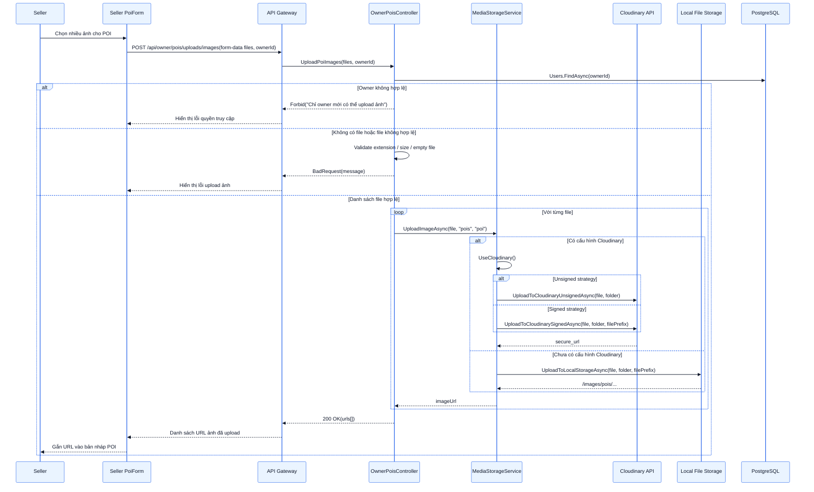
```mermaid
%%{init: {
  "theme": "base",
  "themeVariables": {
    "primaryColor": "#EAF4FF",
    "primaryBorderColor": "#2563EB",
    "primaryTextColor": "#0F172A",
    "lineColor": "#2563EB",
    "secondaryColor": "#DBEAFE",
    "tertiaryColor": "#F8FBFF",
    "noteBkgColor": "#EFF6FF",
    "noteBorderColor": "#3B82F6",
    "activationBorderColor": "#2563EB",
    "activationBkgColor": "#DBEAFE",
    "sequenceNumberColor": "#0F172A"
  }
}}%%
sequenceDiagram
    participant Seller as Seller
    participant PoiForm as Seller PoiForm
    participant API as API Gateway
    participant OwnerCtl as OwnerPoisController
    participant MediaSvc as MediaStorageService
    participant Cloudinary as Cloudinary API
    participant FileStore as Local File Storage
    participant DB as PostgreSQL

    Seller ->> PoiForm: Chọn nhiều ảnh cho POI
    PoiForm ->> API: POST /api/owner/pois/uploads/images(form-data files, ownerId)
    API ->> OwnerCtl: UploadPoiImages(files, ownerId)
    OwnerCtl ->> DB: Users.FindAsync(ownerId)

    alt Owner không hợp lệ
        OwnerCtl -->> API: Forbid("Chỉ owner mới có thể upload ảnh")
        API -->> PoiForm: Hiển thị lỗi quyền truy cập
    else Không có file hoặc file không hợp lệ
        OwnerCtl ->> OwnerCtl: Validate extension / size / empty file
        OwnerCtl -->> API: BadRequest(message)
        API -->> PoiForm: Hiển thị lỗi upload ảnh
    else Danh sách file hợp lệ
        loop Với từng file
            OwnerCtl ->> MediaSvc: UploadImageAsync(file, "pois", "poi")

            alt Có cấu hình Cloudinary
                MediaSvc ->> MediaSvc: UseCloudinary()
                alt Unsigned strategy
                    MediaSvc ->> Cloudinary: UploadToCloudinaryUnsignedAsync(file, folder)
                else Signed strategy
                    MediaSvc ->> Cloudinary: UploadToCloudinarySignedAsync(file, folder, filePrefix)
                end
                Cloudinary -->> MediaSvc: secure_url
            else Chưa có cấu hình Cloudinary
                MediaSvc ->> FileStore: UploadToLocalStorageAsync(file, folder, filePrefix)
                FileStore -->> MediaSvc: /images/pois/...
            end

            MediaSvc -->> OwnerCtl: imageUrl
        end

        OwnerCtl -->> API: 200 OK(urls[])
        API -->> PoiForm: Danh sách URL ảnh đã upload
        PoiForm -->> Seller: Gắn URL vào bản nháp POI
    end
```

### 10.17. Sequence Seller Chỉnh Sửa POI Và Gửi Duyệt Lại

> Bao gồm các trường hợp: seller mở POI cần sửa, cập nhật thông tin chính, ảnh, bản dịch, audio, lưu thay đổi thành công và đưa POI trở lại trạng thái chờ admin duyệt.

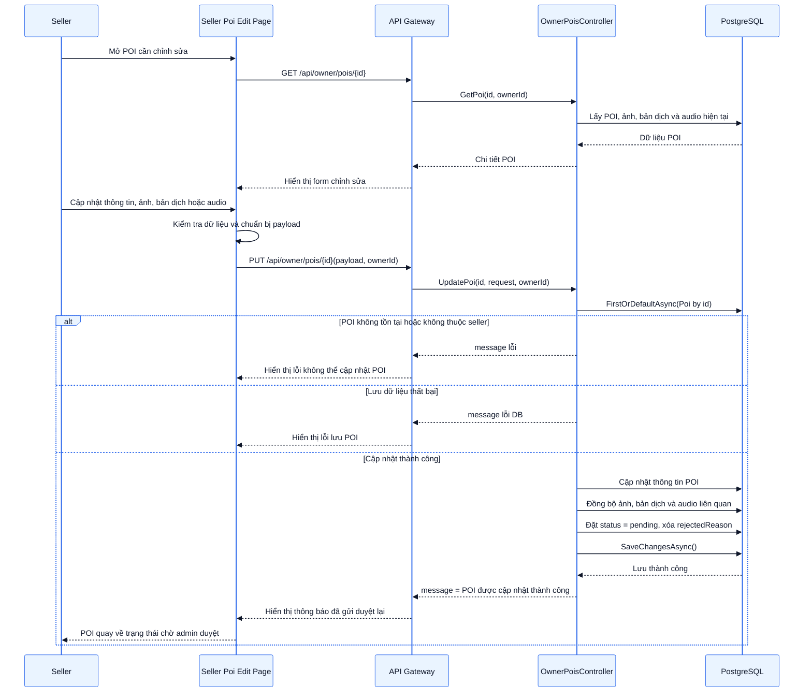
```mermaid
%%{init: {
  "theme": "base",
  "themeVariables": {
    "primaryColor": "#EAF4FF",
    "primaryBorderColor": "#2563EB",
    "primaryTextColor": "#0F172A",
    "lineColor": "#2563EB",
    "secondaryColor": "#DBEAFE",
    "tertiaryColor": "#F8FBFF",
    "noteBkgColor": "#EFF6FF",
    "noteBorderColor": "#3B82F6",
    "activationBorderColor": "#2563EB",
    "activationBkgColor": "#DBEAFE",
    "sequenceNumberColor": "#0F172A"
  }
}}%%
sequenceDiagram
    participant Seller as Seller
    participant EditFlow as Seller Poi Edit Page
    participant API as API Gateway
    participant OwnerCtl as OwnerPoisController
    participant DB as PostgreSQL

    Seller ->> EditFlow: Mở POI cần chỉnh sửa
    EditFlow ->> API: GET /api/owner/pois/{id}
    API ->> OwnerCtl: GetPoi(id, ownerId)
    OwnerCtl ->> DB: Lấy POI, ảnh, bản dịch và audio hiện tại
    DB -->> OwnerCtl: Dữ liệu POI
    OwnerCtl -->> API: Chi tiết POI
    API -->> EditFlow: Hiển thị form chỉnh sửa

    Seller ->> EditFlow: Cập nhật thông tin, ảnh, bản dịch hoặc audio
    EditFlow ->> EditFlow: Kiểm tra dữ liệu và chuẩn bị payload
    EditFlow ->> API: PUT /api/owner/pois/{id}(payload, ownerId)
    API ->> OwnerCtl: UpdatePoi(id, request, ownerId)
    OwnerCtl ->> DB: FirstOrDefaultAsync(Poi by id)

    alt POI không tồn tại hoặc không thuộc seller
        OwnerCtl -->> API: message lỗi
        API -->> EditFlow: Hiển thị lỗi không thể cập nhật POI
    else Lưu dữ liệu thất bại
        OwnerCtl -->> API: message lỗi DB
        API -->> EditFlow: Hiển thị lỗi lưu POI
    else Cập nhật thành công
        OwnerCtl ->> DB: Cập nhật thông tin POI
        OwnerCtl ->> DB: Đồng bộ ảnh, bản dịch và audio liên quan
        OwnerCtl ->> DB: Đặt status = pending, xóa rejectedReason
        OwnerCtl ->> DB: SaveChangesAsync()
        DB -->> OwnerCtl: Lưu thành công
        OwnerCtl -->> API: message = POI được cập nhật thành công
        API -->> EditFlow: Hiển thị thông báo đã gửi duyệt lại
        EditFlow -->> Seller: POI quay về trạng thái chờ admin duyệt
    end
```

### 10.18. Sequence Seller Cập Nhật Audio Và Bản Dịch

> Bao gồm các trường hợp: seller yêu cầu dịch nội dung cho nhiều ngôn ngữ, tạo audio mới, cập nhật audio hiện có, xóa audio và đưa audio về trạng thái chờ admin duyệt lại.

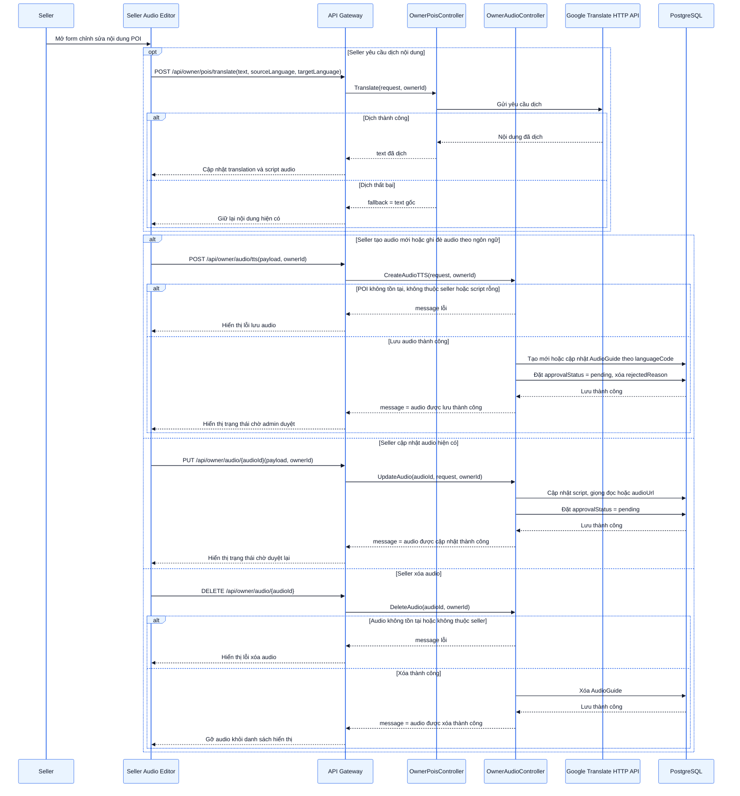
```mermaid
%%{init: {
  "theme": "base",
  "themeVariables": {
    "primaryColor": "#EAF4FF",
    "primaryBorderColor": "#2563EB",
    "primaryTextColor": "#0F172A",
    "lineColor": "#2563EB",
    "secondaryColor": "#DBEAFE",
    "tertiaryColor": "#F8FBFF",
    "noteBkgColor": "#EFF6FF",
    "noteBorderColor": "#3B82F6",
    "activationBorderColor": "#2563EB",
    "activationBkgColor": "#DBEAFE",
    "sequenceNumberColor": "#0F172A"
  }
}}%%
sequenceDiagram
    participant Seller as Seller
    participant ContentFlow as Seller Audio Editor
    participant API as API Gateway
    participant OwnerPoisCtl as OwnerPoisController
    participant OwnerAudioCtl as OwnerAudioController
    participant TranslateSvc as Google Translate HTTP API
    participant DB as PostgreSQL

    Seller ->> ContentFlow: Mở form chỉnh sửa nội dung POI

    opt Seller yêu cầu dịch nội dung
        ContentFlow ->> API: POST /api/owner/pois/translate(text, sourceLanguage, targetLanguage)
        API ->> OwnerPoisCtl: Translate(request, ownerId)
        OwnerPoisCtl ->> TranslateSvc: Gửi yêu cầu dịch

        alt Dịch thành công
            TranslateSvc -->> OwnerPoisCtl: Nội dung đã dịch
            OwnerPoisCtl -->> API: text đã dịch
            API -->> ContentFlow: Cập nhật translation và script audio
        else Dịch thất bại
            OwnerPoisCtl -->> API: fallback = text gốc
            API -->> ContentFlow: Giữ lại nội dung hiện có
        end
    end

    alt Seller tạo audio mới hoặc ghi đè audio theo ngôn ngữ
        ContentFlow ->> API: POST /api/owner/audio/tts(payload, ownerId)
        API ->> OwnerAudioCtl: CreateAudioTTS(request, ownerId)

        alt POI không tồn tại, không thuộc seller hoặc script rỗng
            OwnerAudioCtl -->> API: message lỗi
            API -->> ContentFlow: Hiển thị lỗi lưu audio
        else Lưu audio thành công
            OwnerAudioCtl ->> DB: Tạo mới hoặc cập nhật AudioGuide theo languageCode
            OwnerAudioCtl ->> DB: Đặt approvalStatus = pending, xóa rejectedReason
            DB -->> OwnerAudioCtl: Lưu thành công
            OwnerAudioCtl -->> API: message = audio được lưu thành công
            API -->> ContentFlow: Hiển thị trạng thái chờ admin duyệt
        end
    else Seller cập nhật audio hiện có
        ContentFlow ->> API: PUT /api/owner/audio/{audioId}(payload, ownerId)
        API ->> OwnerAudioCtl: UpdateAudio(audioId, request, ownerId)
        OwnerAudioCtl ->> DB: Cập nhật script, giọng đọc hoặc audioUrl
        OwnerAudioCtl ->> DB: Đặt approvalStatus = pending
        DB -->> OwnerAudioCtl: Lưu thành công
        OwnerAudioCtl -->> API: message = audio được cập nhật thành công
        API -->> ContentFlow: Hiển thị trạng thái chờ duyệt lại
    else Seller xóa audio
        ContentFlow ->> API: DELETE /api/owner/audio/{audioId}
        API ->> OwnerAudioCtl: DeleteAudio(audioId, ownerId)

        alt Audio không tồn tại hoặc không thuộc seller
            OwnerAudioCtl -->> API: message lỗi
            API -->> ContentFlow: Hiển thị lỗi xóa audio
        else Xóa thành công
            OwnerAudioCtl ->> DB: Xóa AudioGuide
            DB -->> OwnerAudioCtl: Lưu thành công
            OwnerAudioCtl -->> API: message = audio được xóa thành công
            API -->> ContentFlow: Gỡ audio khỏi danh sách hiển thị
        end
    end
```

### 10.19. Sequence Seller Tạo, Gia Hạn Và Kích Hoạt Lại QR

> Bao gồm các trường hợp: seller mở màn QR, tạo QR mới cho POI, cộng thêm lượt quét, bật hoặc tắt QR, gửi yêu cầu kích hoạt lại khi QR bị hệ thống tạm ngưng và xóa QR khỏi trang seller.


```mermaid
%%{init: {
  "theme": "base",
  "themeVariables": {
    "primaryColor": "#EAF4FF",
    "primaryBorderColor": "#2563EB",
    "primaryTextColor": "#0F172A",
    "lineColor": "#2563EB",
    "secondaryColor": "#DBEAFE",
    "tertiaryColor": "#F8FBFF",
    "noteBkgColor": "#EFF6FF",
    "noteBorderColor": "#3B82F6",
    "activationBorderColor": "#2563EB",
    "activationBkgColor": "#DBEAFE",
    "sequenceNumberColor": "#0F172A"
  }
}}%%
sequenceDiagram
    participant Seller as Seller
    participant SellerQrPage as Seller QR Page
    participant API as API Gateway
    participant OwnerQrCtl as OwnerQrController
    participant DB as PostgreSQL

    Seller ->> SellerQrPage: Truy cập trang quản lý QR
    SellerQrPage ->> API: GET /api/owner/qr?ownerId=...
    API ->> OwnerQrCtl: GetQrEntries(ownerId)
    OwnerQrCtl ->> DB: Lấy QR của seller, POI liên quan và log quét
    DB -->> OwnerQrCtl: Danh sách QR
    OwnerQrCtl -->> API: Dữ liệu QR
    API -->> SellerQrPage: Hiển thị danh sách QR

    alt Seller tạo QR mới
        Seller ->> SellerQrPage: Nhập POI, tên QR, số lượt quét
        SellerQrPage ->> API: POST /api/owner/qr(payload, ownerId)
        API ->> OwnerQrCtl: CreateQrEntry(request, ownerId)

        alt Seller không hợp lệ hoặc POI không hợp lệ
            OwnerQrCtl -->> API: message lỗi
            API -->> SellerQrPage: Hiển thị lỗi tạo QR
        else Tạo QR thành công
            OwnerQrCtl ->> DB: Tạo QrEntry(status = active, usedScans = 0)
            DB -->> OwnerQrCtl: entryCode, qrUrl
            OwnerQrCtl -->> API: 200 OK(message, qrUrl)
            API -->> SellerQrPage: Hiển thị QR mới
        end
    else Seller cộng thêm lượt quét
        Seller ->> SellerQrPage: Gửi yêu cầu topup QR
        SellerQrPage ->> API: PUT /api/owner/qr/{id}/topup(additionalScans)
        API ->> OwnerQrCtl: TopUpQrEntry(id, request, ownerId)

        alt QR không tồn tại hoặc số lượt cộng thêm không hợp lệ
            OwnerQrCtl -->> API: message lỗi
            API -->> SellerQrPage: Hiển thị lỗi gia hạn QR
        else QR đang bị admin_suspended
            OwnerQrCtl -->> API: message = cần gửi yêu cầu kích hoạt lại
            API -->> SellerQrPage: Hiển thị thông báo không thể topup trực tiếp
        else Gia hạn thành công
            OwnerQrCtl ->> DB: Cộng TotalScans, cập nhật trạng thái nếu cần
            DB -->> OwnerQrCtl: Lưu thành công
            OwnerQrCtl -->> API: message = đã gia hạn lượt quét
            API -->> SellerQrPage: Cập nhật số lượt còn lại
        end
    else Seller bật hoặc tắt QR
        Seller ->> SellerQrPage: Chọn chuyển trạng thái active/inactive
        SellerQrPage ->> API: PUT /api/owner/qr/{id}/status(status)
        API ->> OwnerQrCtl: UpdateQrEntryStatus(id, request, ownerId)

        alt QR không tồn tại hoặc trạng thái không hợp lệ
            OwnerQrCtl -->> API: message lỗi
            API -->> SellerQrPage: Hiển thị lỗi cập nhật trạng thái
        else QR bị hệ thống tạm ngưng và seller muốn bật lại
            OwnerQrCtl -->> API: message = cần gửi yêu cầu kích hoạt lại
            API -->> SellerQrPage: Hiển thị hướng dẫn gửi yêu cầu cho admin
        else Cập nhật trạng thái thành công
            OwnerQrCtl ->> DB: Đổi trạng thái QR
            DB -->> OwnerQrCtl: Lưu thành công
            OwnerQrCtl -->> API: message = đã cập nhật trạng thái QR
            API -->> SellerQrPage: Làm mới danh sách QR
        end
    else Seller gửi yêu cầu kích hoạt lại
        Seller ->> SellerQrPage: Nhập ghi chú gửi admin
        SellerQrPage ->> API: POST /api/owner/qr/{id}/activation-request(note)
        API ->> OwnerQrCtl: RequestActivation(id, request, ownerId)

        alt QR không tồn tại hoặc không thuộc seller
            OwnerQrCtl -->> API: message lỗi
            API -->> SellerQrPage: Hiển thị lỗi gửi yêu cầu
        else QR không ở trạng thái admin_suspended
            OwnerQrCtl -->> API: message = QR này không bị hệ thống tạm ngưng
            API -->> SellerQrPage: Hiển thị thông báo không thể gửi yêu cầu
        else Gửi yêu cầu thành công
            OwnerQrCtl ->> DB: Lưu activationRequestedAt và activationRequestNote
            DB -->> OwnerQrCtl: Lưu thành công
            OwnerQrCtl -->> API: message = đã gửi yêu cầu kích hoạt lại
            API -->> SellerQrPage: Hiển thị trạng thái đang chờ admin xử lý
        end
    else Seller xóa QR khỏi trang của mình
        Seller ->> SellerQrPage: Xác nhận xóa QR
        SellerQrPage ->> API: DELETE /api/owner/qr/{id}
        API ->> OwnerQrCtl: DeleteQrEntry(id, ownerId)

        alt QR không tồn tại hoặc seller không hợp lệ
            OwnerQrCtl -->> API: message lỗi
            API -->> SellerQrPage: Hiển thị lỗi xóa QR
        else Xóa thành công
            OwnerQrCtl ->> DB: Đổi status = seller_deleted
            DB -->> OwnerQrCtl: Lưu thành công
            OwnerQrCtl -->> API: message = đã xóa QR khỏi trang seller
            API -->> SellerQrPage: Gỡ QR khỏi danh sách hiển thị
        end
    end
```

### 10.20. Sequence Seller Xem Log Quét QR

> Bao gồm các trường hợp: seller xem log của một QR cụ thể, xem toàn bộ log quét của mình và lọc lại kết quả theo từ khóa hoặc trạng thái quét.

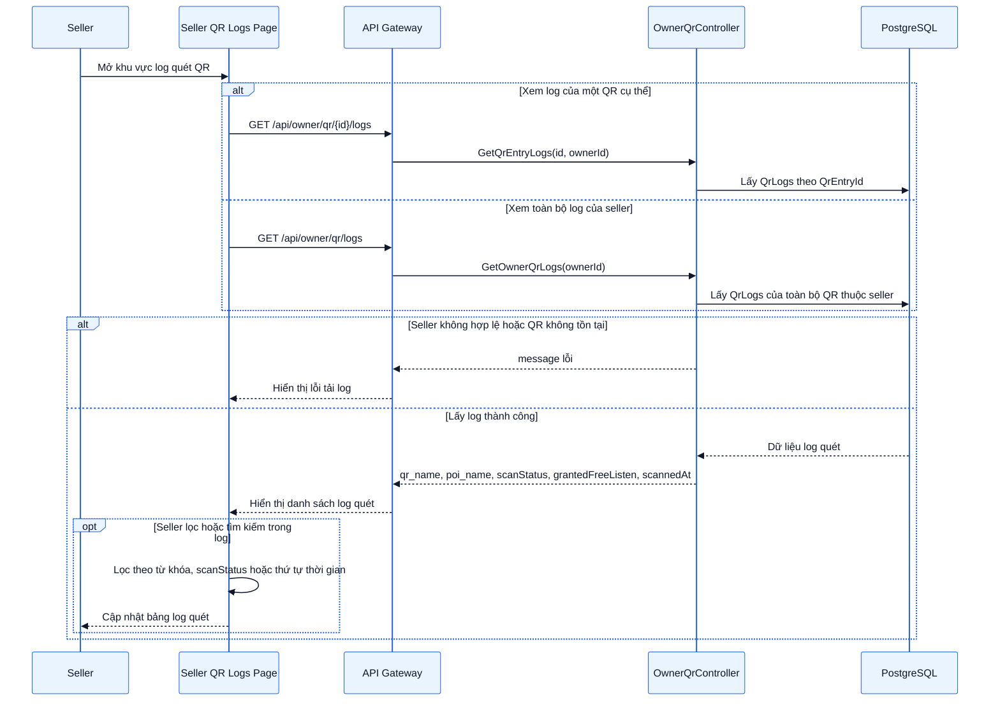
```mermaid
%%{init: {
  "theme": "base",
  "themeVariables": {
    "primaryColor": "#EAF4FF",
    "primaryBorderColor": "#2563EB",
    "primaryTextColor": "#0F172A",
    "lineColor": "#2563EB",
    "secondaryColor": "#DBEAFE",
    "tertiaryColor": "#F8FBFF",
    "noteBkgColor": "#EFF6FF",
    "noteBorderColor": "#3B82F6",
    "activationBorderColor": "#2563EB",
    "activationBkgColor": "#DBEAFE",
    "sequenceNumberColor": "#0F172A"
  }
}}%%
sequenceDiagram
    participant Seller as Seller
    participant QrAnalyticsFlow as Seller QR Logs Page
    participant API as API Gateway
    participant OwnerQrCtl as OwnerQrController
    participant DB as PostgreSQL

    Seller ->> QrAnalyticsFlow: Mở khu vực log quét QR

    alt Xem log của một QR cụ thể
        QrAnalyticsFlow ->> API: GET /api/owner/qr/{id}/logs
        API ->> OwnerQrCtl: GetQrEntryLogs(id, ownerId)
        OwnerQrCtl ->> DB: Lấy QrLogs theo QrEntryId
    else Xem toàn bộ log của seller
        QrAnalyticsFlow ->> API: GET /api/owner/qr/logs
        API ->> OwnerQrCtl: GetOwnerQrLogs(ownerId)
        OwnerQrCtl ->> DB: Lấy QrLogs của toàn bộ QR thuộc seller
    end

    alt Seller không hợp lệ hoặc QR không tồn tại
        OwnerQrCtl -->> API: message lỗi
        API -->> QrAnalyticsFlow: Hiển thị lỗi tải log
    else Lấy log thành công
        DB -->> OwnerQrCtl: Dữ liệu log quét
        OwnerQrCtl -->> API: qr_name, poi_name, scanStatus, grantedFreeListen, scannedAt
        API -->> QrAnalyticsFlow: Hiển thị danh sách log quét

        opt Seller lọc hoặc tìm kiếm trong log
            QrAnalyticsFlow ->> QrAnalyticsFlow: Lọc theo từ khóa, scanStatus hoặc thứ tự thời gian
            QrAnalyticsFlow -->> Seller: Cập nhật bảng log quét
        end
    end
```

### 10.21. Sequence Seller Thanh Toán Nâng Cấp POI

> Luồng này mở rộng sequence tạo POI, tập trung vào màn thanh toán nâng cấp riêng cho seller: tải trạng thái giao dịch, polling SePay, kiểm tra lại giao dịch thủ công và quay về danh sách POI sau khi thanh toán thành công.

```mermaid
%%{init: {
  "theme": "base",
  "themeVariables": {
    "primaryColor": "#EAF4FF",
    "primaryBorderColor": "#2563EB",
    "primaryTextColor": "#0F172A",
    "lineColor": "#2563EB",
    "secondaryColor": "#DBEAFE",
    "tertiaryColor": "#F8FBFF",
    "noteBkgColor": "#EFF6FF",
    "noteBorderColor": "#3B82F6",
    "activationBorderColor": "#2563EB",
    "activationBkgColor": "#DBEAFE",
    "sequenceNumberColor": "#0F172A"
  }
}}%%
sequenceDiagram
    participant Seller as Seller
    participant UpgradePage as Seller POI Upgrade Payment Page
    participant API as API Gateway
    participant PaymentsCtl as PaymentsController
    participant Sepay as SePay API
    participant DraftSvc as POI Draft Service
    participant DB as PostgreSQL

    Seller ->> UpgradePage: Mở /payments/poi-upgrade?code=...
    UpgradePage ->> API: GET /api/owner/payments/status?code=...
    API ->> PaymentsCtl: GetOwnerPaymentStatus(code, ownerId)
    PaymentsCtl ->> DB: Tìm Payment theo code + ownerId

    alt Không tìm thấy payment hoặc owner không hợp lệ
        PaymentsCtl -->> API: message lỗi
        API -->> UpgradePage: Hiển thị lỗi tải thanh toán
    else Tìm thấy payment
        PaymentsCtl ->> PaymentsCtl: TrySyncPaymentFromSepayAsync(payment)
        PaymentsCtl ->> Sepay: GET transactions theo payment code
        Sepay -->> PaymentsCtl: Giao dịch gần đúng

        alt Đã khớp giao dịch thành công
            PaymentsCtl ->> DraftSvc: ConfirmPoiUpgradeAsync(payment)
            DraftSvc ->> DB: Tạo POI từ draft nếu cần và đánh dấu payment = used
            DB -->> DraftSvc: Lưu thành công
            PaymentsCtl -->> API: checkoutResponse(status = used)
            API -->> UpgradePage: Hiển thị thanh toán thành công
            UpgradePage -->> Seller: Tự động quay về danh sách POI
        else Chưa khớp giao dịch
            PaymentsCtl -->> API: checkoutResponse(status = pending hoặc rejected)
            API -->> UpgradePage: Hiển thị QR, số tiền và nội dung chuyển khoản

            loop Mỗi 3 giây khi payment còn pending
                UpgradePage ->> API: GET /api/owner/payments/status?code=...
                API ->> PaymentsCtl: Đồng bộ lại trạng thái payment
                PaymentsCtl ->> Sepay: Kiểm tra giao dịch mới
                Sepay -->> PaymentsCtl: Kết quả mới nhất
                PaymentsCtl -->> API: payment status hiện tại
                API -->> UpgradePage: Cập nhật message và trạng thái
            end

            opt Seller bấm "Tôi đã thanh toán" hoặc "Kiểm tra lại thanh toán"
                UpgradePage ->> API: POST /api/owner/payments/submit?code=...
                API ->> PaymentsCtl: ResubmitOwnerPayment(code, ownerId)
                PaymentsCtl ->> PaymentsCtl: ExpirePaymentIfNeededAsync(payment)

                alt Payment đã hết hạn
                    PaymentsCtl -->> API: payment = rejected, rejectedReason = hết thời gian chờ
                    API -->> UpgradePage: Khóa nút xác nhận và báo hết hạn
                else Chưa hết hạn
                    PaymentsCtl ->> DB: Đặt status = pending, SubmittedAt = now
                    PaymentsCtl ->> Sepay: Kiểm tra lại giao dịch
                    Sepay -->> PaymentsCtl: Kết quả đối soát

                    alt Đối soát thành công
                        PaymentsCtl ->> DraftSvc: ConfirmPoiUpgradeAsync(payment)
                        DraftSvc ->> DB: Hoàn tất POI nâng cấp và đánh dấu payment thành used
                        DB -->> DraftSvc: Lưu thành công
                        PaymentsCtl -->> API: message = đã xác nhận giao dịch thành công
                        API -->> UpgradePage: Điều hướng về /pois?payment=success
                    else Chưa ghi nhận giao dịch
                        PaymentsCtl -->> API: message = vui lòng chờ thêm hoặc kiểm tra lại nội dung chuyển khoản
                        API -->> UpgradePage: Giữ nguyên màn thanh toán
                    end
                end
            end
        end
    end
```

### 10.22. Sequence Admin Duyệt POI

> Bao gồm các trường hợp: admin mở danh sách POI, lọc POI cần duyệt, xem chi tiết, phê duyệt POI và audio liên quan hoặc từ chối POI với lý do cụ thể.

```mermaid
%%{init: {
  "theme": "base",
  "themeVariables": {
    "primaryColor": "#EAF4FF",
    "primaryBorderColor": "#2563EB",
    "primaryTextColor": "#0F172A",
    "lineColor": "#2563EB",
    "secondaryColor": "#DBEAFE",
    "tertiaryColor": "#F8FBFF",
    "noteBkgColor": "#EFF6FF",
    "noteBorderColor": "#3B82F6",
    "activationBorderColor": "#2563EB",
    "activationBkgColor": "#DBEAFE",
    "sequenceNumberColor": "#0F172A"
  }
}}%%
sequenceDiagram
    participant Admin as Admin
    participant AdminPoisPage as Admin POI Moderation Page
    participant API as API Gateway
    participant AdminCtl as AdminController
    participant DB as PostgreSQL

    Admin ->> AdminPoisPage: Truy cập trang quản lý POI
    AdminPoisPage ->> API: GET /api/admin/pois?adminId=...&status=...
    API ->> AdminCtl: GetAllPois(adminId, status, q, ownerId)
    AdminCtl ->> DB: Lấy danh sách POI, ảnh, audio và seller liên quan
    DB -->> AdminCtl: Dữ liệu POI
    AdminCtl -->> API: Danh sách POI đã chuẩn hóa
    API -->> AdminPoisPage: Hiển thị danh sách và hàng chờ duyệt

    opt Admin xem chi tiết POI
        Admin ->> AdminPoisPage: Chọn một POI để xem
        AdminPoisPage -->> Admin: Mở thông tin mô tả, ảnh, audio, seller và trạng thái hiện tại
    end

    alt Admin phê duyệt POI
        Admin ->> AdminPoisPage: Chọn "Duyệt"
        AdminPoisPage ->> API: PUT /api/admin/pois/{id}/approve
        API ->> AdminCtl: ApprovePoi(id, adminId)

        alt Admin không hợp lệ hoặc POI không tồn tại
            AdminCtl -->> API: message lỗi
            API -->> AdminPoisPage: Hiển thị lỗi phê duyệt
        else Duyệt thành công
            AdminCtl ->> DB: Đổi status POI = approved, xóa rejectedReason
            AdminCtl ->> DB: Đổi approvalStatus của audio liên quan = approved
            DB -->> AdminCtl: Lưu thành công
            AdminCtl -->> API: message = POI được phê duyệt thành công
            API -->> AdminPoisPage: Cập nhật trạng thái POI và audio
        end
    else Admin từ chối POI
        Admin ->> AdminPoisPage: Chọn "Từ chối" và nhập lý do
        AdminPoisPage ->> API: PUT /api/admin/pois/{id}/reject(reason)
        API ->> AdminCtl: RejectPoi(id, request, adminId)

        alt Admin không hợp lệ hoặc POI không tồn tại
            AdminCtl -->> API: message lỗi
            API -->> AdminPoisPage: Hiển thị lỗi từ chối
        else Từ chối thành công
            AdminCtl ->> DB: Đổi status POI = rejected, lưu rejectedReason
            DB -->> AdminCtl: Lưu thành công
            AdminCtl -->> API: message = POI bị từ chối
            API -->> AdminPoisPage: Hiển thị trạng thái bị từ chối
        end
    end
```

### 10.23. Sequence Admin Xem Chi Tiết, Cập Nhật Trạng Thái Và Hủy Tài Khoản

> Bao gồm các trường hợp: admin tải danh sách tài khoản, tìm kiếm theo từ khóa, xem chi tiết tài khoản, cập nhật trạng thái tài khoản và hủy tài khoản khi cần thiết.

```mermaid
%%{init: {
  "theme": "base",
  "themeVariables": {
    "primaryColor": "#EAF4FF",
    "primaryBorderColor": "#2563EB",
    "primaryTextColor": "#0F172A",
    "lineColor": "#2563EB",
    "secondaryColor": "#DBEAFE",
    "tertiaryColor": "#F8FBFF",
    "noteBkgColor": "#EFF6FF",
    "noteBorderColor": "#3B82F6",
    "activationBorderColor": "#2563EB",
    "activationBkgColor": "#DBEAFE",
    "sequenceNumberColor": "#0F172A"
  }
}}%%
sequenceDiagram
    participant Admin as Admin
    participant AccountFlow as Admin Users Page
    participant API as API Gateway
    participant AdminCtl as AdminController
    participant DB as PostgreSQL

    Admin ->> AccountFlow: Truy cập trang quản lý tài khoản
    AccountFlow ->> API: GET /api/admin/users?role=...&q=...
    API ->> AdminCtl: GetUsers(adminId, role, q)
    AdminCtl ->> DB: Lấy user, seller và thống kê POI/listen liên quan
    DB -->> AdminCtl: Danh sách tài khoản
    AdminCtl -->> API: Danh sách user đã chuẩn hóa
    API -->> AccountFlow: Hiển thị danh sách tài khoản

    opt Admin xem chi tiết tài khoản
        AccountFlow ->> API: GET /api/admin/users/{userId}/detail
        API ->> AdminCtl: GetUserDetail(userId, adminId)
        AdminCtl ->> DB: Lấy thông tin chi tiết, POI, QR, listen và favorite liên quan
        DB -->> AdminCtl: Thông tin chi tiết tài khoản
        AdminCtl -->> API: Chi tiết user hoặc seller
        API -->> AccountFlow: Hiển thị hồ sơ chi tiết
    end

    alt Admin cập nhật trạng thái tài khoản
        Admin ->> AccountFlow: Chọn active, paused, banned hoặc canceled
        AccountFlow ->> API: PUT /api/admin/users/{userId}/status(status)
        API ->> AdminCtl: UpdateUserStatus(userId, request, adminId)

        alt Admin không hợp lệ, user không tồn tại hoặc trạng thái không hợp lệ
            AdminCtl -->> API: message lỗi
            API -->> AccountFlow: Hiển thị lỗi cập nhật trạng thái
        else Cập nhật thành công
            AdminCtl ->> DB: Cập nhật AccountStatus, IsActive, UpdatedAt
            DB -->> AdminCtl: Lưu thành công
            AdminCtl -->> API: message = đã cập nhật trạng thái tài khoản
            API -->> AccountFlow: Cập nhật trạng thái trên danh sách
        end
    else Admin hủy tài khoản
        Admin ->> AccountFlow: Chọn hủy tài khoản
        AccountFlow ->> API: DELETE /api/admin/users/{userId}
        API ->> AdminCtl: DeleteUser(userId, adminId)

        alt Admin không hợp lệ hoặc user không tồn tại
            AdminCtl -->> API: message lỗi
            API -->> AccountFlow: Hiển thị lỗi hủy tài khoản
        else Hủy thành công
            AdminCtl ->> DB: Đặt accountStatus = canceled và isActive = false
            DB -->> AdminCtl: Lưu thành công
            AdminCtl -->> API: message = tài khoản đã được hủy
            API -->> AccountFlow: Cập nhật danh sách tài khoản
        end
    end
```

### 10.24. Sequence Admin Cập Nhật Trạng Thái Thiết Bị

> Bao gồm các trường hợp: admin mở danh sách thiết bị, xem chi tiết thiết bị, cập nhật trạng thái active, inactive, banned hoặc user_deleted và xử lý các gói còn hiệu lực khi thiết bị bị khóa hoặc bị xóa.

```mermaid
%%{init: {
  "theme": "base",
  "themeVariables": {
    "primaryColor": "#EAF4FF",
    "primaryBorderColor": "#2563EB",
    "primaryTextColor": "#0F172A",
    "lineColor": "#2563EB",
    "secondaryColor": "#DBEAFE",
    "tertiaryColor": "#F8FBFF",
    "noteBkgColor": "#EFF6FF",
    "noteBorderColor": "#3B82F6",
    "activationBorderColor": "#2563EB",
    "activationBkgColor": "#DBEAFE",
    "sequenceNumberColor": "#0F172A"
  }
}}%%
sequenceDiagram
    participant Admin as Admin
    participant DeviceFlow as Admin Devices Page
    participant API as API Gateway
    participant AdminCtl as AdminController
    participant DB as PostgreSQL

    Admin ->> DeviceFlow: Truy cập trang quản lý thiết bị
    DeviceFlow ->> API: GET /api/admin/devices?status=...&q=...
    API ->> AdminCtl: GetDevices(adminId, status, q)
    AdminCtl ->> DB: Lấy danh sách thiết bị, subscription và thống kê liên quan
    DB -->> AdminCtl: Dữ liệu thiết bị
    AdminCtl -->> API: Danh sách thiết bị
    API -->> DeviceFlow: Hiển thị danh sách thiết bị

    opt Admin xem chi tiết thiết bị
        DeviceFlow ->> API: GET /api/admin/devices/{deviceId}/detail
        API ->> AdminCtl: GetDeviceDetail(deviceId, adminId)
        AdminCtl ->> DB: Lấy listen, favorite, payment và subscription của thiết bị
        DB -->> AdminCtl: Thông tin chi tiết thiết bị
        AdminCtl -->> API: Chi tiết thiết bị
        API -->> DeviceFlow: Hiển thị hồ sơ thiết bị
    end

    Admin ->> DeviceFlow: Chọn trạng thái mới cho thiết bị
    DeviceFlow ->> API: PUT /api/admin/devices/{deviceId}/status(status, reason)
    API ->> AdminCtl: UpdateDeviceStatus(deviceId, request, adminId)

    alt Admin không hợp lệ, thiết bị không tồn tại hoặc trạng thái không hợp lệ
        AdminCtl -->> API: message lỗi
        API -->> DeviceFlow: Hiển thị lỗi cập nhật thiết bị
    else Chuyển sang active hoặc inactive
        AdminCtl ->> DB: Cập nhật Status, IsActive, LastSeen
        DB -->> AdminCtl: Lưu thành công
        AdminCtl -->> API: message = đã cập nhật thiết bị
        API -->> DeviceFlow: Cập nhật trạng thái trên danh sách
    else Chuyển sang banned hoặc user_deleted
        AdminCtl ->> DB: Cập nhật Status, IsActive, BanReason/BannedAt/DeletedAt
        AdminCtl ->> DB: Hết hiệu lực các subscription còn hoạt động của thiết bị
        DB -->> AdminCtl: Lưu thành công
        AdminCtl -->> API: message = đã cập nhật thiết bị
        API -->> DeviceFlow: Hiển thị trạng thái bị khóa hoặc đã xóa
    end
```

### 10.25. Sequence Admin Xử Lý QR Bị Tạm Ngưng

> Bao gồm các trường hợp: admin xem danh sách QR, tạm ngưng QR đang hoạt động, seller gửi yêu cầu kích hoạt lại, admin chấp thuận mở lại QR hoặc từ chối yêu cầu kích hoạt lại.

```mermaid
%%{init: {
  "theme": "base",
  "themeVariables": {
    "primaryColor": "#EAF4FF",
    "primaryBorderColor": "#2563EB",
    "primaryTextColor": "#0F172A",
    "lineColor": "#2563EB",
    "secondaryColor": "#DBEAFE",
    "tertiaryColor": "#F8FBFF",
    "noteBkgColor": "#EFF6FF",
    "noteBorderColor": "#3B82F6",
    "activationBorderColor": "#2563EB",
    "activationBkgColor": "#DBEAFE",
    "sequenceNumberColor": "#0F172A"
  }
}}%%
sequenceDiagram
    participant Admin as Admin
    participant AdminQrPage as Admin QR Review Flow
    participant Seller as Seller
    participant SellerQrPage as Seller QR Page
    participant API as API Gateway
    participant AdminQrCtl as AdminQrController
    participant OwnerQrCtl as OwnerQrController
    participant DB as PostgreSQL

    Admin ->> AdminQrPage: Truy cập trang quản lý QR
    AdminQrPage ->> API: GET /api/admin/qr?adminId=...
    API ->> AdminQrCtl: GetAllQrEntries(adminId)
    AdminQrCtl ->> DB: Lấy danh sách QR, owner, POI, log liên quan
    DB -->> AdminQrCtl: Dữ liệu QR toàn hệ thống
    AdminQrCtl -->> API: Danh sách QR
    API -->> AdminQrPage: Hiển thị danh sách QR

    alt Admin tạm ngưng QR đang hoạt động
        Admin ->> AdminQrPage: Chọn "Tạm ngưng" và nhập lý do
        AdminQrPage ->> API: PUT /api/admin/qr/{id}/status(status=admin_suspended, reason)
        API ->> AdminQrCtl: UpdateQrStatus(id, request, adminId)

        alt Admin không hợp lệ hoặc QR không tồn tại
            AdminQrCtl -->> API: message lỗi
            API -->> AdminQrPage: Hiển thị lỗi cập nhật trạng thái
        else Cập nhật thành công
            AdminQrCtl ->> DB: Đổi status = admin_suspended, lưu suspensionReason
            DB -->> AdminQrCtl: Lưu thành công
            AdminQrCtl -->> API: message = đã cập nhật trạng thái QR
            API -->> AdminQrPage: QR chuyển sang trạng thái tạm ngưng
        end
    end

    opt Seller gửi yêu cầu kích hoạt lại
        Seller ->> SellerQrPage: Chọn QR bị tạm ngưng và gửi yêu cầu
        SellerQrPage ->> API: POST /api/owner/qr/{id}/activation-request(note)
        API ->> OwnerQrCtl: RequestActivation(id, request, ownerId)

        alt Seller không hợp lệ hoặc QR không thuộc seller
            OwnerQrCtl -->> API: message lỗi
            API -->> SellerQrPage: Hiển thị lỗi gửi yêu cầu
        else QR không ở trạng thái admin_suspended
            OwnerQrCtl -->> API: message = QR này không bị hệ thống tạm ngưng
            API -->> SellerQrPage: Hiển thị thông báo không thể gửi yêu cầu
        else Gửi yêu cầu thành công
            OwnerQrCtl ->> DB: Lưu activationRequestedAt và activationRequestNote
            DB -->> OwnerQrCtl: Lưu thành công
            OwnerQrCtl -->> API: message = đã gửi yêu cầu kích hoạt lại cho admin
            API -->> SellerQrPage: Hiển thị trạng thái đang chờ admin xử lý
        end
    end

    alt Admin chấp thuận mở lại QR
        Admin ->> AdminQrPage: Chọn "Mở lại QR"
        AdminQrPage ->> API: PUT /api/admin/qr/{id}/status(status=active)
        API ->> AdminQrCtl: UpdateQrStatus(id, request, adminId)

        alt Admin không hợp lệ hoặc QR không tồn tại
            AdminQrCtl -->> API: message lỗi
            API -->> AdminQrPage: Hiển thị lỗi mở lại QR
        else Mở lại thành công
            AdminQrCtl ->> DB: Đổi status = active, xóa activationRequestedAt, activationRequestNote và suspensionReason
            DB -->> AdminQrCtl: Lưu thành công
            AdminQrCtl -->> API: message = đã cập nhật trạng thái QR
            API -->> AdminQrPage: QR hoạt động trở lại
        end
    else Admin từ chối yêu cầu kích hoạt lại
        Admin ->> AdminQrPage: Chọn "Từ chối yêu cầu" và nhập lý do
        AdminQrPage ->> API: POST /api/admin/qr/{id}/activation-request/reject(reason)
        API ->> AdminQrCtl: RejectActivationRequest(id, request, adminId)

        alt Admin không hợp lệ hoặc QR không tồn tại
            AdminQrCtl -->> API: message lỗi
            API -->> AdminQrPage: Hiển thị lỗi từ chối yêu cầu
        else Từ chối thành công
            AdminQrCtl ->> DB: Giữ status = admin_suspended, cập nhật suspensionReason mới, xóa activationRequestedAt và activationRequestNote
            DB -->> AdminQrCtl: Lưu thành công
            AdminQrCtl -->> API: message = đã từ chối yêu cầu kích hoạt lại
            API -->> AdminQrPage: QR tiếp tục ở trạng thái tạm ngưng
        end
    end
```

### 10.26. Sequence Admin Tạo, Cập Nhật Và Xóa Gói Sử Dụng

> Bao gồm các trường hợp: admin mở danh sách gói, tạo gói mới, chỉnh sửa gói hiện có, xóa gói và từ chối thao tác khi dữ liệu hoặc quyền truy cập không hợp lệ.

```mermaid
%%{init: {
  "theme": "base",
  "themeVariables": {
    "primaryColor": "#EAF4FF",
    "primaryBorderColor": "#2563EB",
    "primaryTextColor": "#0F172A",
    "lineColor": "#2563EB",
    "secondaryColor": "#DBEAFE",
    "tertiaryColor": "#F8FBFF",
    "noteBkgColor": "#EFF6FF",
    "noteBorderColor": "#3B82F6",
    "activationBorderColor": "#2563EB",
    "activationBkgColor": "#DBEAFE",
    "sequenceNumberColor": "#0F172A"
  }
}}%%
sequenceDiagram
    participant Admin as Admin
    participant PlanFlow as Admin Plans Page
    participant API as API Gateway
    participant PlansCtl as PlansController
    participant DB as PostgreSQL

    Admin ->> PlanFlow: Truy cập trang quản lý gói sử dụng
    PlanFlow ->> API: GET /api/Plans/admin?adminId=...
    API ->> PlansCtl: GetPlansForAdmin(adminId)
    PlansCtl ->> DB: Lấy danh sách plan
    DB -->> PlansCtl: Dữ liệu gói
    PlansCtl -->> API: Danh sách plan
    API -->> PlanFlow: Hiển thị danh sách gói

    alt Admin tạo gói mới
        Admin ->> PlanFlow: Nhập tên gói, số ngày và giá
        PlanFlow ->> API: POST /api/Plans(payload, adminId)
        API ->> PlansCtl: CreatePlan(request, adminId)

        alt Admin không hợp lệ hoặc dữ liệu gói không hợp lệ
            PlansCtl -->> API: message lỗi
            API -->> PlanFlow: Hiển thị lỗi tạo gói
        else Tạo thành công
            PlansCtl ->> DB: Tạo Plan mới
            DB -->> PlansCtl: Lưu thành công
            PlansCtl -->> API: Dữ liệu gói mới
            API -->> PlanFlow: Cập nhật danh sách gói
        end
    else Admin chỉnh sửa gói hiện có
        Admin ->> PlanFlow: Cập nhật tên, số ngày hoặc giá
        PlanFlow ->> API: PUT /api/Plans/{id}(payload, adminId)
        API ->> PlansCtl: UpdatePlan(id, request, adminId)

        alt Admin không hợp lệ, không tìm thấy gói hoặc dữ liệu không hợp lệ
            PlansCtl -->> API: message lỗi
            API -->> PlanFlow: Hiển thị lỗi cập nhật gói
        else Cập nhật thành công
            PlansCtl ->> DB: Cập nhật thông tin plan
            DB -->> PlansCtl: Lưu thành công
            PlansCtl -->> API: Dữ liệu plan mới
            API -->> PlanFlow: Làm mới danh sách gói
        end
    else Admin xóa gói
        Admin ->> PlanFlow: Xác nhận xóa gói
        PlanFlow ->> API: DELETE /api/Plans/{id}?adminId=...
        API ->> PlansCtl: DeletePlan(id, adminId)

        alt Admin không hợp lệ hoặc không tìm thấy gói
            PlansCtl -->> API: message lỗi
            API -->> PlanFlow: Hiển thị lỗi xóa gói
        else Xóa thành công
            PlansCtl ->> DB: Xóa Plan
            DB -->> PlansCtl: Lưu thành công
            PlansCtl -->> API: message = đã xóa gói
            API -->> PlanFlow: Gỡ gói khỏi danh sách hiển thị
        end
    end
```

### 10.27. Sequence Admin Quản Lý Tour

> Luồng này phản ánh `AdminToursController` hiện tại, gồm tải danh sách tour, upload cover, tạo mới, cập nhật thứ tự POI và xóa tour.

```mermaid
%%{init: {
  "theme": "base",
  "themeVariables": {
    "primaryColor": "#EAF4FF",
    "primaryBorderColor": "#2563EB",
    "primaryTextColor": "#0F172A",
    "lineColor": "#2563EB",
    "secondaryColor": "#DBEAFE",
    "tertiaryColor": "#F8FBFF",
    "noteBkgColor": "#EFF6FF",
    "noteBorderColor": "#3B82F6",
    "activationBorderColor": "#2563EB",
    "activationBkgColor": "#DBEAFE",
    "sequenceNumberColor": "#0F172A"
  }
}}%%
sequenceDiagram
    participant Admin as Admin
    participant ToursPage as Admin Tours Page
    participant API as API Gateway
    participant ToursCtl as AdminToursController
    participant MediaSvc as MediaStorageService
    participant DB as PostgreSQL

    Admin ->> ToursPage: Mở trang quản lý tour
    ToursPage ->> API: GET /api/admin/tours?adminId=...
    API ->> ToursCtl: GetTours(adminId)
    ToursCtl ->> DB: Users.FindAsync(adminId)
    ToursCtl ->> DB: Query Tours + TourPois + Pois + PoiImages
    ToursCtl ->> ToursCtl: BuildAdminTourResponse(...)
    ToursCtl -->> API: Danh sách tour
    API -->> ToursPage: Hiển thị tour hiện có

    opt Admin upload ảnh cover
        Admin ->> ToursPage: Chọn ảnh cover
        ToursPage ->> API: POST /api/admin/tours/uploads/cover(form-data file, adminId)
        API ->> ToursCtl: UploadCoverImage(file, adminId)
        ToursCtl ->> MediaSvc: UploadImageAsync(file, "tours", "tour-cover")
        MediaSvc -->> ToursCtl: coverImageUrl
        ToursCtl -->> API: 200 OK(url)
        API -->> ToursPage: Gắn coverImageUrl vào form tour
    end

    alt Admin tạo tour mới
        Admin ->> ToursPage: Nhập tên, mô tả, chọn POI theo thứ tự, bật/tắt publish
        ToursPage ->> API: POST /api/admin/tours(payload, adminId)
        API ->> ToursCtl: CreateTour(request, adminId)
        ToursCtl ->> DB: Validate admin + check approved POIs

        alt Payload không hợp lệ
            ToursCtl -->> API: BadRequest(message)
            API -->> ToursPage: Hiển thị lỗi lưu tour
        else Hợp lệ
            ToursCtl ->> DB: Insert Tour
            ToursCtl ->> DB: Insert TourPois(sortOrder)
            ToursCtl ->> ToursCtl: GetTourDetailInternalAsync(tour.Id)
            ToursCtl -->> API: Tour vừa tạo
            API -->> ToursPage: Cập nhật danh sách tour
        end
    else Admin cập nhật tour
        Admin ->> ToursPage: Sửa thông tin hoặc đổi thứ tự POI
        ToursPage ->> API: PUT /api/admin/tours/{tourId}(payload, adminId)
        API ->> ToursCtl: UpdateTour(tourId, request, adminId)
        ToursCtl ->> DB: FindAsync(tourId)
        ToursCtl ->> DB: Validate approved POIs
        ToursCtl ->> DB: RemoveRange(existingTourPois)
        ToursCtl ->> DB: AddRange(new TourPois(sortOrder))
        ToursCtl ->> ToursCtl: GetTourDetailInternalAsync(tourId)
        ToursCtl -->> API: Tour đã cập nhật
        API -->> ToursPage: Làm mới card tour
    else Admin xóa tour
        Admin ->> ToursPage: Xác nhận xóa
        ToursPage ->> API: DELETE /api/admin/tours/{tourId}?adminId=...
        API ->> ToursCtl: DeleteTour(tourId, adminId)
        ToursCtl ->> DB: DELETE FROM tour_pois WHERE tour_id = tourId
        ToursCtl ->> DB: DELETE FROM tours WHERE id = tourId
        ToursCtl -->> API: message = Đã xóa tour
        API -->> ToursPage: Gỡ tour khỏi danh sách
    end
```

### 10.28. Sequence Admin Upload Cover Tour

> Luồng này tách riêng thao tác upload ảnh cover cho tour trong admin portal, bao gồm kiểm tra quyền admin, validate file, upload qua `MediaStorageService` và gắn URL trả về vào form tour.

```mermaid
%%{init: {
  "theme": "base",
  "themeVariables": {
    "primaryColor": "#EAF4FF",
    "primaryBorderColor": "#2563EB",
    "primaryTextColor": "#0F172A",
    "lineColor": "#2563EB",
    "secondaryColor": "#DBEAFE",
    "tertiaryColor": "#F8FBFF",
    "noteBkgColor": "#EFF6FF",
    "noteBorderColor": "#3B82F6",
    "activationBorderColor": "#2563EB",
    "activationBkgColor": "#DBEAFE",
    "sequenceNumberColor": "#0F172A"
  }
}}%%
sequenceDiagram
    participant Admin as Admin
    participant ToursPage as Admin Tours Page
    participant API as API Gateway
    participant ToursCtl as AdminToursController
    participant MediaSvc as MediaStorageService
    participant Cloudinary as Cloudinary API
    participant FileStore as Local File Storage
    participant DB as PostgreSQL

    Admin ->> ToursPage: Chọn ảnh cover từ máy
    ToursPage ->> API: POST /api/admin/tours/uploads/cover(form-data file, adminId)
    API ->> ToursCtl: UploadCoverImage(file, adminId)
    ToursCtl ->> DB: Users.FindAsync(adminId)

    alt Admin không hợp lệ
        ToursCtl -->> API: Forbid("Chỉ admin mới có thể upload ảnh")
        API -->> ToursPage: Hiển thị lỗi quyền truy cập
    else Không có file, file rỗng hoặc vượt quá giới hạn
        ToursCtl ->> ToursCtl: Validate file tồn tại và size <= 5MB
        ToursCtl -->> API: BadRequest(message)
        API -->> ToursPage: Hiển thị lỗi upload cover
    else Extension không hợp lệ
        ToursCtl ->> ToursCtl: Chỉ chấp nhận JPG, PNG, WEBP
        ToursCtl -->> API: BadRequest(message)
        API -->> ToursPage: Hiển thị lỗi định dạng ảnh
    else File hợp lệ
        ToursCtl ->> MediaSvc: UploadImageAsync(file, "tours", "tour-cover")

        alt Có cấu hình Cloudinary
            MediaSvc ->> Cloudinary: Upload ảnh cover
            Cloudinary -->> MediaSvc: secure_url
        else Chưa có cấu hình Cloudinary
            MediaSvc ->> FileStore: Lưu file vào local storage
            FileStore -->> MediaSvc: /images/tours/...
        end

        MediaSvc -->> ToursCtl: coverImageUrl
        ToursCtl -->> API: 200 OK(url)
        API -->> ToursPage: Gắn URL cover vào form tạo/sửa tour
        ToursPage -->> Admin: Hiển thị preview cover mới
    end
```

### 10.29. Sequence Admin Publish Và Ẩn Tour

> Luồng này tách riêng thao tác bật hoặc tắt `isPublished` của tour trong admin portal. Về implementation hiện tại, trạng thái publish được lưu thông qua `PUT /api/admin/tours/{tourId}` cùng toàn bộ payload tour.

```mermaid
%%{init: {
  "theme": "base",
  "themeVariables": {
    "primaryColor": "#EAF4FF",
    "primaryBorderColor": "#2563EB",
    "primaryTextColor": "#0F172A",
    "lineColor": "#2563EB",
    "secondaryColor": "#DBEAFE",
    "tertiaryColor": "#F8FBFF",
    "noteBkgColor": "#EFF6FF",
    "noteBorderColor": "#3B82F6",
    "activationBorderColor": "#2563EB",
    "activationBkgColor": "#DBEAFE",
    "sequenceNumberColor": "#0F172A"
  }
}}%%
sequenceDiagram
    participant Admin as Admin
    participant ToursPage as Admin Tours Page
    participant API as API Gateway
    participant ToursCtl as AdminToursController
    participant DB as PostgreSQL
    participant PWA as PWA Tours Page

    Admin ->> ToursPage: Chọn một tour và bật/tắt publish
    ToursPage ->> ToursPage: Giữ nguyên name, cover, poiIds và đổi isPublished
    ToursPage ->> API: PUT /api/admin/tours/{tourId}(payload, adminId)
    API ->> ToursCtl: UpdateTour(tourId, request, adminId)
    ToursCtl ->> DB: Users.FindAsync(adminId)
    ToursCtl ->> DB: FindAsync(tourId)

    alt Admin không hợp lệ hoặc tour không tồn tại
        ToursCtl -->> API: message lỗi
        API -->> ToursPage: Hiển thị lỗi cập nhật trạng thái publish
    else Payload thiếu tên, cover hoặc không có POI
        ToursCtl -->> API: BadRequest(message)
        API -->> ToursPage: Hiển thị lỗi form tour
    else Danh sách POI có mục chưa approved hoặc không hợp lệ
        ToursCtl ->> DB: Validate approved POIs
        ToursCtl -->> API: BadRequest(message)
        API -->> ToursPage: Không cho publish/ẩn với dữ liệu không hợp lệ
    else Payload hợp lệ
        ToursCtl ->> DB: Cập nhật Tour.IsPublished và UpdatedAt
        ToursCtl ->> DB: Đồng bộ lại tour_pois theo payload hiện tại
        DB -->> ToursCtl: Lưu thành công
        ToursCtl -->> API: Tour đã cập nhật
        API -->> ToursPage: Cập nhật badge Published / Hidden trên danh sách

        alt isPublished = true
            PWA ->> API: GET /api/tours
            API ->> DB: Chỉ query tour publish và còn POI hợp lệ
            API -->> PWA: Tour xuất hiện trên màn /tours
        else isPublished = false
            PWA ->> API: GET /api/tours
            API ->> DB: Loại tour này khỏi danh sách public
            API -->> PWA: Tour không còn hiển thị cho user
        end
    end
```

---

## 11. Sơ Đồ Lớp (Class Diagram)

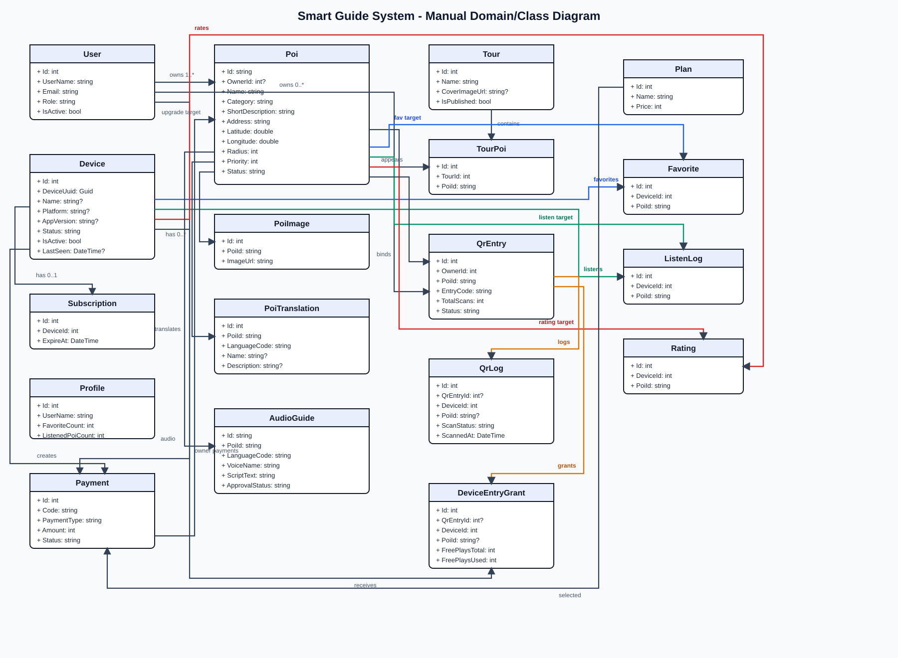

## 12. Sơ Đồ ERD

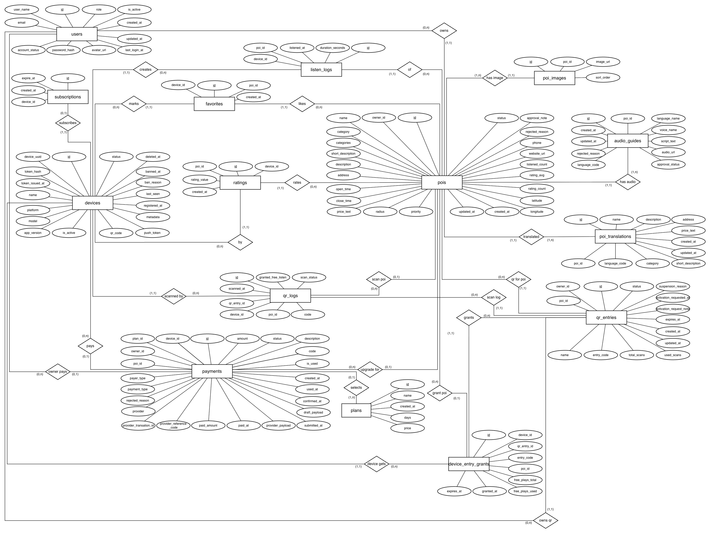

---

## 13. Sơ Đồ Hoạt Động (Activity Diagram)

> **Quy ước ký hiệu:** `(( ● ))` = Bắt đầu · `(( ◉ ))` = Kết thúc · `{ }` = Điều kiện rẽ nhánh · `[ ]` = Hành động xử lý
>
> Quy ước cập nhật: activity dưới đây chỉ mô tả `luồng nghiệp vụ`, `thao tác chính`, `điều kiện rẽ nhánh` và `kết quả`. Không đưa tên hàm/method chi tiết vào activity để tránh trùng vai trò với sequence diagram.

### 13.1. Activity Khởi Tạo Thiết Bị Và Truy Cập PWA

```mermaid
flowchart TD
    START(( ● )) --> OPEN_APP[User mở PWA hoặc vào màn cần dữ liệu]
    OPEN_APP --> CHECK_UUID{Đã có<br/>deviceUuid?}

    CHECK_UUID -- Chưa có --> GEN_UUID[Tạo deviceUuid mới]
    GEN_UUID --> SAVE_UUID[Lưu deviceUuid vào localStorage]
    CHECK_UUID -- Đã có --> READ_UUID[Đọc deviceUuid hiện có]

    SAVE_UUID --> REGISTER
    READ_UUID --> REGISTER[Đăng ký thiết bị với API]
    REGISTER --> FIND_DEVICE{Tìm thấy<br/>thiết bị cũ?}

    FIND_DEVICE -- Có --> CHECK_STATUS{Thiết bị<br/>bị khóa?}
    FIND_DEVICE -- Không --> MATCH_FP{Nhận diện lại theo<br/>fingerprint hoặc subscription?}

    MATCH_FP -- Có --> REBIND[Gán lại deviceUuid cho thiết bị cũ]
    MATCH_FP -- Không --> CREATE_DEVICE[Tạo thiết bị mới]
    REBIND --> CHECK_STATUS
    CREATE_DEVICE --> CHECK_STATUS

    CHECK_STATUS -- Có --> BLOCKED[Hiển thị thông báo thiết bị không hợp lệ]
    CHECK_STATUS -- Không --> SAVE_DEVICE_ID[Lưu deviceId vào localStorage]
    SAVE_DEVICE_ID --> LOAD_INIT[Tải dữ liệu ban đầu của ứng dụng]
    LOAD_INIT --> END_OK(( ◉ ))
    BLOCKED --> END_BLOCK(( ◉ ))

    style START fill:#000,color:#fff,stroke:#000
    style END_OK fill:#000,color:#fff,stroke:#fff,stroke-width:3px
    style END_BLOCK fill:#000,color:#fff,stroke:#fff,stroke-width:3px
    style BLOCKED fill:#EF4444,color:#fff
    style LOAD_INIT fill:#2563EB,color:#fff
```

### 13.2. Activity Tìm Kiếm Và Lọc POI

```mermaid
flowchart TD
    START(( ● )) --> LOAD_POIS[Tải danh sách POI đã được duyệt]
    LOAD_POIS --> GET_LOCATION{Có lấy được<br/>vị trí hiện tại?}

    GET_LOCATION -- Có --> CALC_DISTANCE[Tính distanceKm cho từng POI]
    GET_LOCATION -- Không --> RAW_LIST[Giữ danh sách POI gốc]
    CALC_DISTANCE --> RAW_LIST

    RAW_LIST --> INPUT_KEYWORD{User nhập<br/>từ khóa?}
    INPUT_KEYWORD -- Có --> FILTER_TEXT[Lọc theo tên, địa chỉ, danh mục]
    INPUT_KEYWORD -- Không --> FILTER_TYPE
    FILTER_TEXT --> FILTER_TYPE{Chọn bộ lọc nào?}
    FILTER_TYPE -- Tất cả --> KEEP_ALL[Giữ toàn bộ kết quả]
    FILTER_TYPE -- Gần bạn --> FILTER_NEARBY[Giữ POI trong bán kính gần]
    FILTER_TYPE -- Miễn phí --> FILTER_FREE[Giữ POI có giá miễn phí]

    KEEP_ALL --> SORT_LIST
    FILTER_NEARBY --> SORT_LIST
    FILTER_FREE --> SORT_LIST
    INPUT_KEYWORD -- Không --> FILTER_TYPE

    SORT_LIST[Sắp xếp theo khoảng cách, tên hoặc lượt nghe] --> SHOW_RESULT[Hiển thị danh sách và gợi ý]
    SHOW_RESULT --> SELECT_POI{User chọn POI?}
    SELECT_POI -- Có --> OPEN_POI[Mở chi tiết hoặc định vị trên bản đồ]
    SELECT_POI -- Không --> END_NODE(( ◉ ))
    OPEN_POI --> END_NODE

    style START fill:#000,color:#fff,stroke:#000
    style END_NODE fill:#000,color:#fff,stroke:#fff,stroke-width:3px
    style SHOW_RESULT fill:#2563EB,color:#fff
```

### 13.3. Activity User Quét QR Và Nhận Quyền Nghe

```mermaid
flowchart TD
    START(( ● )) --> SCAN[User quét QR hoặc chọn ảnh QR]
    SCAN --> PARSE{QR payload<br/>hợp lệ?}

    PARSE -- Không --> ERR_QR[Hiển thị lỗi quét QR]
    PARSE -- Có --> ENSURE_DEVICE[Đảm bảo thiết bị đã được nhận diện]
    ENSURE_DEVICE --> CALL_ENTRY[Gửi entryCode và deviceId đến API]
    CALL_ENTRY --> CHECK_QR{QR tồn tại và<br/>đang khả dụng?}

    CHECK_QR -- Không --> ERR_ENTRY[Hiển thị lỗi QR không hợp lệ hoặc bị tạm ngưng]
    CHECK_QR -- Có --> CHECK_QUOTA{QR còn lượt<br/>miễn phí?}

    CHECK_QUOTA -- Không --> OPEN_POI_1[Mở POI tương ứng]
    OPEN_POI_1 --> GO_PAYWALL_1[Chuyển sang paywall]

    CHECK_QUOTA -- Có --> CHECK_SUB{Thiết bị đã có<br/>gói sử dụng?}
    CHECK_SUB -- Có --> OPEN_POI_2[Mở nội dung POI]
    CHECK_SUB -- Không --> CHECK_USED{Thiết bị đã dùng<br/>free listen trước đó?}

    CHECK_USED -- Có --> OPEN_POI_3[Mở POI tương ứng]
    OPEN_POI_3 --> GO_PAYWALL_2[Chuyển sang paywall]
    CHECK_USED -- Không --> GRANT[Tạo DeviceEntryGrant<br/>và ghi log granted]
    GRANT --> OPEN_POI_4[Mở nội dung POI với 1 lượt miễn phí]
    OPEN_POI_4 --> END_OK(( ◉ ))
    OPEN_POI_2 --> END_OK
    GO_PAYWALL_1 --> END_FAIL(( ◉ ))
    GO_PAYWALL_2 --> END_FAIL
    ERR_QR --> END_FAIL
    ERR_ENTRY --> END_FAIL

    style START fill:#000,color:#fff,stroke:#000
    style END_OK fill:#000,color:#fff,stroke:#fff,stroke-width:3px
    style END_FAIL fill:#000,color:#fff,stroke:#fff,stroke-width:3px
    style GRANT fill:#2563EB,color:#fff
    style ERR_QR fill:#EF4444,color:#fff
    style ERR_ENTRY fill:#EF4444,color:#fff
```

### 13.4. Activity Kiểm Tra Quyền Truy Cập Và Phát Audio

```mermaid
flowchart TD
    START(( ● )) --> OPEN_POI[Mở chi tiết hoặc POI trên bản đồ]
    OPEN_POI --> GET_ACCESS[Kiểm tra free listen và subscription]
    GET_ACCESS --> ALLOW{Được nghe<br/>nội dung?}

    ALLOW -- Không --> SAVE_RETURN[Lưu điểm quay lại]
    SAVE_RETURN --> PAYWALL[Chuyển sang paywall]

    ALLOW -- Có --> PICK_AUDIO[Chọn audio theo ngôn ngữ hiện tại]
    PICK_AUDIO --> HAS_SCRIPT{POI có script<br/>để phát?}

    HAS_SCRIPT -- Không --> ERR_AUDIO[Hiển thị thông báo chưa có audio]
    HAS_SCRIPT -- Có --> PLAY[Phát audio hoặc TTS]
    PLAY --> FREE_MODE{Đang dùng<br/>lượt miễn phí?}

    FREE_MODE -- Có --> CONSUME[Tiêu thụ 1 lượt free listen]
    FREE_MODE -- Không --> LOG_LISTEN
    CONSUME --> CONSUME_OK{Tiêu thụ<br/>thành công?}
    CONSUME_OK -- Không --> ERR_FREE[Hiển thị lỗi hết lượt miễn phí]
    CONSUME_OK -- Có --> LOG_LISTEN[Ghi ListenLog và tăng listenedCount]

    LOG_LISTEN --> UPDATE_UI[Cập nhật lượt nghe và trạng thái trên giao diện]
    UPDATE_UI --> END_OK(( ◉ ))
    PAYWALL --> END_FAIL(( ◉ ))
    ERR_AUDIO --> END_FAIL
    ERR_FREE --> END_FAIL

    style START fill:#000,color:#fff,stroke:#000
    style END_OK fill:#000,color:#fff,stroke:#fff,stroke-width:3px
    style END_FAIL fill:#000,color:#fff,stroke:#fff,stroke-width:3px
    style PLAY fill:#2563EB,color:#fff
    style ERR_AUDIO fill:#EF4444,color:#fff
    style ERR_FREE fill:#EF4444,color:#fff
```

### 13.5. Activity Theo Dõi Vị Trí Và Tự Động Phát Audio

```mermaid
flowchart TD
    START(( ● )) --> TOGGLE{User bật<br/>tracking?}
    TOGGLE -- Không --> END_OFF(( ◉ ))
    TOGGLE -- Có --> LOAD_CFG[Đọc interval, radius, stable hits]
    LOAD_CFG --> LOOP_GPS[Định kỳ lấy vị trí hiện tại]
    LOOP_GPS --> FIND_POI{Có POI nào nằm<br/>trong bán kính?}

    FIND_POI -- Không --> LOOP_GPS
    FIND_POI -- Có --> SELECT_POI[Ưu tiên target từ QR, priority và khoảng cách]
    SELECT_POI --> STABLE{Đã đủ số lần<br/>xác nhận ổn định?}

    STABLE -- Chưa --> LOOP_GPS
    STABLE -- Rồi --> CHECK_ACCESS[Kiểm tra quyền truy cập nội dung]
    CHECK_ACCESS --> CAN_PLAY{Được tự động<br/>phát audio?}

    CAN_PLAY -- Không --> LOOP_GPS
    CAN_PLAY -- Có --> PLAY_AUTO[Tự động phát audio cho POI]
    PLAY_AUTO --> PLAY_OK{Phát thành công?}

    PLAY_OK -- Có --> SET_COOLDOWN[Đặt cooldown để tránh phát lặp]
    SET_COOLDOWN --> LOOP_GPS
    PLAY_OK -- Không --> STOP_TRACKING[Tắt tracking để tránh lặp lỗi]
    STOP_TRACKING --> END_ERR(( ◉ ))

    style START fill:#000,color:#fff,stroke:#000
    style END_OFF fill:#000,color:#fff,stroke:#fff,stroke-width:3px
    style END_ERR fill:#000,color:#fff,stroke:#fff,stroke-width:3px
    style PLAY_AUTO fill:#2563EB,color:#fff
    style STOP_TRACKING fill:#EF4444,color:#fff
```

### 13.6. Activity Thanh Toán Và Kích Hoạt Gói

```mermaid
flowchart TD
    START(( ● )) --> SELECT_PLAN[User chọn gói sử dụng]
    SELECT_PLAN --> CREATE_PAYMENT[Hệ thống tạo payment pending]
    CREATE_PAYMENT --> CREATE_OK{Tạo payment<br/>thành công?}

    CREATE_OK -- Không --> ERR_CREATE[Hiển thị lỗi tạo giao dịch]
    CREATE_OK -- Có --> SHOW_QR[Hiển thị QR SePay và nội dung chuyển khoản]
    SHOW_QR --> WAIT_PAY{Giao dịch đã<br/>được ghi nhận?}

    WAIT_PAY -- Chưa --> USER_CONFIRM{User bấm<br/>Toi da thanh toan?}
    USER_CONFIRM -- Không --> POLL_STATUS[Tiếp tục polling trạng thái payment]
    POLL_STATUS --> TIMEOUT{Payment<br/>hết hạn?}
    TIMEOUT -- Chưa --> WAIT_PAY
    USER_CONFIRM -- Có --> SUBMIT_CHECK[Đồng bộ thủ công với SePay]
    SUBMIT_CHECK --> WAIT_PAY

    WAIT_PAY -- Đã ghi nhận --> APPLY_SUB[Khởi tạo hoặc gia hạn subscription]
    APPLY_SUB --> APPLY_OK{Kích hoạt gói<br/>thành công?}
    APPLY_OK -- Không --> ERR_APPLY[Hiển thị lỗi cập nhật gói]
    APPLY_OK -- Có --> RETURN_CONTENT[Quay lại nội dung hoặc màn trước đó]
    RETURN_CONTENT --> END_OK(( ◉ ))

    TIMEOUT -- Có --> EXPIRED[Hiển thị trạng thái rejected hoặc hết hạn]

    ERR_CREATE --> END_FAIL(( ◉ ))
    ERR_APPLY --> END_FAIL
    EXPIRED --> END_FAIL

    style START fill:#000,color:#fff,stroke:#000
    style END_OK fill:#000,color:#fff,stroke:#fff,stroke-width:3px
    style END_FAIL fill:#000,color:#fff,stroke:#fff,stroke-width:3px
    style SHOW_QR fill:#2563EB,color:#fff
    style EXPIRED fill:#EF4444,color:#fff
```

### 13.7. Activity User Khám Phá Theo Tour

```mermaid
flowchart TD
    START(( ● )) --> OPEN_TOURS[User mở màn hình Tour]
    OPEN_TOURS --> LOAD_TOURS[Tải danh sách tour đã publish]
    LOAD_TOURS --> HAS_TOUR{Có tour nào<br/>khả dụng?}

    HAS_TOUR -- Không --> EMPTY[Hiển thị trạng thái chưa có tour]
    HAS_TOUR -- Có --> CALC_METRICS[Tính quãng đường và thời gian ước lượng]
    CALC_METRICS --> PICK_TOUR{User chọn tour?}

    PICK_TOUR -- Không --> END_IDLE(( ◉ ))
    PICK_TOUR -- Có --> OPEN_MAP[Chuyển sang map với tourId]
    OPEN_MAP --> CHECK_ACCESS[Kiểm tra quyền truy cập nội dung]
    CHECK_ACCESS --> ACCESS_OK{Được truy cập?}

    ACCESS_OK -- Không --> PAYWALL[Chuyển sang paywall]
    ACCESS_OK -- Có --> ORDER_POIS[Sắp POI theo sort_order]
    ORDER_POIS --> DRAW_ROUTE[Vẽ tuyến đường và hiển thị overview]
    DRAW_ROUTE --> FOLLOW{User bật theo dõi tour?}

    FOLLOW -- Không --> VIEW_ONLY[Xem bản đồ và chọn POI thủ công]
    FOLLOW -- Có --> TRACK_USER[Theo dõi vị trí hiện tại trên tuyến]
    TRACK_USER --> PLAY_NEARBY[Tự động phát khi đến gần POI phù hợp]
    PLAY_NEARBY --> END_OK(( ◉ ))
    VIEW_ONLY --> END_OK
    PAYWALL --> END_FAIL(( ◉ ))
    EMPTY --> END_IDLE

    style START fill:#000,color:#fff,stroke:#000
    style END_OK fill:#000,color:#fff,stroke:#fff,stroke-width:3px
    style END_IDLE fill:#000,color:#fff,stroke:#fff,stroke-width:3px
    style END_FAIL fill:#000,color:#fff,stroke:#fff,stroke-width:3px
    style DRAW_ROUTE fill:#2563EB,color:#fff
    style PAYWALL fill:#EF4444,color:#fff
```

### 13.8. Activity Seller Tạo Và Gửi Duyệt POI

```mermaid
flowchart TD
    START(( ● )) --> OPEN_FORM[Seller mở form tạo POI]
    OPEN_FORM --> INPUT_DATA[Nhập thông tin, ảnh, bản dịch, audio]
    INPUT_DATA --> VALIDATE{Dữ liệu<br/>hợp lệ?}

    VALIDATE -- Không --> INPUT_DATA
    VALIDATE -- Có --> NEED_TRANSLATE{Có cần dịch<br/>nội dung?}

    NEED_TRANSLATE -- Có --> TRANSLATE[Thực hiện dịch và sinh bản dịch/audio]
    NEED_TRANSLATE -- Không --> CHECK_UPGRADE
    TRANSLATE --> CHECK_UPGRADE{Có phát sinh<br/>upgradeAmount?}

    CHECK_UPGRADE -- Không --> CREATE_POI[Tạo POI, ảnh, bản dịch và audio]
    CREATE_POI --> SET_PENDING[Đặt POI về trạng thái pending]
    SET_PENDING --> SHOW_SUCCESS[Thông báo đã gửi admin duyệt]
    SHOW_SUCCESS --> END_OK(( ◉ ))

    CHECK_UPGRADE -- Có --> PREPARE_PAYMENT[Chuẩn bị payment nâng cấp POI]
    PREPARE_PAYMENT --> PAYMENT_OK{Chuẩn bị<br/>thành công?}
    PAYMENT_OK -- Không --> ERR_PAYMENT[Hiển thị lỗi chuẩn bị nâng cấp]
    PAYMENT_OK -- Có --> OPEN_UPGRADE[Chuyển sang luồng thanh toán nâng cấp]
    OPEN_UPGRADE --> END_WAIT(( ◉ ))
    ERR_PAYMENT --> END_WAIT

    style START fill:#000,color:#fff,stroke:#000
    style END_OK fill:#000,color:#fff,stroke:#fff,stroke-width:3px
    style END_WAIT fill:#000,color:#fff,stroke:#fff,stroke-width:3px
    style CREATE_POI fill:#2563EB,color:#fff
    style ERR_PAYMENT fill:#EF4444,color:#fff
```

### 13.9. Activity Seller Upload Ảnh POI

```mermaid
flowchart TD
    START(( ● )) --> OPEN_UPLOAD[Seller mở khu vực upload ảnh]
    OPEN_UPLOAD --> PICK_FILES[Chọn một hoặc nhiều ảnh]
    PICK_FILES --> HAS_FILE{Có file nào<br/>được chọn?}

    HAS_FILE -- Không --> END_CANCEL(( ◉ ))
    HAS_FILE -- Có --> VALIDATE[Kiểm tra định dạng JPG, PNG, WEBP và giới hạn dung lượng]
    VALIDATE --> VALID_OK{File hợp lệ?}

    VALID_OK -- Không --> SHOW_ERR[Hiển thị lỗi upload]
    VALID_OK -- Có --> SEND_API[Gửi form-data đến API upload ảnh]
    SEND_API --> STORAGE_MODE{Môi trường có<br/>Cloudinary?}

    STORAGE_MODE -- Có --> UP_CLOUD[Upload lên Cloudinary]
    STORAGE_MODE -- Không --> UP_LOCAL[Lưu vào local storage]
    UP_CLOUD --> GET_URLS[Nhận secure_url]
    UP_LOCAL --> GET_URLS[Nhận local image url]
    GET_URLS --> BIND_FORM[Gắn danh sách URL vào form POI]
    BIND_FORM --> PREVIEW[Hiển thị preview ảnh]
    PREVIEW --> END_OK(( ◉ ))
    SHOW_ERR --> END_FAIL(( ◉ ))

    style START fill:#000,color:#fff,stroke:#000
    style END_OK fill:#000,color:#fff,stroke:#fff,stroke-width:3px
    style END_FAIL fill:#000,color:#fff,stroke:#fff,stroke-width:3px
    style UP_CLOUD fill:#2563EB,color:#fff
    style UP_LOCAL fill:#2563EB,color:#fff
    style SHOW_ERR fill:#EF4444,color:#fff
```

### 13.10. Activity Seller Quản Lý QR

```mermaid
flowchart TD
    START(( ● )) --> OPEN_QR[Seller mở màn quản lý QR]
    OPEN_QR --> CHOOSE{Chọn thao tác}

    CHOOSE -- Tạo QR --> CREATE_FORM[Nhập POI, tên QR, số lượt quét]
    CREATE_FORM --> VALID_CREATE{Dữ liệu<br/>hợp lệ?}
    VALID_CREATE -- Không --> CREATE_FORM
    VALID_CREATE -- Có --> CREATE_QR[Tạo QR mới]
    CREATE_QR --> OPEN_QR

    CHOOSE -- Gia hạn lượt --> TOPUP[Nhập số lượt cần cộng thêm]
    TOPUP --> CHECK_SUSPEND{QR bị<br/>admin_suspended?}
    CHECK_SUSPEND -- Có --> REQUEST_HINT[Hiển thị hướng dẫn gửi yêu cầu kích hoạt lại]
    CHECK_SUSPEND -- Không --> APPLY_TOPUP[Cộng thêm TotalScans và cập nhật trạng thái]
    APPLY_TOPUP --> OPEN_QR
    REQUEST_HINT --> OPEN_QR

    CHOOSE -- Bật/Tắt QR --> TOGGLE[Chọn active hoặc inactive]
    TOGGLE --> CHECK_LOCK{QR bị hệ thống<br/>tạm ngưng?}
    CHECK_LOCK -- Có --> ACT_REQUEST[Nhập ghi chú gửi admin]
    ACT_REQUEST --> SEND_REQUEST[Gửi yêu cầu kích hoạt lại]
    SEND_REQUEST --> OPEN_QR
    CHECK_LOCK -- Không --> UPDATE_STATUS[Cập nhật trạng thái QR]
    UPDATE_STATUS --> OPEN_QR

    CHOOSE -- Xóa QR khỏi seller --> CONFIRM_DELETE{Xác nhận xóa?}
    CONFIRM_DELETE -- Không --> OPEN_QR
    CONFIRM_DELETE -- Có --> HIDE_QR[Đặt status = seller_deleted]
    HIDE_QR --> OPEN_QR

    CHOOSE -- Xem log --> VIEW_LOG[Hiển thị log quét QR]
    VIEW_LOG --> OPEN_QR

    CHOOSE -- Thoát --> END_NODE(( ◉ ))

    style START fill:#000,color:#fff,stroke:#000
    style END_NODE fill:#000,color:#fff,stroke:#fff,stroke-width:3px
    style CREATE_QR fill:#2563EB,color:#fff
    style APPLY_TOPUP fill:#2563EB,color:#fff
    style REQUEST_HINT fill:#EF4444,color:#fff
```

### 13.11. Activity Admin Duyệt POI

```mermaid
flowchart TD
    START(( ● )) --> OPEN_QUEUE[Admin mở danh sách POI]
    OPEN_QUEUE --> FILTER_PENDING[Lọc các POI đang pending]
    FILTER_PENDING --> HAS_POI{Có POI cần<br/>duyệt?}

    HAS_POI -- Không --> END_EMPTY(( ◉ ))
    HAS_POI -- Có --> REVIEW[Chọn POI và xem mô tả, ảnh, audio]
    REVIEW --> DECIDE{Quyết định<br/>của admin}

    DECIDE -- Duyệt --> APPROVE[Đặt POI = approved]
    APPROVE --> APPROVE_AUDIO[Đặt audio liên quan = approved]
    APPROVE_AUDIO --> RETURN_LIST[Quay lại hàng chờ duyệt]
    RETURN_LIST --> FILTER_PENDING

    DECIDE -- Từ chối --> INPUT_REASON[Nhập lý do từ chối]
    INPUT_REASON --> REJECT[Đặt POI = rejected]
    REJECT --> RETURN_LIST

    DECIDE -- Bỏ qua --> FILTER_PENDING

    style START fill:#000,color:#fff,stroke:#000
    style END_EMPTY fill:#000,color:#fff,stroke:#fff,stroke-width:3px
    style APPROVE fill:#2563EB,color:#fff
    style REJECT fill:#EF4444,color:#fff
```

### 13.12. Activity Admin Xử Lý QR Bị Tạm Ngưng

```mermaid
flowchart TD
    START(( ● )) --> ADMIN_OPEN[Admin mở danh sách QR]
    ADMIN_OPEN --> ACTION{Tình huống bắt đầu}

    ACTION -- Admin chủ động tạm ngưng QR --> PICK_QR[Chọn QR đang hoạt động]
    PICK_QR --> INPUT_SUSPEND[Nhập lý do tạm ngưng]
    INPUT_SUSPEND --> SUSPEND[Đặt status = admin_suspended]
    SUSPEND --> WAIT_REQUEST[Chờ seller phản hồi]

    ACTION -- Seller gửi yêu cầu kích hoạt lại --> CHECK_REQUEST{QR có đang<br/>admin_suspended?}
    CHECK_REQUEST -- Không --> REJECT_REQ[Không thể gửi yêu cầu]
    CHECK_REQUEST -- Có --> SAVE_REQUEST[Lưu activationRequestedAt và ghi chú]
    SAVE_REQUEST --> ADMIN_REVIEW[Admin xem yêu cầu kích hoạt lại]

    WAIT_REQUEST --> ADMIN_REVIEW
    ADMIN_REVIEW --> DECIDE{Admin quyết định}
    DECIDE -- Chấp thuận --> ACTIVATE[Đặt status = active<br/>và xóa thông tin request]
    DECIDE -- Từ chối --> INPUT_REJECT[Nhập lý do từ chối]
    INPUT_REJECT --> KEEP_SUSPEND[Giữ status = admin_suspended<br/>và cập nhật lý do]

    ACTIVATE --> END_OK(( ◉ ))
    KEEP_SUSPEND --> END_OK
    REJECT_REQ --> END_FAIL(( ◉ ))

    style START fill:#000,color:#fff,stroke:#000
    style END_OK fill:#000,color:#fff,stroke:#fff,stroke-width:3px
    style END_FAIL fill:#000,color:#fff,stroke:#fff,stroke-width:3px
    style SUSPEND fill:#F59E0B,color:#fff
    style ACTIVATE fill:#2563EB,color:#fff
    style KEEP_SUSPEND fill:#EF4444,color:#fff
```

### 13.13. Activity Admin Quản Trị Hệ Thống

```mermaid
flowchart TD
    START(( ● )) --> LOGIN{Admin đã<br/>đăng nhập?}
    LOGIN -- Chưa --> AUTH[Nhập tài khoản admin]
    AUTH --> VERIFY{Xác thực<br/>thành công?}
    VERIFY -- Không --> AUTH
    VERIFY -- Có --> DASHBOARD[Truy cập dashboard admin]
    LOGIN -- Đã rồi --> DASHBOARD

    DASHBOARD --> CHOOSE{Chọn phân hệ}

    CHOOSE -- Tài khoản --> USER_FLOW[Xem chi tiết, cập nhật trạng thái hoặc hủy tài khoản]
    USER_FLOW --> DASHBOARD

    CHOOSE -- POI --> POI_FLOW[Duyệt, từ chối hoặc xóa POI]
    POI_FLOW --> DASHBOARD

    CHOOSE -- QR --> QR_FLOW[Tạm ngưng, mở lại hoặc từ chối yêu cầu kích hoạt]
    QR_FLOW --> DASHBOARD

    CHOOSE -- Thiết bị --> DEVICE_FLOW[Cập nhật active, inactive, banned hoặc user_deleted]
    DEVICE_FLOW --> DASHBOARD

    CHOOSE -- Gói sử dụng --> PLAN_FLOW[Tạo, sửa hoặc xóa plan]
    PLAN_FLOW --> DASHBOARD

    CHOOSE -- Thanh toán / Analytics --> ANALYTICS_FLOW[Xem payments, số liệu vận hành và thống kê]
    ANALYTICS_FLOW --> DASHBOARD

    CHOOSE -- Đăng xuất --> END_NODE(( ◉ ))

    style START fill:#000,color:#fff,stroke:#000
    style END_NODE fill:#000,color:#fff,stroke:#fff,stroke-width:3px
    style DASHBOARD fill:#2563EB,color:#fff
```

### 13.14. Activity Admin Quản Lý Tour

```mermaid
flowchart TD
    START(( ● )) --> OPEN_PAGE[Admin mở trang quản lý tour]
    OPEN_PAGE --> CHOOSE{Chọn thao tác}

    CHOOSE -- Tạo tour --> OPEN_FORM[Nhập tên, mô tả, chọn POI theo thứ tự]
    OPEN_FORM --> NEED_COVER{Đã có ảnh cover?}
    NEED_COVER -- Chưa --> UPLOAD_COVER[Upload ảnh cover]
    NEED_COVER -- Có --> VALIDATE_TOUR
    UPLOAD_COVER --> VALIDATE_TOUR{Tên, cover và danh sách POI hợp lệ?}
    VALIDATE_TOUR -- Không --> SHOW_ERR_CREATE[Hiển thị lỗi form tour]
    VALIDATE_TOUR -- Có --> CHECK_APPROVED[Kiểm tra các POI đều approved]
    CHECK_APPROVED --> APPROVED_OK{Tất cả POI hợp lệ?}
    APPROVED_OK -- Không --> SHOW_ERR_CREATE
    APPROVED_OK -- Có --> SAVE_TOUR[Tạo tour và tour_pois]
    SAVE_TOUR --> REFRESH_LIST[Quay lại danh sách tour]
    REFRESH_LIST --> OPEN_PAGE

    CHOOSE -- Sửa tour --> PICK_TOUR[Chọn tour cần sửa]
    PICK_TOUR --> EDIT_TOUR[Cập nhật thông tin hoặc đổi thứ tự POI]
    EDIT_TOUR --> VALIDATE_EDIT{Payload hợp lệ?}
    VALIDATE_EDIT -- Không --> SHOW_ERR_EDIT[Hiển thị lỗi cập nhật]
    VALIDATE_EDIT -- Có --> REPLACE_LINKS[Xóa liên kết cũ và tạo lại tour_pois]
    REPLACE_LINKS --> OPEN_PAGE

    CHOOSE -- Xóa tour --> CONFIRM_DELETE{Xác nhận xóa?}
    CONFIRM_DELETE -- Không --> OPEN_PAGE
    CONFIRM_DELETE -- Có --> DELETE_TOUR[Xóa tour và tour_pois]
    DELETE_TOUR --> OPEN_PAGE

    CHOOSE -- Xem trên bản đồ --> VIEW_ROUTE[Hiển thị các POI theo thứ tự tour]
    VIEW_ROUTE --> OPEN_PAGE

    CHOOSE -- Thoát --> END_NODE(( ◉ ))
    SHOW_ERR_CREATE --> OPEN_FORM
    SHOW_ERR_EDIT --> EDIT_TOUR

    style START fill:#000,color:#fff,stroke:#000
    style END_NODE fill:#000,color:#fff,stroke:#fff,stroke-width:3px
    style SAVE_TOUR fill:#2563EB,color:#fff
    style REPLACE_LINKS fill:#2563EB,color:#fff
    style DELETE_TOUR fill:#EF4444,color:#fff
```

---

## 14. Phụ Lục: Cấu Trúc Thư Mục Dự Án

> Cây thư mục dưới đây được trình bày ở mức tổng quan để phục vụ việc định vị các thành phần chính của hệ thống, không liệt kê toàn bộ file chi tiết trong từng ứng dụng.

```text
smart-guide-system/
├── README.md
├── global.json
├── apps/
│   ├── pwa/
│   │   ├── public/
│   │   └── src/
│   ├── seller-web/
│   │   ├── public/
│   │   └── src/
│   └── admin-web/
│       ├── public/
│       └── src/
├── services/
│   └── api/
│       ├── Controllers/
│       ├── Data/
│       ├── Models/
│       ├── database/
│       ├── wwwroot/
│       ├── Program.cs
│       └── SmartGuideAPI.csproj
└── docs/
    ├── PRD.md
    └── images/
```
